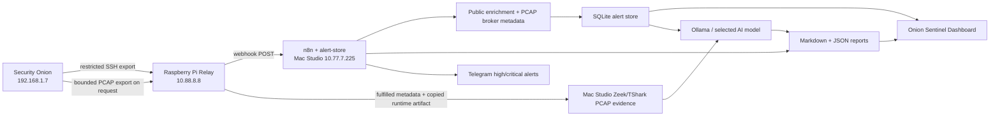

# Onion Sentinel

Disaster-recovery and rapid-deployment repo for the Onion Sentinel Security Onion alert relay, n8n alert-store, local AI analysis pipeline, Telegram notification path, and SOC dashboard.

This repository is designed to be safe for a private GitHub repo. It contains source code, example configs, launch/service definitions, workflow exports, and deployment runbooks. It must not contain live SSH keys, Telegram tokens, relay webhook tokens, n8n runtime data, SQLite databases, generated reports, admin sessions, or `.env` files.

## Architecture



## Directory Map

| Directory | Node / Layer | Purpose |
| --- | --- | --- |
| `security-onion/` | Security Onion | Restricted alert export wrapper, sudoers drop-in, SSH forced-command template. |
| `relay/` | Raspberry Pi relay | Pulls Security Onion alerts over restricted SSH and POSTs new alerts plus quiet-cycle heartbeats to n8n. Includes systemd timer/service and install script. |
| `relay/n8n-docker/` | Relay-facing n8n handoff | Notes for the webhook target that the relay posts to. The actual n8n stack lives in `n8n/`. |
| `n8n/` | Mac Studio Docker n8n + alert-store | Docker Compose, n8n workflow export, alert-store code, local AI scripts, model settings, launchd jobs. |
| `onion-sentinel-dashboard/` | Mac Studio dashboard | LAN portal backend and SOC dashboard builder/assets. |
| `mac-studio/` | Mac Studio host orchestration | Host-level restore order and service ownership. |
| `operations/` | Cross-node validation | Stack verification commands and operational checks. |
| `docs/` | Full project documentation | Architecture, filtering, AI policy, daily rollups, and DR runbooks. |
| `tests/` | Regression tests | Scheduler priority and SOC alert summary API tests. |

## Rapid Restore Order

1. Restore Security Onion wrapper: `security-onion/README.md`.
2. Restore Mac Studio n8n and alert-store: `n8n/README.md`.
3. Restore Onion Sentinel dashboard: `onion-sentinel-dashboard/README.md`.
4. Restore Raspberry Pi relay: `relay/README.md`.
5. Import and activate the n8n workflow from `n8n/workflows/`.
6. Configure secrets from examples only on the destination hosts.
7. Run validation: `operations/verify-stack.zsh`.

## Product And Deployment Contract

Onion Sentinel is treated as a production SOC analyst tool and this repo is the
sanitized disaster recovery source of truth. Keep runtime changes mirrored back
into source, templates, docs, and runbooks without copying secrets, databases,
generated reports, or live alert data. See
`docs/product-deployment-requirements.md` for the current UI, workflow,
deployment, AI, notification, and validation requirements.

The current reliability boundaries, durable queue behavior, service-level
objectives, and recovery checks are in
`docs/reliability-and-slo-runbook.md`.

The least-privilege migration plan for supported Security Onion APIs and
policy-brokered OSQuery investigations is in
`docs/security-onion-api-and-osquery-roadmap.md`. Restricted SSH remains the
production transport until that roadmap's acceptance gates pass.

The staged plan for evaluating Hermes Agent, OpenClaw, and a thin
Onion Sentinel-specific investigation runtime is in
`docs/llm-harness-and-investigation-runtime-roadmap.md`. Direct Ollama remains
the production baseline until the adapter, policy, security, shadow-testing,
and rollback gates in that roadmap pass.

## Secret Handling

Never commit these live files:

- `/etc/so-alert-relay/relay.env`
- `/opt/so-alert-relay/keys/*`
- `$HOME/n8n-local/.env`
- `$HOME/n8n-local/alert_store_data/*.sqlite3`
- `$HOME/n8n-local/n8n_data/`
- `$HOME/report_portal/.admin_*`
- Telegram bot tokens, chat IDs, relay webhook tokens, SSH private keys, n8n credential exports.

Before pushing:

```bash
operations/secret-scan.zsh
git status --short
git diff --cached --stat
```

## Fresh Clone Checklist

```bash
git clone <private-repo-url> OnionSentinel
cd OnionSentinel

# Inspect deployment docs.
open README.md
open docs/disaster-recovery-runbook.md

# Run local secret scan before first push or commit.
operations/secret-scan.zsh
```

## Production Defaults

| Component | Default |
| --- | --- |
| Security Onion | `192.168.1.7` |
| Relay VLAN | `10.88.8.0/24` |
| Relay host | `10.88.8.8` |
| Mac Studio | `10.77.7.225` |
| n8n webhook | `http://10.77.7.225:5678/webhook/security-onion-alert` |
| Dashboard | `http://10.77.7.225:8765/view/b68c5a48b9778061/` |
| Alert DB | `$HOME/n8n-local/alert_store_data/alerts.sqlite3` |
| Reports | `$HOME/n8n-local/soc-alerts` and `~/Documents/SOC Alerts` symlink |
