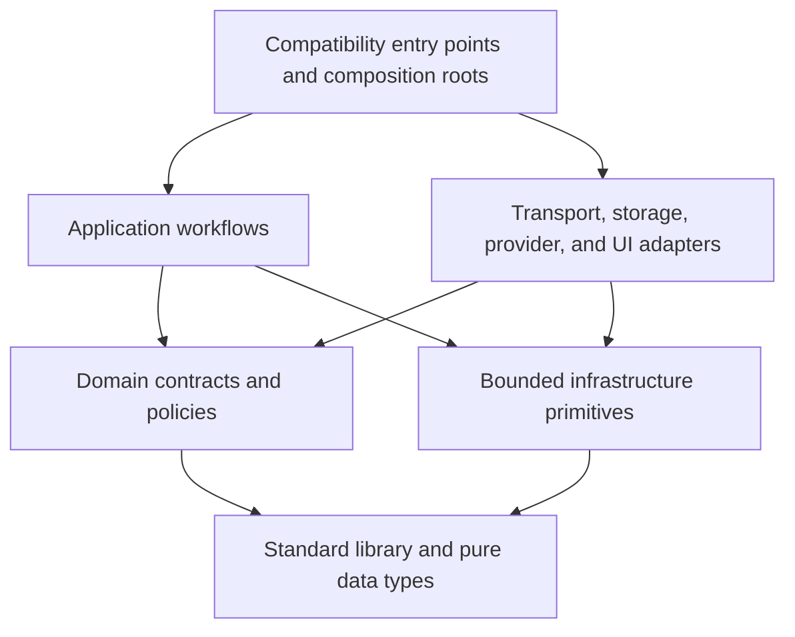

# ADR: Modular Onion Sentinel Runtime Boundaries

- **Status:** Accepted for staged implementation
- **Decision date:** 2026-08-06
- **Baseline release:** `3eec576a59b51b74badcc042de2e3418fca9c867`
- **Tracking:** ARR-70 and children ARR-71 through ARR-85

## Context

Onion Sentinel has accumulated mature investigation, recovery, provenance,
provider-routing, UI, and persistence controls inside a small number of very
large files. Those controls are valuable, but their concentration makes safe
changes harder to review and lets unrelated concerns share mutable state.

The synchronized baseline contains these production concentration points:

| File | Lines | Definitions | Largest definition |
| --- | ---: | ---: | ---: |
| `n8n/bin/run-local-ai-analysis.py` | 19,462 | 341 | 967 lines |
| `onion-sentinel-dashboard/report_portal.py` | 14,366 | 421 | 749 lines |
| `n8n/alert_store/alert_store.js` | 12,586 | n/a | n/a |
| `onion-sentinel-dashboard/scripts/build_soc_alerts_dashboard.py` | 11,421 | 236 | 582 lines |
| `operations/run-incident-harness-cohort.py` | 4,935 | 86 | 704 lines |
| `n8n/bin/auto-run-ai-analysis.py` | 4,697 | 102 | 577 lines |
| `n8n/bin/onion_sentinel_harness.py` | 4,272 | 92 | 1,724-line class |
| `n8n/bin/build-ai-investigation-prompt.py` | 3,971 | 73 | 480 lines |

Line count is a warning signal rather than an architecture by itself. The
specific problem is mixed reasons to change: provider transports, evidence
policy, orchestration, storage, rendering, HTTP dispatch, and recovery are
implemented together and can call one another without an explicit boundary.

## Decision

Onion Sentinel will be decomposed incrementally into layered, domain-focused
packages. Existing production entry-point filenames and wire contracts remain
available as compatibility adapters until the new packages pass behavior,
security, and investigation-parity gates.

This is not a rewrite. Implementations move in reversible slices behind stable
interfaces. The legacy implementation is removed only after its callers and
tests use the extracted interface and behavior parity is proven.

## Engineering Budgets

The repository will use a ratcheting baseline so existing debt does not block
incremental improvement or become permission for new debt.

| Measure | Target | Enforced limit |
| --- | ---: | ---: |
| Production module | 300–600 lines | 800 lines for new modules |
| New production file | 300–600 lines | never more than 1,200 lines |
| CLI or HTTP entry point | 100–250 lines | reviewed transitional exception |
| Function | at most 50 lines | 100 lines for new/materially changed code |
| Cyclomatic complexity | at most 10 | 15 for new/materially changed code |
| Import cycles | none | any cycle fails |

Grandfathered files may not grow. When a file or function shrinks, its lower
measurement becomes the new baseline. Exceptions identify the owner, cohesive
reason, risk, and expiration. Generated, vendored, schema, and frozen
compatibility files are excluded only by a narrow reviewed allowlist.

## Non-Negotiable Invariants

Modularization must not weaken these behaviors:

1. Security Onion and Relay evidence access remains read-only.
2. Models receive bounded capabilities, never credentials or arbitrary query,
   shell, SSH, filesystem, or network authority.
3. Query authorization, target binding, time/row/byte budgets, result receipts,
   evidence references, provenance, and custody remain fail closed.
4. Provider, model, reasoning effort, agent role, harness activation, policy,
   and source release are attributed to observed execution.
5. Primary analysis, independent review, disagreement adjudication, and
   deterministic guards retain distinct identities and audit records.
6. Confidence reflects evidence quality and telemetry coverage rather than
   model agreement alone.
7. Durable leases, retries, crash reconciliation, stale-trace recovery, and
   output commits remain idempotent.
8. Raw evidence, derived analysis, memory candidates, analyst decisions, and
   public reports remain distinct.
9. Runtime files remain bounded, path-confined, owner-controlled, atomically
   replaced, and secret-redacted.
10. Existing HTTP paths, JSON schemas, CLI arguments, exit codes, launchd
    labels, installer paths, database schemas, and report fields remain
    compatible unless a separate versioned migration is approved.
11. Onion Sentinel and the Hermes LAN Portal retain the service boundary in
    `docs/dashboard-service-boundary.md`.
12. Frozen investigation-query compatibility bundles remain byte-stable unless
    their protocol is separately versioned and deployed to every enforcement
    point.

## Dependency Model

Dependencies point inward. Lower layers never import higher layers.



### Allowed directions

- `contracts` and domain policy may depend on standard-library types and other
  lower-level contracts.
- application workflows may depend on contracts and injected ports.
- adapters may implement ports and use bounded infrastructure helpers.
- entry points may construct adapters and workflows, then translate terminal
  errors into existing exit codes or HTTP responses.

### Forbidden directions

- contracts importing providers, HTTP handlers, databases, filesystem
  repositories, or compatibility entry points;
- application workflows importing a concrete provider, database, or HTTP
  handler instead of a port;
- adapters importing orchestration entry points;
- renderers reading databases, invoking providers, executing queries, or
  mutating job state;
- route handlers owning transactions or business decisions;
- provider adapters authorizing their own route, harness, or tool access;
- cyclic imports, including cycles hidden behind conditional imports;
- new imports from `n8n/compat` into the current protocol runtime.

## Target Runtime Shape

Names are an architectural target, not permission to move code without the
characterization gate. The exact package root will be selected in ARR-74 while
preserving the flat production script paths.

```text
n8n/
  onion_sentinel/
    contracts/          # versioned data objects, errors, ports
    analysis/
      orchestration/    # trusted analysis state machine
      providers/        # Codex, Ollama, Hermes, OpenClaw adapters
      evidence/         # references, provenance, projection, admission
      queries/          # governed execution, pivots, repairs, audit
      review/            # independent review and adjudication
      conclusions/       # confidence and deterministic evidence guards
      persistence/       # unit of work, index, memory, artifacts
      reporting/         # pure structured/Markdown rendering
    scheduler/           # job selection, leases, recovery, reconciliation
    harness/             # policy, ledger, store, run state, maintenance
    prompts/             # bounded prompt construction and compaction
  bin/                   # stable thin CLI compatibility wrappers

onion-sentinel-dashboard/
  portal/
    contracts/           # request/response and view models
    routes/              # declarative method/path bindings
    services/            # domain workflows
    repositories/        # SQLite/PostgreSQL/filesystem adapters
    renderers/            # pure fragments and reports
  pages/                 # static page builders
  components/            # shared escaped/accessibility-safe components
  scripts/               # stable builder compatibility wrapper

n8n/alert_store/
  routes/                # request validation, authorization, serialization
  services/              # domain operations and transaction boundaries
  repositories/          # SQLite/PostgreSQL implementations
  jobs/                  # background schedulers and outboxes
  lib/                   # bounded shared primitives
  alert_store.js         # thin composition/startup entry point

operations/
  onion_sentinel_eval/
    manifests/           # cohort and execution-proof contracts
    collection/          # freeze and bounded dispatch
    monitoring/          # job observation and reconciliation
    grading/             # trace and conclusion evaluation
    reports/             # sanitized result rendering
  *.py                    # stable thin CLI wrappers
```

## Stable Ports

The first package extraction defines interfaces with these responsibilities:

| Port | Input | Output | Must not own |
| --- | --- | --- | --- |
| `ProviderAdapter` | validated model route and bounded request | observed model receipt and structured response | route authorization, query execution, persistence |
| `QueryEngine` | authorized investigation state and proposed requests | evidence additions, audit entries, gaps, next state | provider credentials, report rendering, final verdict |
| `ReviewPipeline` | primary result and independent evidence package | reviewer result, disagreement, adjudication state | persistence or hidden evidence mutation |
| `ConclusionPipeline` | evidence-bound analysis state | normalized verdict, confidence, review gates, reasons | model invocation or evidence collection |
| `ResultUnitOfWork` | validated terminal result and artifact plan | commit receipt and post-commit tasks | analytical decisions |
| `JobRepository` | typed claim/state transition requests | durable job/lease receipts | running models or queries |
| `HarnessRepository` | policy-bound ledger operations | hash-bound run and event receipts | provider routing or evidence authority |
| `PortalService` | validated request model and caller authority | bounded response/view model | HTTP socket handling or HTML escaping |
| `AlertStoreService` | authorized domain command/query | transaction-bound domain result | raw HTTP parsing |

Adapters raise normalized errors that preserve the existing category,
retryability, public message, private diagnostic boundary, and terminal exit or
HTTP status. Domain code does not inspect provider exception text.

## Compatibility Seams

### Python script loading

Many tests use `importlib.util.spec_from_file_location` or
`SourceFileLoader` against hyphenated legacy filenames. Launchd and the
installer also invoke those files directly. During migration:

- legacy files continue to define or re-export symbols used by tests;
- `main()` remains callable and retains its current argument and exit contract;
- package modules never import the wrapper;
- test migration happens alongside each extraction, not as a mass rename;
- removing a re-export requires proof that repository and runtime callers no
  longer use it.

### Production deployment

`install-macstudio-stack.zsh` currently copies individual Python files into a
flat `$HOME/n8n-local/bin` tree and individual portal files into the dashboard
runtime. Before a package import is used in production, the installer must:

1. create a private staging directory;
2. copy the complete package tree rather than selected files;
3. reject symlinks and non-regular source files where appropriate;
4. validate required package manifests and imports in staging;
5. atomically replace the package directory under the deployment guard;
6. preserve operator-owned configuration and evidence;
7. include package files in release identity, backup, restore, and secret
   scans; and
8. prove rollback to the preceding complete package tree.

No wrapper may depend on a package that the installer does not deploy.

### Node runtime

The alert store remains CommonJS during this migration. `alert_store.js`
continues as the `package.json` main/start target while route and service
modules are extracted. A module-system conversion is a separate decision.

### HTTP and generated UI

Portal route method/path pairs, response schemas, status codes, bounded-body
rules, authorization checks, and cache behavior are contracts. Generated page
IDs, API URLs, form field names, accessibility behavior, and required classes
are compatibility seams. Full byte-for-byte HTML is not a contract unless a
test documents why it must be.

## State and Side-Effect Ownership

| Side effect | Sole owner after migration | Required receipt or guard |
| --- | --- | --- |
| Model subprocess/HTTP invocation | provider adapter | observed provider/model receipt, timeout and output bounds |
| Security Onion/Relay query | governed query adapter | authorization and result-bound query receipt |
| Live endpoint OSQuery | separately approved adapter | target approval and restricted contract receipt |
| AI durable job transition | job repository/service | lease and monotonic transition receipt |
| Harness event/ledger write | harness repository | run identity and hash-chain/ledger digest |
| Analysis artifact commit | result unit of work | atomic commit receipt and release identity |
| Memory promotion | post-commit memory service | committed result and candidate provenance |
| Portal mutation | authorized domain service | caller/auth and durable mutation receipt |
| Alert-store transaction | domain service/repository | transaction and idempotency identity |
| Static page publication | dashboard publisher | staged build and atomic tree publication |

Pure contracts, validators, policies, view models, and renderers do not perform
network, process, filesystem, clock, random-ID, or database operations. Those
values are provided through explicit context or ports.

## Migration and Release Gates

1. **ARR-73:** accept this decision and the module map.
2. **ARR-72:** freeze observable behavior at every planned seam.
3. **ARR-71:** introduce ratcheting metrics, complexity, dependency, and cycle
   checks without suppressing new regressions.
4. **ARR-74:** add the package skeleton and composition root.
5. **ARR-75–ARR-78:** extract AI subsystems independently.
6. **ARR-79:** reduce the AI wrapper and main orchestration.
7. **ARR-80–ARR-84:** modularize dashboard, evaluation, portal, alert store,
   scheduler, and harness tracks.
8. **ARR-85:** remove baseline exceptions and run the full parity release gate.

Each extraction is one-way only after:

- characterization tests pass before and after;
- the full affected test suites pass;
- the old implementation is no longer called;
- import and installer verification pass;
- secret/sensitive-file scans pass; and
- a clean rollback exists.

Production deployment additionally requires a graceful worker drain, exact
release identity, database integrity checks, operational SLOs, readiness,
bounded canary, and rollback rehearsal. Modularization alone never authorizes
deployment.

## Rejected Alternatives

### Rewrite the runner or portal

Rejected because the monoliths contain many hard-won safety and recovery
rules. A rewrite would replace observable behavior before it is fully
characterized and make regressions difficult to localize.

### Split files mechanically by line count

Rejected because small files can remain tightly coupled or mix concerns.
Boundaries follow state ownership and reasons to change; line budgets ratchet
the result after those boundaries are correct.

### Keep flat scripts and add more helper files ad hoc

Rejected because flat imports do not establish dependency direction,
interfaces, or deployment completeness. A package plus thin compatibility
wrappers makes the boundary explicit.

### Convert Python, Node, HTTP, and database architecture simultaneously

Rejected because it would multiply migration variables. Python packaging,
CommonJS decomposition, and persistence behavior remain separately testable.

## Consequences

The repository temporarily carries compatibility wrappers and duplicated
exports. The installer and tests need package-awareness before the first
production extraction. Some changes will initially add lines while creating
interfaces; the ratcheting baseline applies per grandfathered monolith and
prevents those temporary seams from becoming permanent growth.

The benefit is a system whose provider, evidence, review, persistence, UI,
scheduler, and harness changes can be reviewed and tested independently while
preserving the investigation and security contracts that make Onion Sentinel
trustworthy.
