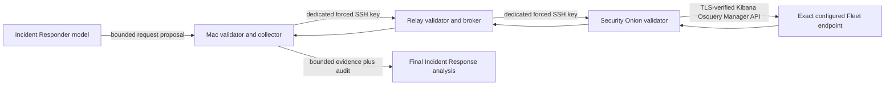

# Incident Response Query and Model Routing

This document defines the production security boundaries for Incident
Responder evidence collection, live endpoint OSQuery, model execution, and
automatic escalation. These are application contracts, not prompt
recommendations.

## Evidence Layers

Incident Response uses two deliberately separate evidence layers:

1. Baseline evidence packs are immutable, always bounded, and assembled by the
   Security Onion wrapper. Neither the model nor the Mac Studio chooses their
   Query DSL, OSQuery SQL, indices, fields, or local target.
2. Live endpoint OSQuery is an optional second round. The Incident Responder
   may propose a bounded read-only query against an operator-defined endpoint
   alias. Every trust boundary validates it independently. The feature remains
   fail-closed until exact aliases, Fleet agent IDs, TLS trust, and Kibana
   authorization are configured.

The baseline packs still run when live endpoint OSQuery is disabled or
unavailable. A live-query failure is recorded as an evidence gap; it must not
erase or fabricate baseline findings.

After baseline collection, the provider-neutral investigation loop may request
additional bounded Elastic/OQL pivots from these reviewed packs:
`alert_context`, `network_flow`, `dns_activity`, `system_auth`, `zeek_tls`,
`zeek_http`, `zeek_files`, `zeek_ssh`, `zeek_stun`, `zeek_quic`,
`zeek_anomalies`, `osquery_history`, and `cross_sensor_timeline`. These are
follow-up capabilities, not additional mandatory baseline searches.

Each follow-up may optionally copy a subset of one trusted `event_tuple` to
preserve source/destination IP roles, ports, transport, protocol, community ID,
and rule ID. Tuple fields are ANDed with the exact observable and time filters.
The Mac and Security Onion validators reject unsupported fields, values drawn
from different events, swapped roles, missing provenance, and returned hits
that do not satisfy the tuple.

## Fixed Elastic Packs

`security-onion/bin/export-incident-evidence` constructs these five searches:

| Pack | Reviewed index scope | Allowed datasets |
| --- | --- | --- |
| `alert_context` | `logs-suricata.alerts-so`, `logs-detections.alerts-so` | `suricata.alert` |
| `network_flow` | Zeek connection, endpoint network, and the two alert data streams | `zeek.conn`, `endpoint.events.network`, `suricata.alert`, `sigma.alert` |
| `dns_activity` | Zeek DNS and endpoint network data streams | `zeek.dns`, `endpoint.events.network` |
| `osquery_history` | Endpoint process/file/network and Osquery Manager result/action-response data streams | `endpoint.events.process`, `endpoint.events.file`, `endpoint.events.network`, `osquery_manager.result`, `osquery_manager.action.responses` |
| `cross_sensor_timeline` | The reviewed alert, Zeek connection/DNS, and endpoint network/process/file data streams | `suricata.alert`, `sigma.alert`, `zeek.conn`, `zeek.dns`, endpoint network/process/file events |

Each search is limited to approved fields, exact validated observables, no more
than four windows of 24 hours each, no more than 16 observables in each
category, and 200 hits. Reports retain an analyst-readable KQL equivalent and
the exact executed Query DSL. Query DSL is the execution record; KQL is an
explanation of intent.

The caller also supplies the representative alert's Elasticsearch backing
index and document ID as an anchor. Both values originate in the restricted
alert-export wrapper, outside the event `_source`. Before evidence can be
marked complete, the incident wrapper must retrieve that exact anchor once
from the reviewed alert indices and then prove a contradictory positive/negative
ID filter returns no records. Missing anchors, root errors, timeouts, failed
shards, zero searchable shards, malformed hit metadata, and results from an
index outside the pack's fixed scope are explicit evidence gaps. Consequently,
`complete: true` means the fixed queries, controls, and local OSquery packs all
passed semantic validation; it does not merely mean the SSH command returned
successfully.

## Fixed Local OSQuery Packs

The same wrapper can execute only these reviewed queries against the Security
Onion node itself:

| Pack | Exact SQL |
| --- | --- |
| `system_inventory` | `SELECT hostname, uuid, cpu_brand, cpu_physical_cores, cpu_logical_cores, physical_memory, hardware_vendor, hardware_model FROM system_info LIMIT 1;` |
| `logged_in_users` | `SELECT user, tty, host, time, type, pid FROM logged_in_users ORDER BY time DESC LIMIT 100;` |
| `listening_ports` | `SELECT lp.protocol, lp.address, lp.port, lp.pid, p.name, p.path FROM listening_ports AS lp LEFT JOIN processes AS p ON lp.pid = p.pid ORDER BY lp.port LIMIT 200;` |
| `process_inventory` | `SELECT pid, parent, name, path, uid, gid, start_time FROM processes ORDER BY pid LIMIT 200;` |
| `installed_packages` | `SELECT name, version, release, source, arch FROM rpm_packages ORDER BY name LIMIT 200;` |
| `scheduled_tasks` | `SELECT event, minute, hour, day_of_month, month, day_of_week, command, path FROM crontab ORDER BY path LIMIT 200;` |
| `startup_items` | `SELECT name, path, args, type, status, source FROM startup_items ORDER BY name LIMIT 200;` |

These packs do limit the model to predefined queries. They inspect Security
Onion, not arbitrary managed endpoints. Exact SQL, target, status, digest,
bounded row metadata, and errors are retained in the Incident Response report.

## Restricted Live Endpoint OSQuery

Live endpoint OSQuery is an Incident Responder-only capability:

The model selects an operator alias, a purpose, and one read-only `SELECT`.
Aliases map to exact Fleet agent IDs only in the root-owned Security Onion
configuration. Wildcards and all-endpoint targets are forbidden.

Every hop enforces:

- at most 8 queries per case;
- at most 4,096 characters per query;
- one SQL statement, `SELECT` only;
- no SQL comments, CTEs, compound queries, subqueries, derived tables, comma
  joins, mutations, pragmas, or extension loading;
- a row limit from 1 through 200, with 100 added when omitted;
- at most a 4 MiB response and 10 minutes of reported execution time;
- one absolute batch deadline of at most 130 seconds and at most four
  concurrent endpoint queries, preserving at least 50 seconds of the Relay's
  180-second transport budget;
- only these tables: `arp_cache`, `crontab`, `deb_packages`, `groups`,
  `homebrew_packages`, `interface_addresses`, `kernel_info`,
  `listening_ports`, `logged_in_users`, `process_open_sockets`, `processes`,
  `routes`, `rpm_packages`, `startup_items`, `suid_bin`, `system_info`,
  and `users`.

This is not arbitrary SQL, shell access, a generic endpoint command channel, or
permission to target every enrolled host. The Mac sends no Fleet agent ID or
Kibana credential. The relay has no Kibana credential. Security Onion accepts
only the forced command and stores the root-only endpoint map and authorization
material.

Configuration remains disabled by default:

- Mac: `$HOME/n8n-local/config/live-osquery.json`
- Relay: `/etc/so-alert-relay/live-osquery.json`
- Security Onion: `/etc/onion-sentinel/live-osquery.json`

The three-node configuration and a current operator approval are the
enablement boundary for every provider path. The Mac's lowest-level collector
enforces the owner-only mode-0600, time-bounded
`harness_operator_approval` against every requested alias immediately before
transport, even when the custom harness is not active. The harness additionally
records the same decision in its immutable tool-authorization event. An
expired, missing, malformed, disabled, or differently scoped approval fails
closed in ordinary, shadow, enforce, Hermes, and OpenClaw paths; enabling the
transport configuration alone never manufactures approval.

Enable it only after configuring exact operator aliases on all three nodes,
mapping each alias to one exact Fleet agent ID on Security Onion, pinning both
SSH host keys, installing the two dedicated keys, configuring either verified
Kibana TLS or the wrapper's strict loopback-HTTP exception, and provisioning
the narrowest Osquery Manager authorization registered by the deployed Kibana
runtime. When the licensed sub-feature privilege for **Run live queries** is
registered, use it. If the runtime exposes only `feature_osquery.all`, use the
explicit `kibana-feature-osquery-all-brokered-v1` compensation profile: an
expiring root-only credential usable only by the fixed-route Security Onion
wrapper. The wrapper exposes create, status, and result retrieval for bounded
live queries and has no route for saved queries, packs, schedules, arbitrary
Kibana APIs, or caller-supplied paths. Never use an `all`, wildcard,
or shared administrative target. Returned evidence is associated with the
submitted request by target alias and normalized SQL digest, never by array
position. The Security Onion HTTP client disables environment proxies and
redirects, and validates the exact configured Fleet agent and query action on
the submission and every result row before stripping those identifiers from
returned evidence.

## Model Concurrency

Inference is split into independent provider lanes:

- All Ollama and other local-model work shares one host-wide inference lock.
  Only one local model may run at a time, regardless of agent role.
- GPT CLI and Codex CLI jobs use a separate CLI worker and do not acquire the
  Ollama inference lock.
- One CLI analysis may therefore run in parallel with one local-model analysis.
  A CLI outage cannot block the local lane, and an Ollama backlog cannot block
  the CLI lane.
- Each durable job retains its provider assignment. There is no silent
  cross-provider fallback because that could change privacy and cost
  boundaries.

The production Incident Responder route is Codex CLI using `gpt-5.5` with
`medium` reasoning. Local model benchmark results and fallback guidance are in
`docs/local-ollama-model-benchmark.md`.

## Automatic SOC Policy

The Settings page exposes three independent SOC Analyst policy thresholds:

- **Automatic AI analysis**: the lowest alert severity that automatically
  queues the assigned SOC Analyst model.
- **Automatic PCAP analysis**: the lowest alert severity that automatically
  queues a PCAP request.
- **Automatic Incident Response**: the lowest alert severity that automatically
  creates or reopens a case and queues the Incident Responder.

Severity order is `informational`, `low`, `medium`, `high`, `critical`. A
selected threshold includes that severity and every higher severity. Incident
Response and automatic AI analysis also support `disabled`.

The policy is stored in the runtime `ai_model_settings.json`. Alert-store
hot-reloads it for new post-commit queue decisions, and the AI scheduler
re-reads the analysis threshold before each claim. Suppressed or policy-dropped
alerts are not automatically queued. Duplicate pending work is coalesced by
stable alert group. Existing below-threshold automatic AI jobs are completed
without inference when claimed, while prior analysis artifacts remain visible
as audit history. Manual PCAP requests, escalations, and AI reanalysis remain
available independently of these automatic thresholds.

Repository defaults are:

- AI analysis threshold: `informational`
- PCAP threshold: `informational`
- Incident Response threshold: `disabled`

Runtime operators may choose stricter thresholds without changing or committing
the live settings file. A settings file that predates the AI-analysis control
keeps the historical `informational` behavior until an operator explicitly
saves the new threshold.

## Verification

Use synthetic TEST-NET fixtures for end-to-end validation. The live-query path
must first prove its fail-closed behavior while disabled. Once configured,
validate one exact disposable endpoint alias and inspect the report audit for
the submitted alias, normalized SQL, query digest, result status, row count,
truncation state, duration, and explicit errors. Never test with a wildcard
target or production-sensitive query.
