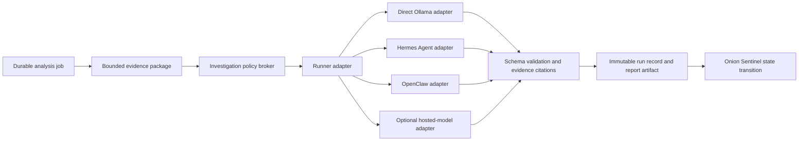

# LLM Harness And Investigation Runtime Roadmap

## Purpose

This roadmap defines how Onion Sentinel may evaluate Hermes Agent, OpenClaw,
and a purpose-built investigation runtime without weakening the current local,
deterministic alert-analysis path. The repository remains the source of truth;
runtime credentials, conversation history, live evidence, and generated agent
artifacts remain on their designated hosts and out of Git.

This document is a roadmap, not a statement that these harnesses are authorized
for production alert handling today.

## Current Promotion Gate

No harness, adapter, policy-broker, or investigation-runtime phase may begin on
the production path until the existing direct-Ollama deployment has completed
its current qualification cycle. The gate requires a clear protected PCAP
backlog, green operational SLO evaluation, a successful recovery drill, and a
continuous 48-hour production soak with no unresolved ingestion, analysis,
notification, disk-capacity, or PCAP-flow warning. Experimental work before
that point must remain synthetic, isolated, disabled by default, and unable to
reach live evidence or mutate production state.

## Current Production Boundary

- The scheduled SOC Analyst pipeline uses the selected local Ollama model and
  bounded prompt packages generated by Onion Sentinel.
- Onion Sentinel owns alert identity, grouping, priority, state transitions,
  evidence collection, durable scheduling, output validation, and audit logs.
- Zeek and TShark parse PCAP before evidence is supplied to an LLM. A model does
  not receive unrestricted packet files, shell access, or filesystem access.
- Cyber Security Agent memory is bounded Markdown evidence. Automated writes to
  individual or shared memory are not enabled until provenance, review, and
  rollback controls exist.
- General-purpose agent harnesses must not receive direct SQLite writes, n8n
  administration, raw provider credentials, unrestricted SSH, unrestricted
  OSQuery, or arbitrary command execution.
- The existing `$HOME/.hermes` dashboard deployment paths do not imply that
  Hermes Agent is part of the production SOC analysis path.

## Target Architecture

Onion Sentinel should expose one versioned model-runner contract while keeping
the alert workflow independent from any individual harness.

The adapter input must contain a bounded, versioned evidence package, role
prompt, model route, tool policy, deadline, and correlation ID. The adapter
output must use the same validated response schema regardless of the selected
harness. Harnesses may propose actions; Onion Sentinel decides whether an
action is allowed, requires approval, or is denied.

## Evaluation Tracks

### Direct Ollama

Keep direct Ollama as the production baseline and rollback path. It has the
smallest attack surface and the fewest moving parts, and it provides a stable
control against which every harness experiment can be measured.

### Hermes Agent

Evaluate Hermes first as a local, optional runner for multi-step investigations
and typed tool use. Begin in shadow mode with tools disabled, then permit only
read-only Onion Sentinel tools through the policy broker. Do not grant Hermes a
general shell, direct database mutation, or access to runtime secret files.

Potential value:

- Better orchestration of bounded, multi-step investigation tasks.
- A reusable local-agent interface for Threat Hunter, Cyber Threat Intel, and
  Incident Responder workflows.
- Faster experimentation than building every orchestration feature internally.

Primary risks:

- A larger dependency and prompt-injection surface than direct model calls.
- Tool and memory behavior may change between releases.
- General agent features can blur Onion Sentinel's ownership of state and audit.

### OpenClaw

Evaluate OpenClaw only as an optional, isolated analyst interaction surface or
shadow runner after the common adapter and policy broker are proven. It must not
become a required component of ingestion, alert state, PCAP transfer, or the
automatic analysis queue.

Potential value:

- An interactive analyst experience for guided investigations.
- A second harness implementation for validating adapter portability.

Primary risks:

- Additional operational, session, authorization, and supply-chain surface.
- Interactive autonomy can produce less deterministic runs.
- A failure or upgrade must never interrupt core Onion Sentinel processing.

Before implementation, verify the security model, licensing, local deployment
behavior, and tool controls of the exact OpenClaw release selected for testing.

### Onion Sentinel Investigation Runtime

Build a thin domain-specific runtime rather than another general autonomous
agent framework. Its responsibilities should be limited to:

- Versioned evidence and response contracts.
- Model and harness routing with deadlines, cancellation, and retry policy.
- Typed, least-privilege investigation tools.
- Human approval gates for consequential actions.
- Evidence provenance, citations, redaction, and output validation.
- Durable run state, idempotency, audit records, metrics, and replay.
- Per-role and shared-memory read/write policy with review and rollback.

The runtime should reuse the existing durable analysis queue and alert-store
contracts. It must not fork a second source of truth for alerts, suppressions,
acknowledgements, reports, or PCAP state.

## Typed Tool Boundary

Initial tools should be read-only and return bounded structured data:

| Tool | Allowed behavior | Explicitly prohibited |
| --- | --- | --- |
| Alert evidence | Read one normalized alert group and its timeline | Arbitrary SQL or database writes |
| Enrichment evidence | Read normalized cached provider findings | Raw API keys or unbounded provider responses |
| PCAP evidence | Read parsed Zeek/TShark summaries | Raw packet export to external models |
| Report history | Read bounded prior analyses and analyst notes | Editing or deleting prior reports |
| Security Onion search | Execute reviewed query templates through a broker | Arbitrary SSH, shell, or unbounded searches |
| OSQuery | Execute versioned read-only query packs after policy checks | Arbitrary SQL, shell expansion, or unrestricted targets |

Mutation tools, including acknowledgement, suppression, notification, memory
updates, or response actions, require separate schemas, authorization checks,
idempotency keys, and immutable audit records. High-impact actions require
explicit analyst approval.

## Phased Deployment Plan

1. Define and test a versioned `AnalysisRequest` and `AnalysisResult` contract
   around the existing direct Ollama runner.
2. Extract the current Ollama invocation behind a runner adapter without
   changing scheduling, evidence, reports, or alert state behavior.
3. Add conformance tests that every adapter must pass using synthetic evidence.
4. Implement the policy broker and a minimal read-only tool registry. Default
   deny all tools not explicitly assigned to an agent role.
5. Add a Hermes adapter in shadow mode with tools disabled. Compare output
   quality, runtime, resource use, failure rate, and schema compliance against
   direct Ollama.
6. Enable one low-risk read-only tool at a time for Hermes after threat modeling
   and authorization tests pass.
7. Evaluate OpenClaw in an isolated development environment as an optional
   analyst interface and adapter-portability test. Keep it off the production
   ingestion and automatic-analysis paths.
8. Introduce the thin Onion Sentinel Investigation Runtime for routing, policy,
   approvals, audit, and memory governance only where existing components do
   not already provide those capabilities.
9. Run production shadow comparisons with no state mutation, then conduct a
   limited analyst-approved pilot.
10. Promote an adapter only after failure isolation, rollback, disaster
    recovery, security review, and operator runbooks are validated.

## Acceptance Gates

- Direct Ollama remains available as a tested fallback.
- Harness failure, timeout, or upgrade cannot block alert ingestion, heartbeat
  processing, PCAP transfer, dashboard reads, or another analysis adapter.
- Every run has a correlation ID, bounded evidence manifest, model and harness
  identity, tool-call log, runtime metrics, result status, and artifact hashes.
- Synthetic prompt-injection tests cannot obtain secrets, arbitrary shell
  execution, unrestricted filesystem access, or unauthorized state mutation.
- Tool authorization is server-side and default-deny; model text cannot expand
  permissions.
- Outputs pass the existing response schema and clearly distinguish supplied
  evidence, inference, uncertainty, and recommended action.
- Replayed jobs are idempotent unless an analyst explicitly requests a new
  analysis generation.
- Agent memory writes include source, timestamp, role, evidence references,
  confidence, and approval state, and can be reverted without editing history.
- Secrets and live evidence do not enter Git, generated client JavaScript,
  dashboard HTML, or unprotected logs.
- Backup and restore procedures recover adapter configuration disabled by
  default and do not restore stale sessions or access tokens into service.

## Decision Record

The preferred direction is incremental:

1. Preserve direct Ollama as the dependable automatic-analysis path.
2. Add a common adapter and policy boundary.
3. Evaluate Hermes first in shadow mode.
4. Treat OpenClaw as an optional isolated analyst interface, not core plumbing.
5. Build only the Onion Sentinel-specific investigation controls that a general
   harness should not own.

This approach captures the benefits of agent harnesses without coupling the
SOC pipeline to their release cycles or granting them authority over Onion
Sentinel's durable state.
