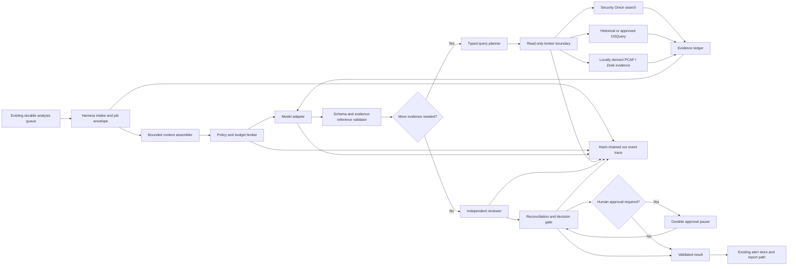
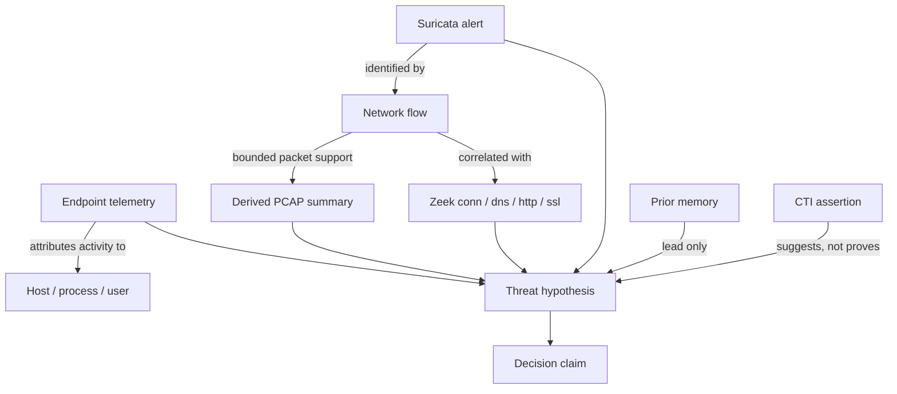

# Onion Sentinel Investigation Harness

## Status

This document defines the target design and staged delivery plan for Onion
Sentinel's custom investigation harness.

The code currently present in this repository is a **disabled-by-default,
shadow-capable foundation**. It is not yet a finished autonomous investigation
framework, it is not enabled by the checked-in configuration, and it does not
grant a model direct access to Security Onion, endpoints, packet captures,
shells, credentials, or production state.

The checked-in policy at
`n8n/config/investigation_harness_policy.json` has `enabled: false` and
`mode: shadow`. The first implementation in
`n8n/bin/onion_sentinel_harness.py` establishes contracts, policy checks,
durable run metadata, evidence and reasoning ledgers, model and tool call
ledgers, memory-promotion decisions, and a hash-chained event trace around the
existing analysis runner. Terminal events bind digests of every non-event
ledger so post-run row tampering is detectable. It is a control-plane
foundation to qualify before enforcement, not permission to bypass the
existing brokers.

Activation is also route-gated. Even when an operator-owned runtime policy has
`enabled: true`, Onion Sentinel does not start this custom harness when either
the assigned model or the configured second-opinion model uses Hermes Agent or
OpenClaw. Those providers are already agent harnesses and must not be nested
inside the Onion Sentinel harness. Ordinary Ollama and Codex CLI routes remain
eligible; `mode: shadow` observes them without enforcement, while
`mode: enforce` applies the qualified controls. Explicit approval gates are a
safety boundary rather than a qualification control: shadow mode never turns
a denied approval-gated mutation or operational action into permission.

No harness can guarantee perfect conclusions. The engineering goal is to make
accuracy, uncertainty, provenance, failure, and operational safety measurable,
reviewable, and steadily improvable.

## Design Goals

The harness should:

- support SOC analysis, incident response, threat hunting, SIEM engineering,
  and cyber threat intelligence through role-specific workflows;
- remain independent of Ollama, Codex CLI, Hermes Agent, OpenClaw, or any
  particular hosted model;
- give models bounded evidence and typed capabilities rather than credentials,
  arbitrary network access, a shell, or unrestricted query execution;
- persist enough state to resume, replay, audit, compare, and grade every
  investigation;
- preserve the distinction between observed evidence, model inference,
  remembered context, analyst judgment, and approved action;
- make every consequential decision traceable to current evidence references;
- use an independent reviewer and deterministic validators for conclusions that
  affect cases, shared memory, detections, or response recommendations;
- fail closed on missing evidence, malformed output, unknown capabilities,
  route mismatches, timeouts, budget exhaustion, and approval uncertainty;
- preserve Onion Sentinel's existing durable queue and alert store as the
  sources of truth; and
- keep Security Onion read-only during investigation unless a separately
  authorized operational workflow explicitly says otherwise.

## Non-Goals

The harness is not:

- a general-purpose autonomous computer-use agent;
- a replacement for Security Onion, its access controls, or its query APIs;
- a second alert, case, suppression, PCAP, or report source of truth;
- authority for an LLM to run arbitrary SSH, shell, SQL, HTTP, Query DSL,
  OSQuery, or packet-capture commands;
- a mechanism for silently falling back to another model when an assigned route
  fails;
- a place to persist provider credentials, raw authentication headers, browser
  sessions, or unbounded evidence;
- an automatic containment system; or
- a reason to treat confident prose as verified fact.

## Engineering Principles

### The trusted runtime owns the loop

Models are untrusted reasoning components. The Onion Sentinel runtime owns the
state machine, budgets, evidence manifest, tool registry, authorization,
approvals, retries, cancellation, response validation, trace, and persistence.
This follows the same separation described in OpenAI's
[agent-runtime migration guidance](https://developers.openai.com/cookbook/examples/agents_sdk/migrate-from-claude-agent-sdk/readme):
the application remains the trusted control plane while model and sandbox
execution are separate concerns.

### Structured output is necessary but insufficient

Every model response and tool request should conform to a versioned schema.
Schema adherence reduces parsing ambiguity but does not establish that a claim
is true. OpenAI's
[Structured Outputs guidance](https://developers.openai.com/api/docs/guides/structured-outputs)
likewise distinguishes structural conformance from substantive correctness.
Onion Sentinel must still validate evidence references, query coverage,
authorization, model identity, and conclusion logic.

### Default deny and least privilege

Capabilities are registered by the runtime and assigned to exact roles.
Unknown roles, unknown capabilities, and capabilities absent from the role
policy are denied. Every mutation remains approval-gated even if a policy
author accidentally omits it from the approval list. This complements, rather
than replaces, Security Onion's own
[role-based access control](https://docs.securityonion.net/en/2.4/rbac.html).
Approval-gated operational actions, including live endpoint OSQuery dispatch,
also fail closed in shadow mode. Shadow mode may observe ordinary policy and
budget denials without interrupting production, but it cannot manufacture
human consent.

### Evidence before narrative

The investigation is built from immutable evidence references and bounded
results. A report is a view over that record, not the record itself. Claims
without resolvable evidence remain hypotheses or gaps. Memory is a lead, never
proof of the current incident.

### Durable, idempotent execution

Long-running investigations must survive process restarts without repeating
side effects or losing their position. Each job, stage, model call, tool call,
decision, and approved mutation needs an idempotency identity. Temporal's
[durable execution model](https://docs.temporal.io/temporal) is a useful
reference for deterministic workflow state, event history, retry boundaries,
and resumability; Onion Sentinel does not need to adopt Temporal to apply those
principles.

### Accuracy is evaluated from the full trajectory

Scoring only the final paragraph hides bad queries, unsupported pivots, and
tool failures. Evaluation must inspect the complete trace. OpenAI's
[agent evaluation](https://developers.openai.com/api/docs/guides/agent-evals)
and
[trace grading](https://developers.openai.com/api/docs/guides/trace-grading)
guidance supports starting with traces and promoting stable failures into
repeatable datasets.

## Architecture



The harness is deliberately thin. It orchestrates the existing runner and
bounded brokers; it must not duplicate ingestion, alert identity, grouping,
acknowledgement, suppression, case, notification, PCAP-transfer, or report
ownership.

## Trust Boundaries

| Component | Trust level | Permitted responsibility | Prohibited responsibility |
| --- | --- | --- | --- |
| Harness control plane | Trusted application code | State, policy, schemas, budgets, routing, approvals, audit, persistence | Inventing evidence or weakening an upstream authorization decision |
| Model or agent adapter | Untrusted reasoning service | Propose hypotheses, queries, conclusions, and actions in a schema | Direct credentials, direct production writes, unrestricted tools, self-expanding permissions |
| Prompt and retrieved content | Untrusted data | Evidence to inspect with source metadata | Instructions that alter system policy or authorize tools |
| Typed broker | Trusted enforcement boundary | Validate and execute a bounded, registered query against an allowed target | Passing through arbitrary shell, HTTP, SQL, or target selection |
| Security Onion | Authoritative telemetry source within its retention and sensor coverage | Return authorized events and metadata | Being mutated by an investigation query |
| Local derived evidence | Trusted collector output with recorded provenance | Supply bounded Zeek, TShark, Suricata, and cached-query results | Implying live completeness when capture, parsing, or retention is partial |
| Analyst | Human authority | Review uncertainty, approve high-impact changes, label outcomes | Being bypassed by model claims or prompt content |
| Agent memory | Untrusted lead until revalidated | Supply prior context with provenance and expiration | Serving as current-case proof or silent policy |

Prompt injection is an evidence-handling problem, not just a prompt-writing
problem. Security Onion fields, packet payloads, DNS names, HTTP bodies,
endpoint output, CTI reports, analyst notes, and prior model output can all
contain adversarial instructions. Apply structural separation, content
delimiters, allowlisted tools, output validation, and least privilege as
recommended by the
[OWASP LLM Prompt Injection Prevention Cheat Sheet](https://cheatsheetseries.owasp.org/cheatsheets/LLM_Prompt_Injection_Prevention_Cheat_Sheet.html).

## Versioned Job Contract

Every native harness run begins with a versioned envelope that is independent
of the selected model:

- run, trace, correlation, alert, and case identifiers;
- agent role and task kind;
- assigned route and later observed model/provider/harness identity;
- prompt, evidence-manifest, policy, and non-secret configuration digests;
- parent or reanalysis run identity;
- deadline, query and model-call budgets, and cancellation state;
- permitted capability set;
- evidence reference contract; and
- creation and completion timestamps.

The current foundation creates this envelope from the bounded prompt package.
It stores digests rather than duplicating the raw prompt in the event trace.
Before durable admission, the
`onion-sentinel-harness-execution-contract-v1` identity pins the exact lowercase
source commit, harness schema, policy version, native primary and optional
reviewer provider/model/reasoning routes, and the selected skill registry and
skill version digests. Missing or malformed identity fails closed; external
Hermes and OpenClaw routes bypass the native harness before this boundary. The
canonical contract and its SHA-256 digest are stored on the run row and in the
`run.started` event, and the job digest covers both fields.

New trace databases use SQLite schema version 5 and terminal ledger manifest
version 3. Read-only verification remains compatible with legacy manifest
versions 1 and 2, while rejecting a downgraded manifest when newer identity
fields are present. Additive migration leaves empty execution-contract columns
only on pre-version-5 rows; every newly admitted native job must carry a valid,
digest-matching contract. Deterministic retry metadata and explicit
request/result schema versions remain future contract work.

## Durable State Machine

The current stage vocabulary is:

1. `intake`
2. `context-assembly`
3. `primary-analysis`
4. `query-planning`
5. `query-execution`
6. `evidence-synthesis`
7. `independent-review`
8. `human-review`
9. `post-processing`
10. `persistence`
11. `complete` or `failed`

Terminal run states include succeeded, failed, and cancelled. A production
implementation also needs a durable `waiting-for-review` pause, lease and
heartbeat metadata, explicit retry attempts, timeout and cancellation events,
and restart tests at every stage boundary.

The SQLite foundation uses WAL mode, full synchronous writes, foreign keys, an
owner-only database file, and idempotency-key collision checks. Each event
links to the previous event hash. This provides useful tamper evidence and
replay ordering, but it is not a signed or externally anchored audit log: an
administrator with database access could rewrite both events and hashes.
Production audit assurance may add signed trace heads or an append-only remote
sink without putting raw evidence or secrets in that sink.

## Investigation Record

### Run ledger

The run ledger owns the current stage, status, assigned and active route,
policy version and mode, timestamps, parent run, input digests, revision,
immutable execution-contract JSON and digest, and terminal summary. It is the
harness execution record, not a replacement for the alert-store record.

### Event ledger

The event ledger is a per-run, ordered, hash-chained stream. Events are bounded
and metadata-sanitized. Secret-like keys and recognized secret values are
redacted before storage; oversized payloads are replaced with a digest and
size. Events use idempotency keys, and reuse with different content fails.

### Evidence ledger

An evidence entry should contain:

- a stable reference;
- collector or broker source;
- source class and trust tier;
- observed time and query time window;
- content or result digest;
- corroborating, contradictory, unavailable, or unknown status;
- coverage and truncation semantics; and
- bounded, non-secret metadata.

The current foundation rejects a later registration that attempts to change
the content associated with an existing evidence reference. Future versions
should represent derivation edges explicitly, such as alert to flow, flow to
PCAP, PCAP to Zeek record, and indicator to CTI assertion.

### Hypothesis ledger

Hypotheses are first-class state, not hidden chain-of-thought. Each entry
contains a short analyst-readable statement, status, supporting and
contradicting references, the next discriminating question, and a revision.
Unknown evidence references must not support a hypothesis. Internal private
reasoning is neither requested nor persisted.

Useful statuses include proposed, supported, weakened, contradicted,
unresolved, and rejected. A mature workflow should require the model to keep at
least one plausible benign alternative until discriminating evidence closes
it.

### Decision ledger

Decisions record classification, escalation, confidence, memory promotion,
review reconciliation, and approval outcomes. A decision includes current
evidence references, a rationale digest, and the canonical digest of the exact
response supplied at that stage. The final decision is recorded only after
collector-owned audits and deterministic policy metadata are attached, so its
digest can be compared directly with the response submitted to the alert
store. Confidence must be calibrated against replay results; a label such as
`high` is not meaningful without measured reliability.

### Model-call ledger

The model ledger records requested route, observed model, provider and harness,
purpose, independent-review flag, status, input and output digests, and
duration. This lets the UI and audit distinguish the assigned route from the
model that actually ran and prevents a silent provider fallback from looking
successful.

Before every model invocation, the current harness records a separate route
authorization decision. Primary calls must exactly match the primary route
bound into the immutable job envelope; independent-review calls must exactly
match the separately bound reviewer route. Enforce mode rejects a mismatch
before reserving model-call budget or invoking an adapter. Shadow mode records
the mismatch without changing the selected response.

The current runner records the initial analysis, iterative follow-ups,
independent-review attempts, validation failures, and provider failures.
Promotion still requires adapter-wide conformance tests for retries,
cancellation, timeouts, and route mismatches so every supported model and
harness reports the same observed identity and terminal status semantics.

### Tool-call ledger

The tool ledger records a normalized call identity, round, backend,
capability, purpose, request and result digests, status, read-only assertion,
coverage, truncation, and timestamp. Raw credentials and unbounded result
bodies do not belong in this table.

The model may propose a tool request. The broker independently validates its
schema, language, target, time range, field allowlist, row and byte limits,
timeout, role capability, and approval state. Model text can never directly
invoke an executor.

## Evidence and Claim Graph

The target investigation representation is a small provenance graph:



High-value correlation fields should be preserved when available, including
`community_id`, Suricata `flow_id`, Zeek `uid` and `fuid`, endpoint entity
identifiers, five-tuple, VLAN, sensor, timestamp, and original event identity.
Correlation by IP address alone is weak when DHCP, NAT, proxies, VPNs, and
shared infrastructure are present.

Every final claim should identify:

- direct supporting observations;
- derived or external assertions;
- contradicting observations;
- evidence gaps and telemetry-quality limits;
- the time and asset scope to which it applies; and
- the next action that could disprove it.

Negative conclusions require explicit coverage semantics. A query returning
zero rows supports “no matches in this validated query's time, index, sensor,
field, and retention scope” only when the query succeeded and was not
truncated. Timeout, authorization failure, unavailable telemetry, partial
capture, parsing failure, or an unknown field is an evidence gap, not a clean
result.

## Typed Investigation Brokers

The long-term broker registry should use a different validator for each query
language and evidence system. Converting everything into an opaque “query”
string defeats the policy boundary.

| Capability | Safe initial behavior | Required validation | Known caveat |
| --- | --- | --- | --- |
| `security-onion.events.query` | Bounded Elastic-backed event search using a supported, read-only interface | Index/data-stream allowlist, language/version, time range, fields, pagination, result bytes, timeout, expensive-clause limits | Query DSL, KQL, ES\|QL, and EQL have different grammars and cost profiles |
| `security-onion.oql.query` | Bounded OQL search through the Onion Sentinel broker | OQL parser/allowlist, field mapping, time range, row and byte limits | OQL availability and fields depend on the deployed Security Onion release and data |
| `suricata.events.read` | Retrieve normalized alert and flow events | Alert identity, sensor, time, and field allowlist | A signature match proves the event matched rule logic, not that malware is present |
| `zeek.derived.query` | Read already parsed Zeek records associated with a bounded capture or flow | Log type, UID/community correlation, time scope, row limit | Missing logs may mean protocol/parser/retention coverage is absent |
| `pcap.derived.query` | Read local, already-derived Zeek/TShark summaries | Capture identity, digest, parser version, packet/time bounds | Partial capture, snap length, loss, encryption, and asymmetric routing limit conclusions |
| `endpoint.osquery.query` | Prefer historical, already-collected results | Versioned query pack, table/column allowlist, host allowlist, timeout, output limit | A live `SELECT` still consumes endpoint resources and may expose sensitive host data |
| `threat-intel.lookup` | Retrieve bounded, provenance-rich intelligence | Provider allowlist, confidence, first/last seen, TLP/handling, freshness, indicator normalization | Reputation is context and can be stale, circular, or infrastructure-shared |
| `detections.read` | Read the active rule and metadata | Exact rule/version identity | Rule text and mapping may differ from public upstream versions |

Security Onion's documented query surfaces and field behavior should be
treated as version-specific contracts, not inferred by the model. Relevant
operator references include
[Elasticsearch](https://docs.securityonion.net/en/2.4/elasticsearch.html),
[Dashboards queries](https://docs.securityonion.net/en/2.4/dashboards.html),
and the
[`so-elasticsearch-query` utility](https://docs.securityonion.net/en/2.4/so-elasticsearch-query.html).
The model should be given the validated field catalog and examples for the
deployed release, while the broker remains responsible for execution.
`so-elasticsearch-query` forwards cURL arguments and is not itself a read-only
security boundary. Read-only operation depends on broker-enforced HTTP method,
path, index, request-body, and RBAC allowlists; the harness must never expose
the utility as unrestricted model-selected command execution.

The language validators also need language-specific semantics. Elastic
documents that
[KQL is a filter language](https://www.elastic.co/docs/reference/query-languages/kql)
and does not aggregate, transform, or sort, while
[ES|QL is a piped analysis language](https://www.elastic.co/docs/reference/query-languages/esql)
with independent result and resource limits. Query DSL boolean `filter` and
`must_not` clauses run in filter context, unlike scoring clauses. The broker
therefore records the declared language and version, validates it with the
matching parser, injects the trusted time/index scope outside model text, and
applies an execution-cost policy appropriate to that language. It must never
reinterpret a rejected KQL expression as Lucene, OQL, Query DSL, or ES|QL.

Similarly, osquery documents a `SELECT`-oriented SQL interface, but also notes
that extensions may expose action-capable tables. “SELECT only” is therefore a
necessary syntax check, not a complete safety boundary. Onion Sentinel retains
an exact table/column/predicate allowlist, opaque target aliases, output and
runtime limits, sensitive-column policy, and the separate live-query approval
gate even when the submitted SQL begins with `SELECT`.

### PCAP is not automatically side-effect free

Reading an already-present local capture or derived summary can be
investigation-read-only. Requesting a new Security Onion PCAP job is different:
the
[Connect API](https://docs.securityonion.net/en/2.4/api/)
documents that `GET /connect/joblookup/` creates a PCAP lookup job, and the
[PCAP operator guide](https://docs.securityonion.net/en/2.4/pcap.html)
describes cached output under `/nsm/soc/jobs/` and the free space needed to
carve it. The harness must not label remote PCAP carving as a generic read
capability. Keep it outside the first enforcement phase, use existing local
artifacts by default, and introduce a separate authorized, rate-limited,
audited capability only after its operational impact and cleanup behavior are
tested.

Connect and Active Query Management also have deployment and licensing
constraints that must not be mistaken for safety controls. Connect is a
Security Onion Pro feature, and API clients on newly configured grids remain
disabled until the required license and Hydra client setup are complete.
Active Query Management query listing and cancellation are Pro features;
cancellation is not supported for every query and a cancellation request does
not guarantee that execution stopped. The harness therefore needs
least-privilege client credentials plus its own authorization, timeout, and
post-cancellation verification controls.

The harness must also check packet-loss, capture interval, sensor, interface,
snap length, parser errors, encryption, and flow direction before interpreting
an absence in PCAP or Zeek as meaningful.

### Live OSQuery is an active operation

The current foundation recognizes `endpoint.osquery.query` as non-mutating
query content but also classifies it as a sensitive active capability.
Authorization therefore requires explicit human approval even when the runtime
policy omits it from its approval list. Historical OSQuery results are passive;
launching a live distributed query causes endpoint work and expands the data
access boundary.

Before enforcement, split the capability into historical-results read and
live-endpoint query. Live queries additionally need exact target authorization,
approved versioned packs, concurrency and CPU limits, deadlines,
sensitive-column policy, and immutable operator attribution.

### No arbitrary query fallback

If a broker cannot validate a proposed query, it returns a typed rejection. It
must not fall back to SSH, a local shell, `curl`, generic SQL, a broader index,
or a different query language. The rejection becomes trace evidence that the
investigation could not establish that point.

## Investigation Loop

A professional investigation turn should be bounded and explicit:

1. Normalize the alert, asset, time, sensor, rule, and telemetry-quality
   context.
2. Produce competing hypotheses and the smallest useful discriminating
   queries.
3. Validate each query at the broker boundary.
4. Execute accepted queries under per-call and per-run budgets.
5. Register result provenance, coverage, truncation, and correlation edges.
6. Update hypotheses using only resolvable current-run evidence.
7. Stop when the conclusion is sufficiently supported, the next query has low
   expected information value, or the budget is exhausted.
8. Ask an independent reviewer to inspect the same evidence without inheriting
   the primary conclusion.
9. Reconcile disagreements explicitly.
10. Persist a validated report and decisions through the existing alert-store
    path.

The checked-in policy currently bounds model calls, query rounds, total and
per-round queries, prompt evidence bytes and rows, and total run time. Shadow
mode should observe violations without changing the production result.
Enforcement must be enabled only after replay and soak results show the budgets
are realistic.

The default model-visible evidence limits are 1 MiB and 1,200 rows. The row
limit provides bounded headroom above observed full-investigation prompts
(approximately 858 conservatively counted rows), while the independent byte
limit remains the final guard against large records. The provider-neutral
prompt projector and harness policy must use the same row limit; tests enforce
that alignment so changing one limit cannot silently weaken or overconstrain
the other.

## Specialist Workflows

The policy and envelope currently recognize all five roles. Full specialist
schedulers, role-specific result schemas, and end-to-end production workflows
are not all implemented yet. Until they are, an unsupported specialist role
must fail closed rather than silently inheriting the SOC Analyst query policy.

### SOC Analyst

Objective: decide whether the alert represents expected, benign, suspicious,
or malicious activity and whether escalation is warranted.

Required workflow:

- validate rule intent and current alert fields;
- establish asset, identity, direction, frequency, and baseline;
- pivot across associated flow, Zeek, Suricata, and available endpoint data;
- test at least one benign alternative;
- report severity, confidence, scope, evidence gaps, and escalation rationale;
- never claim compromise solely from a signature name or indicator match.

### Incident Responder

Objective: establish incident scope, timeline, impact, and defensible response
recommendations.

Required workflow:

- inherit the escalation evidence without treating its conclusion as fact;
- build a timestamped activity timeline and affected-entity graph;
- search for lateral, persistence, credential, execution, exfiltration, and
  related-host evidence where telemetry supports it;
- distinguish containment recommendations from approved actions;
- identify evidence preservation and recovery needs;
- align process with
  [NIST SP 800-61 Revision 3](https://csrc.nist.gov/pubs/sp/800/61/r3/final).

### Threat Hunter

Objective: evaluate a falsifiable hypothesis across a defined population and
time range.

Required workflow:

- record the hypothesis, expected signals, counter-signals, scope, and stop
  conditions;
- estimate telemetry coverage before querying;
- use staged, cost-bounded queries and preserve every query;
- turn useful findings into a reproducible hunt package;
- report both observed matches and population/coverage limitations;
- propose a detection candidate only after validation against representative
  benign data.

### SIEM Engineer

Objective: assess telemetry and detection quality and produce reviewable
engineering changes.

Required workflow:

- verify data-source health, field mapping, timestamps, ECS normalization,
  retention, and sensor coverage;
- identify false-positive, false-negative, cost, duplication, and suppression
  risks;
- translate detection logic using explicit product/version assumptions;
- test proposed changes on a replay corpus before suggesting deployment;
- treat detection writes as a distinct approval-gated capability;
- preserve upstream Sigma attribution and conversion details using the
  [Sigma specification](https://github.com/SigmaHQ/sigma-specification), and
  pin the exact specification tag or commit and schema version in policy and
  replay metadata.

### Cyber Threat Intelligence

Objective: produce timely, source-aware intelligence that improves hypotheses
and detections without overstating indicator certainty.

Required workflow:

- normalize indicators and entities;
- retain source, collection time, first/last seen, confidence, handling, and
  revocation;
- detect circular reporting and distinguish independent sources;
- map behavior to the current
  [MITRE ATT&CK knowledge base](https://attack.mitre.org/) version;
- exchange structured intelligence with
  the immutable
  [STIX 2.1 OASIS Standard](https://docs.oasis-open.org/cti/stix/v2.1/os/stix-v2.1-os.html)
  and
  [TAXII 2.1](https://docs.oasis-open.org/cti/taxii/v2.1/taxii-v2.1.html)
  where appropriate;
- pin the STIX publication stage or errata and artifact digest in policy and
  replay metadata;
- expire stale indicators and keep CTI assertions separate from local proof.

## Independent Review and Reconciliation

The second-opinion reviewer should receive the evidence manifest and validated
query results without the primary narrative when practical. Its task is to:

- identify unsupported, overstated, or internally inconsistent claims;
- check that the proposed outcome follows the decision policy;
- find relevant evidence the primary ignored;
- challenge scope, confidence, and negative claims;
- detect citation, query, or model-route mismatches; and
- return structured agreement, material disagreement, and required correction.

For high-impact decisions, model-path diversity is preferable to invoking the
same route twice. Independence is weakened when both calls share the same
model, prompt framing, memory, or upstream summary. A deterministic
reconciliation gate, not either model, decides whether agreement is adequate.

## Memory Governance

Agent memory is a high-value prompt-injection and evidence-poisoning target.
The
[OWASP Agent Memory Guard project](https://owasp.org/www-project-agent-memory-guard/)
is an experimental, pre-1.0 threat-model reference for provenance, isolation,
validation, and memory lifecycle controls. Its published roadmap targets v1.0
in Q4 2026, so it is not a normative control or compliance benchmark.

Use four layers:

1. **Run working state**: current evidence and hypotheses; expires with the run.
2. **Case memory**: case-specific facts with evidence references and retention.
3. **Role memory candidates**: proposed reusable lessons awaiting promotion.
4. **Shared memory**: reviewed, versioned knowledge approved for multiple roles.

The current foundation's promotion decision requires:

- no unresolved evidence references;
- at least two corroborating source classes;
- high confidence with a numeric score of at least 0.8;
- independent-review agreement when policy requires it;
- exact role authorization; and
- explicit human approval for every durable promotion, with an additional
  explicit shared-memory check for shared candidates.

This gate is only active when the harness itself is enabled. In shadow mode,
quality and qualification denials are logged without silently changing
production behavior. Missing explicit approval is different: it is a safety
boundary and blocks the write in both shadow and enforce modes. The current
foundation has no durable approval/resume workflow, so every candidate-bearing
automatic memory write that reaches the approval gate remains blocked until
that workflow exists; it does not silently treat missing approval as consent.

Memory persistence is also commit-gated. The response contains only a
deterministic pending or blocked plan; no memory file changes before the
authoritative alert-store analysis commit succeeds. Eligible candidate intent
is staged in an owner-only journal bound to the exact response digest, while
the exact analysis-index payload is durably spooled before submission. A
validated receipt must bind the analysis ID and raw submission digest before
the memory task is atomically promoted from pending to committed. Committed
tasks are replayed by analysis ID, so a crash or a partial role/shared-memory
write finishes without double reinforcement. Only candidate-manifest digests,
counts, status, and an owner-only receipt enter audit state. If submission is
rejected, deferred, or returns an indeterminate receipt, memory files remain
unchanged. A post-commit memory or receipt failure is visible but cannot turn a
committed analysis into a retry that repeats model work.

Future memory records should also contain creator role and model, source and
case, evidence references, valid-from and expiry time, sensitivity and tenant
scope, reviewer and approval, supersession history, and rollback state. Memory
retrieval should be relevance- and scope-bounded. Every retrieved item is
labeled as a lead and revalidated against current evidence.

Never automatically promote:

- raw external content or an instruction found in evidence;
- a conclusion supported only by another model's prior report;
- secrets, personal data, full packet payloads, or unrestricted endpoint data;
- low-confidence or materially disputed findings;
- a transient indicator without freshness and provenance; or
- a failed or truncated query interpreted as absence.

## Action and Approval Model

Read-oriented investigation and production mutation are different authorities.
The foundation registers acknowledgement, suppression, case write, detection
write, notification, containment, and memory promotion as mutating
capabilities. All require approval.

A production approval record should include:

- exact normalized action and target;
- proposed parameters and their digest;
- reason and evidence references;
- risk, blast radius, and rollback plan;
- requesting run, model, role, and operator;
- expiration and one-use nonce;
- approver identity and decision time; and
- execution result and idempotency identity.

Approval must pause and resume the same durable run. Editing a prompt or
responding “yes” in free text is not an authorization token. OpenAI's
[guardrails and approvals guidance](https://developers.openai.com/api/docs/guides/agents/guardrails-approvals)
provides a useful pattern for enforcing validation at the model-input,
model-output, and tool boundaries while preserving approval state.

Containment should remain recommendation-only until a separate response system
has asset ownership, change authority, rollback, out-of-band recovery, and
tested two-person approval.

## Observability

The durable trace should map cleanly to
[OpenTelemetry traces](https://opentelemetry.io/docs/concepts/signals/traces/):

- one trace per investigation run;
- spans for context assembly, each model invocation, broker validation, tool
  execution, evidence synthesis, review, approval wait, and persistence;
- stable attributes for run, case, alert, role, task, policy, adapter, model,
  query backend, status, coverage, and budget use;
- exception and timeout events without secrets or raw sensitive evidence; and
- links between reanalysis, parent incident, and child specialist runs.

OpenTelemetry currently labels its general trace semantic conventions as
`Mixed` stability, while
[GenAI and agent semantic conventions](https://opentelemetry.io/docs/specs/semconv/gen-ai/)
continue to evolve separately. Any exporter must pin the semantic-convention
version and retain Onion Sentinel-specific attributes in an allowlisted custom
namespace until the relevant conventions are stable.

OpenAI's
[agent observability guidance](https://developers.openai.com/api/docs/guides/agents/integrations-observability)
similarly treats model calls, tools, handoffs, and guardrails as parts of one
trace. The current SQLite trace is local and harness-specific; an OpenTelemetry
exporter is a future phase and must use an attribute allowlist.

Operational dashboards should separate:

- assigned route from observed running model;
- queued, active, waiting-for-review, succeeded, failed, cancelled, and stale
  runs;
- model and query latency percentiles;
- schema, policy, timeout, route, and broker rejection rates;
- evidence-source diversity and telemetry-gap rate;
- reviewer agreement and material-disagreement rate;
- memory promotion proposed, accepted, rejected, expired, and rolled back;
- query budget and run-time budget violations; and
- ingestion/alert-store health from harness health.

## Evaluation Program

### Replay corpus

Build a versioned, offline corpus from:

- confirmed true positives and false positives;
- representative benign administrative and software-update behavior;
- common Security Onion alerts with analyst-reviewed outcomes;
- multi-stage incidents with timeline and scope labels;
- telemetry outages, packet loss, sparse endpoint data, field drift, and
  retention gaps;
- adversarial payloads and prompt-injection strings in every evidence field;
- malformed, truncated, duplicated, delayed, and contradictory evidence;
- CTI conflicts and expired indicators; and
- SIEM rule regression and threat-hunt datasets.

Sanitize the corpus before committing it. Store large or sensitive fixtures in
an approved artifact store with stable digests, never in Git.

### Labels

Each case should have analyst-reviewed labels for event occurrence, detection
validity, authorization, maliciousness, affected scope, timeline, key evidence,
acceptable uncertainty, required queries, disallowed claims, and appropriate
next action. Capture reviewer identity, label source, date, confidence, and
adjudication history.

### Metrics

Measure at least:

- outcome precision, recall, and confusion matrix by alert family;
- evidence citation precision and coverage;
- unsupported-claim and invalid-reference rate;
- conclusion calibration and selective accuracy at confidence thresholds;
- affected-entity and timeline accuracy;
- query syntax, authorization, execution, and usefulness rate;
- evidence-source diversity and query redundancy;
- correct treatment of exact zero, partial coverage, and telemetry failure;
- benign-alternative and contradiction coverage;
- ATT&CK mapping correctness and version;
- reviewer disagreement, correction, and escape rate;
- schema, route identity, retry, timeout, and budget compliance;
- prompt-injection and memory-poisoning resistance;
- latency, model calls, query calls, token/resource use, and local GPU impact;
- deterministic replay/idempotency behavior; and
- analyst acceptance and time-to-decision.

Do not optimize a single aggregate score. Track results by role, severity,
data source, alert family, model route, policy version, and evidence
availability. Compare against the current production runner and a
human-reviewed baseline.

### Evaluation ladder

1. Unit-test schemas, authorization, redaction, budgets, idempotency, and hash
   verification.
2. Run synthetic broker contract tests with no live access.
3. Replay frozen investigations offline and grade the full trajectory.
4. Run prompt-injection, memory-poisoning, route-mismatch, outage, timeout, and
   restart fault tests.
5. Shadow real jobs without changing the model result or production state.
6. Compare traces and conclusions with senior analyst adjudication.
7. Promote stable failures into permanent regression cases.
8. Require a release-to-release non-regression report before changing models,
   prompts, policies, broker validators, field maps, or memory logic.

NIST's
[AI RMF Generative AI Profile, NIST AI 600-1](https://nvlpubs.nist.gov/nistpubs/ai/NIST.AI.600-1.pdf)
supports treating governance, content provenance, information integrity,
monitoring, incident disclosure, and measurement as lifecycle controls rather
than one-time model tests.

## Current Implementation Inventory

| Capability | Current foundation | Promotion work still required |
| --- | --- | --- |
| Versioned policy | Strict JSON parser and schema, immutable per-run policy digest, safe file-permission checks, and disabled checked-in policy | Signed/reviewed policy release process and operator UI |
| Role registry | Five explicit roles with exact capabilities | Complete specialist schedulers and role-specific request/result schemas |
| Durable run state | Owner-only SQLite run record and stage transitions; crash-tested immutable analysis spool and commit-gated memory journal | Full run lease, heartbeat, stage resume, cancellation, and fencing |
| Event trace | Bounded sanitized per-run hash chain with idempotency checks; related model/tool/decision rows and events commit atomically; terminal events bind all non-event ledger manifests | External trace-head anchoring and retention policy if audit requirements demand it |
| Evidence ledger | Stable references, digests, source classes, trust tiers, collision rejection | Explicit provenance edges, sensitivity, retention, and telemetry-quality objects |
| Hypothesis ledger | Revisioned supported/contradicting references and next discriminator | Claim graph UI, richer validation, and specialist templates |
| Decision ledger | Outcome, status, confidence, evidence references, rationale digest | Calibrated decision policies and analyst adjudication workflow |
| Model ledger | Initial, follow-up, reviewer, validation-failure, and provider-failure calls with requested and observed identity; exact primary/reviewer route authorization before invocation | Adapter conformance for retries, cancellation, and provider-enforced timeouts |
| Tool ledger | Per-query request/result digests, backend, coverage, truncation | Language-specific broker validators and complete rejection telemetry |
| Budget broker | Atomic model-call/query-round reservations plus prompt-byte, evidence-row, total-query, per-round-query, and run-time checks | Run lease/fencing, token/cost budgets, and provider-enforced cancellation |
| Memory gate | Evidence diversity, confidence, reviewer, role, and human-approval checks; response-bound pending/committed journal; validated alert-store receipt before persistence; analysis-idempotent replay; private digest-only receipt | Durable human approval/resume, versioned memory store, expiry, supersession, rollback, retrieval isolation, and soak |
| Runner integration | Shadow-safe hooks around phases, query rounds, refreshed evidence references, exact final-response binding, exact assigned/observed route attestation, two pre-commit deadline checks, immutable pre-submit spool, bound commit receipt, and non-fatal post-commit audit finalization | Full adapter conformance, whole-run stage resume, and production qualification |
| Trace evaluation | Local snapshot/export, chain verification, and read-only aggregate evaluator | Ground-truth trajectory grading and optional allowlisted OpenTelemetry export |

## Migration Plan

### Phase 0: Preserve the baseline

- Keep the checked-in harness disabled.
- Preserve the current assigned-model runner and direct local-model fallback.
- Record baseline quality, latency, resource, failure, and recovery metrics.
- Complete the existing PCAP backlog, SLO, recovery, and continuous soak gates
  in `llm-harness-and-investigation-runtime-roadmap.md`.

### Phase 1: Qualify the foundation

- Finish unit and integration tests for policy parsing, exact authorization,
  owner-only storage, redaction, idempotency, evidence collision, event-chain
  verification, budgets, model/tool ledgers, and memory decisions.
- Exercise restart and failure at every state boundary.
- Verify trace exports contain no prompt bodies, secrets, or sensitive raw
  evidence.
- Keep all tests synthetic and isolated from live Security Onion.

### Phase 2: Complete instrumentation

- Add uniform retry, timeout, cancellation, and route-mismatch status to every
  model adapter.
- Record broker acceptance and rejection, normalized request digest, result
  digest, coverage, truncation, and duration.
- Verify the reported active model from observed adapter output rather than
  configuration alone.
- Add deterministic request/result contracts and adapter conformance tests.

### Phase 3: Offline replay and adversarial evaluation

- Build and adjudicate the sanitized replay corpus.
- Establish quality and calibration baselines per role and alert family.
- Run injection, poisoned-memory, malformed-query, field-drift, outage,
  timeout, and partial-telemetry suites.
- Set explicit promotion thresholds and rollback triggers.

### Phase 4: Production shadow

- Enable `shadow` only through operator-managed configuration on a qualified
  host.
- Observe real runs without changing the selected model response, ordinary
  read-only query authorization, alert state, case state, or notifications.
  Explicit approval gates remain fail-closed, including for live endpoint
  OSQuery and otherwise eligible memory promotion.
- Run continuously for at least the existing 48-hour soak requirement with no
  unresolved ingestion, analysis, disk, PCAP, or recovery warning.
- Review trace growth, retention, free disk, and failure isolation.

### Phase 5: Read-only enforcement pilot

- Enforce schema, identity, budget, evidence-reference, and registered
  read-only broker policy for a narrow alert family.
- Keep remote PCAP job creation and live endpoint OSQuery out of the passive
  read-only set.
- Require an analyst-visible fallback and kill switch.
- Compare all changed conclusions with the production baseline and adjudicated
  labels.

### Phase 6: Specialist workflows

- Add one role-specific contract and scheduler at a time.
- Start with Incident Responder and Threat Hunter read-only workflows.
- Add SIEM Engineer and CTI after field catalogs, ATT&CK/CTI versioning, Sigma
  conversion, and detection replay are qualified.
- Default deny rather than route an unsupported role through SOC policy.

### Phase 7: Governed memory

- Introduce case memory, candidate stores, expiry, review, supersession, and
  rollback.
- Run candidate-only shadow mode before any automated role-memory write.
- Require human approval for shared memory.
- Evaluate poisoning resistance and retrieval quality over time.

### Phase 8: Consequential actions

- Keep every mutation behind a separately reviewed schema and durable approval.
- Pilot low-impact, reversible actions before notification, detection change,
  or response action.
- Do not automate containment until asset authority, two-person approval,
  rollback, and recovery have been tested end to end.

## Production Promotion Gates

Promotion from one phase to the next requires documented evidence that:

- the prior phase passed its replay, security, SLO, and recovery thresholds;
- ingestion, dashboards, alert store, and existing model routes remain
  isolated from harness failure;
- direct Ollama or another explicitly tested baseline remains available as a
  rollback route;
- all enabled adapters pass the same versioned contract tests;
- assigned and observed model identity match, with no silent fallback;
- default-deny authorization and approval checks cannot be influenced by model
  content;
- query and evidence failures are represented as gaps, not clean results;
- trace and report outputs contain no secrets or unauthorized raw evidence;
- disk growth, retention, WAL behavior, backup, and restore are measured;
- replays are idempotent unless a new analysis generation is requested;
- reviewer disagreement and low-confidence paths fail safely;
- the operator can disable the harness without interrupting ingestion; and
- the release has a rollback plan, recovery drill, and named owner.

Any regression returns the policy to disabled or shadow. Harness availability
must never be an ingestion dependency.

## Offline Trace Evaluation

The trace evaluator opens the harness database in SQLite read-only and
query-only mode, holds one consistent read snapshot, and does not initialize,
migrate, checkpoint, or vacuum it. From the repository root, inspect all runs
with:

```bash
python3 operations/evaluate-harness-traces.py \
  --db ~/n8n-local/alert_store_data/investigation-harness.sqlite3
```

Limit the audit to one run, emit the full JSON report, and fail automation on
a broken event chain with:

```bash
python3 operations/evaluate-harness-traces.py \
  --db ~/n8n-local/alert_store_data/investigation-harness.sqlite3 \
  --run-id RUN_ID \
  --json \
  --out ~/n8n-local/logs/harness-trace-evaluation.json \
  --fail-on-invalid-chain
```

`--out` writes an owner-only `0600` file. The report contains trace metadata
and aggregate metrics rather than raw prompts, query bodies, credentials, or
evidence content. It covers completion and integrity, assigned and observed
model use, tool failures and policy rejections, coverage and truncation,
evidence-source diversity, independent-review disagreement, distinct budget
breaches, and memory-promotion outcomes.

Controlled accuracy grading fails closed unless every selected SOC Analyst and
Incident Responder trace contains at least one successful tool call and every
logged call is explicitly read-only. A zero-call or rejected-only ledger is a
coverage gap, not proof of read-only investigation. Bounded collector query
audits are digest-bound to the stored response when present; Incident
Responder grading also requires a positive read-only Security Onion query
audit.

## Trace Durability and Retention

Shadow mode writes an owner-only SQLite trace ledger at
`~/n8n-local/alert_store_data/investigation-harness.sqlite3`. The daily runtime
recovery bundle takes a transactionally consistent SQLite snapshot, runs
`quick_check` and `foreign_key_check`, then restores the snapshot through
SQLite's backup API and repeats the checks before publishing the atomic
bundle. The isolated recovery drill restores the optional trace snapshot,
validates its schema version and row count against the manifest, and remains
backward-compatible with bundles made before a harness database existed.

The hourly `com.arron.onion-sentinel.harness-maintenance` LaunchAgent applies
three independent bounds to terminal traces: 30 days, 10,000 terminal runs,
and 2 GiB of live SQLite pages. Each pass deletes at most 1,000 terminal runs;
running or review-waiting traces are never eligible. Byte pressure preserves
the newest 1,000 terminal traces. A destructive pass is blocked unless a
recovery bundle no older than 26 hours contains a hash-matching,
quick-checked harness snapshot with the manifest's run count. Every exact
deletion candidate must already be terminal in that snapshot and its event
hash chain must verify; a run completed after the snapshot waits for the next
backup. This ordering ensures retention cannot erase the only recoverable
copy.

New trace databases use SQLite incremental auto-vacuum. Maintenance performs a
bounded incremental-vacuum pass, optimizes statistics, and truncates a WAL only
when SQLite reports that all frames were checkpointed. Existing databases are
not rewritten during deployment; they reuse freed pages and report physical,
live-page, and reclaimable-page bytes so an operator can schedule a separate
offline full vacuum if ever needed.

Inspect or dry-run the maintenance decision without deleting a trace:

```bash
python3 ~/n8n-local/bin/maintain-investigation-harness.py
python3 -m json.tool \
  ~/n8n-local/logs/investigation-harness-maintenance.json
```

An operator-initiated destructive pass uses the same backup prerequisite as
the scheduled job:

```bash
python3 ~/n8n-local/bin/maintain-investigation-harness.py --apply
```

Exit `0` means the database is absent or within bounds, exit `1` requests
another bounded pass, and exit `2` means integrity, permissions, locking, or
backup verification blocked maintenance. The JSON report contains counts and
disk accounting, never raw event payloads or evidence. The operational SLO
monitor requires this report to be no more than two hours old whenever the
harness database exists, fails on a blocked or invalid integrity state, and
surfaces bounded follow-up/checkpoint pressure as a degraded advisory.

During a guarded deployment, the installer runs the deployed command in dry-run
mode before loading the `RunAtLoad` LaunchAgent. It retries a blocked exit `2`
for a bounded startup window and accepts exits `0` or `1` as proof that the
SQLite files and reconciliation query contract are ready. Probe output uses the
separate owner-only
`~/n8n-local/logs/harness-maintenance-deploy-preflight.json` report, so a
transient deployment probe cannot replace the authoritative maintenance report.
If readiness does not converge, installation fails before loading the
maintenance LaunchAgent; the hourly schedule and destructive backup safeguards
remain unchanged.

For controlled cohort evaluation only, set
`ONION_SENTINEL_EVALUATION_FREEZE_MEMORY=1` on the manually invoked analysis
worker. The runner still reads the fixed pre-evaluation role/shared memory but
marks every primary and reviewer candidate ineligible for persistence. The
loaded harness configuration records that freeze in the run digest. It also
defers replay of any crash-recovered committed memory journal entry until a
normal, non-evaluation worker resumes, so recovery work cannot contaminate the
cohort between cases. Hash the role/shared memory files and record the exact
pending/committed memory-task sets before and after the cohort as independent
invariants. Owner-only post-commit receipt additions are expected; validate
their analysis IDs and frozen-memory attestations instead of requiring the
entire journal directory to remain byte-identical. Do not set this variable on
normal scheduled workers.

The controlled scheduler must receive explicit evaluation-local paths for its
AI settings, investigation harness policy, and detection playbooks. It forwards
the policy to `run-local-ai-analysis.py` and the playbooks to the prompt
builder. Controlled mode rejects missing, symlinked, non-owner-private, or
out-of-runtime files so a staged-release evaluation cannot silently exercise a
production configuration from another release.

When that evaluation freeze is active and the custom harness starts, the
provider-neutral query loop also becomes fail-closed. If the initial primary
response omits `investigation_query_requests`, the runner makes exactly one
query-planning retry on the immutable primary route. The retry has its own
harness preflight/model-call trace, stays inside the existing prompt and
six-model-call budgets (the retry reserves one of the three ordinary pivot
follow-up slots), and its planning-only instruction is removed before evidence
synthesis. The run is rejected before artifact persistence unless at
least one request-bound broker result has a successful status and explicit
`read_only: true`; every compact response-side tool binding must also be
read-only. Those bindings contain only call/query identity, backend, status,
and exact request/result digests matching the harness tool ledger—never query
text or returned evidence. Harness initialization, bypass, or trace failures
that shadow mode normally observes without interruption are fatal during this
controlled evaluation. Ordinary production shadow runs outside the evaluation
freeze retain their prior behavior and may conclude without a dynamic pivot.

When a broker-rejected query is eligible for the single non-widening planning
repair, that repair consumes the current ordinary follow-up round. Its trace
identity is `primary-query-planning-repair-1` with purpose
`primary query-planning repair 1 of 1`; the next ordinary synthesis call keeps
the next round number (for example, repair in round 1 is followed by
`primary-followup-2`). Both trace evaluation and offline cohort grading
validate this closed sequence and reject skipped, reused, or duplicate round
slots.

## Operator Configuration and Safety

- The repository policy is a safe template, not a production authorization
  record.
- Runtime policy belongs in the owner-only local configuration directory.
- Enabling the harness and changing from shadow to enforce are separate,
  reviewed changes.
- Per-run activation additionally requires both the primary and second-opinion
  routes to be ordinary Ollama or Codex CLI routes. Selecting Hermes Agent or
  OpenClaw for either route bypasses the Onion Sentinel harness regardless of
  the policy's `enabled` value.
- Runtime credentials remain in dedicated private stores and never enter the
  policy, trace, report, client JavaScript, or Git.
- The harness database is owner-only and requires bounded retention, backup,
  restore, integrity verification, and disk alerts before production shadow.
- Security Onion credentials remain inside the existing trusted broker path.
- Security Onion is treated as read-only during investigation.
- Any future direct action capability requires a separate threat model,
  authorization design, audit, and rollback test.

## Authoritative Engineering References

The design is grounded in primary specifications and operator documentation:

- OpenAI:
  [trusted agent-runtime boundary](https://developers.openai.com/cookbook/examples/agents_sdk/migrate-from-claude-agent-sdk/readme),
  [guardrails and approvals](https://developers.openai.com/api/docs/guides/agents/guardrails-approvals),
  [agent observability](https://developers.openai.com/api/docs/guides/agents/integrations-observability),
  [agent evaluations](https://developers.openai.com/api/docs/guides/agent-evals),
  [trace grading](https://developers.openai.com/api/docs/guides/trace-grading),
  and
  [Structured Outputs](https://developers.openai.com/api/docs/guides/structured-outputs).
- NIST:
  [AI RMF Generative AI Profile, NIST AI 600-1](https://nvlpubs.nist.gov/nistpubs/ai/NIST.AI.600-1.pdf)
  and
  [Incident Response Recommendations and Considerations for Cybersecurity Risk Management: A CSF 2.0 Community Profile, SP 800-61 Revision 3](https://csrc.nist.gov/pubs/sp/800/61/r3/final).
- OWASP:
  [LLM Prompt Injection Prevention Cheat Sheet](https://cheatsheetseries.owasp.org/cheatsheets/LLM_Prompt_Injection_Prevention_Cheat_Sheet.html)
  and
  [Agent Memory Guard (experimental, pre-1.0)](https://owasp.org/www-project-agent-memory-guard/).
- OpenTelemetry:
  [trace concepts](https://opentelemetry.io/docs/concepts/signals/traces/)
  and
  [trace semantic conventions](https://opentelemetry.io/docs/specs/semconv/general/trace/),
  plus the
  [evolving GenAI semantic conventions](https://opentelemetry.io/docs/specs/semconv/gen-ai/).
- Temporal:
  [durable execution and workflows](https://docs.temporal.io/temporal).
- Security Onion:
  [architecture and platform introduction](https://docs.securityonion.net/en/2.4/introduction.html),
  [Elasticsearch](https://docs.securityonion.net/en/2.4/elasticsearch.html),
  [Dashboards](https://docs.securityonion.net/en/2.4/dashboards.html),
  [`so-elasticsearch-query`](https://docs.securityonion.net/en/2.4/so-elasticsearch-query.html),
  [Connect](https://docs.securityonion.net/en/2.4/connect.html),
  [Connect API reference](https://docs.securityonion.net/en/2.4/api/),
  [PCAP](https://docs.securityonion.net/en/2.4/pcap.html),
  [RBAC](https://docs.securityonion.net/en/2.4/rbac.html),
  [Onion AI](https://docs.securityonion.net/en/2.4/assistant.html),
  and
  [Active Query Management](https://docs.securityonion.net/en/2.4/aqm.html).
- Elastic and osquery:
  [KQL](https://www.elastic.co/docs/reference/query-languages/kql),
  [ES|QL](https://www.elastic.co/docs/reference/query-languages/esql),
  [Query DSL boolean queries](https://www.elastic.co/docs/reference/query-languages/query-dsl/query-dsl-bool-query),
  and
  [osquery SQL](https://osquery.readthedocs.io/en/stable/introduction/sql/).
- MITRE and OASIS CTI:
  [MITRE ATT&CK](https://attack.mitre.org/),
  [ATT&CK data and tools](https://attack.mitre.org/resources/attack-data-and-tools/),
  [STIX 2.1 OASIS Standard](https://docs.oasis-open.org/cti/stix/v2.1/os/stix-v2.1-os.html),
  and
  [TAXII 2.1](https://docs.oasis-open.org/cti/taxii/v2.1/taxii-v2.1.html).
- Sigma:
  [Sigma specification repository (version pin required)](https://github.com/SigmaHQ/sigma-specification).

These references inform the control design; they do not certify Onion
Sentinel. Qualification depends on this repository's tests, replay corpus,
security review, operational soak, and recovery evidence.
Where a reference is mutable, production policy and replay metadata must record
its exact version, tag or commit, and artifact digest.
