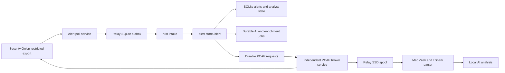

# Reliability And SLO Runbook

This is the current operational reference for the production reliability
controls introduced on 2026-07-13. Older planning documents are historical
context when they disagree with this file.

## Reliability Boundaries



The alert poller and PCAP broker are separate systemd jobs. A slow capture,
large rsync, or parser backlog cannot stop alert polling or five-minute
heartbeats. Public enrichment is asynchronous: `/alert` commits the alert and
a durable enrichment job before returning, while provider calls run after the
ingest transaction closes.

## Relay Services

| Unit | Schedule | Responsibility |
| --- | --- | --- |
| `so-alert-poll.service` | `so-alert-poll.timer`, every 5 minutes | Restricted export, durable outbox delivery, heartbeat. |
| `so-pcap-broker.service` | `so-pcap-broker.timer`, every minute | Claim, export, SSD spool, checksum, Mac transfer, completion. |
| `so-storage-health.service` | `so-storage-health.timer`, hourly | External-mount identity, capacity, temperature, and read-only SMART health. |

The legacy combined `so-alert-relay.timer` is disabled by the current installer
and retained only for controlled rollback compatibility.

The broker outer watchdog is 3,900 seconds and the systemd start limit is 70
minutes. This deliberately exceeds two independently bounded 30-minute rsync
legs plus export/checksum overhead. Interrupted transfers retain `.part` files
and resume with `--append-verify`.

```bash
systemctl list-timers --all so-alert-poll.timer so-pcap-broker.timer so-storage-health.timer --no-pager
systemctl status so-alert-poll.service so-pcap-broker.service so-storage-health.service --no-pager
journalctl -u so-alert-poll.service -u so-pcap-broker.service -u so-storage-health.service -n 100 --no-pager
```

The runtime-only relay outbox records an alert before delivery, leases it while
a worker owns it, and marks it delivered only after a successful webhook
response. Interrupted deliveries return to pending. `alert_id` is the
idempotency key, so replay cannot create a second outbox item.

Security Onion export uses timestamp plus `_id` ordering and Elasticsearch
`search_after` pagination. The page size is 500, normal ceiling is 5,000, and
hard cap is 20,000. Treat `query.saturated=true` as a backlog alarm rather than
a complete successful poll.

## Durable Mac Jobs

`alert-store` owns a reusable SQLite job queue. AI analysis and public
enrichment use unique `(job_type, dedupe_key)` jobs with priorities, attempts,
leases, exponential retry, and terminal states. Restarts requeue expired leases.

```bash
curl -fsS http://127.0.0.1:8787/jobs/stats
curl -fsS http://127.0.0.1:8787/jobs/status
curl -fsS http://127.0.0.1:8787/metrics
```

The n8n `Enrich Alert` node is a visible handoff, not a provider call. It marks
the item queued and forwards it to `/alert`. Alert-store atomically stores the
alert and queues enrichment; its worker owns provider calls, cache, rate limits,
and retries.

PCAP requests retain broker state and separate parser state:

```text
pending -> claimed -> fulfilled
analysis_status: pending -> processing -> completed | failed
```

Automatic requests coalesce on stable alert-group identity. A pending request
may be reused, but a leased request is never mutated. The parser reports to
`/pcap/analysis-status` and deletes raw broker-managed artifacts only after
validated Zeek and TShark evidence is durable.

## Alert Identity

Durable work uses a v2 SHA-256 identity built from rule identity, dataset,
source, destination, destination port, and transport. Severity, routing,
suppression, triage, and analyst state are excluded because they can change
without changing the detection.

The dashboard uses legacy group IDs during the compatibility period.
`alert_group_alias` maps each legacy group to stable v2 identity. The mapping
is refreshed with every single-group summary update and backfilled at startup.

## AI Context And Model Authority

`$HOME/n8n-local/config/ai_model_settings.json` is the model-routing source of
truth; the LaunchAgent does not hardcode a model. Prompt packages include group
timeline, public enrichment, parsed PCAP evidence, analyst state, suppression or
acknowledgement reason, and bounded prior local analyses. AI workers report
`processing`, `completed`, and `failed` durable job transitions.

Local inference has a ten-minute request budget and a 4,096-token output cap.
Ollama JSON mode constrains response syntax, and the runner accepts the first
complete JSON object when a model appends harmless trailing text. Truly
malformed output still fails the durable job and remains visible in the LLM
analysis log rather than being guessed or silently discarded.

## Container Reproducibility

Compose pins n8n and PostgreSQL by immutable image digest and enables
`no-new-privileges`. The alert-store proxy is read-only except for bounded
`tmpfs`. To update: pull and inspect the intended version, record its digest,
recreate the stack, validate workflow activation and synthetic intake, and roll
back to the previous digest if any gate fails. Never use a floating `latest`
tag in production Compose.

## SLOs And Alerts

| Signal | Target | Warning / action |
| --- | --- | --- |
| Relay heartbeat | Successful every 5 minutes | Critical when older than 20 minutes. |
| Alert ingest | Normal error rate 0; p95 below 500 ms | Investigate sustained errors or p95 above 1 second. |
| Enrichment jobs | Oldest pending below 15 minutes | Inspect provider latency, keys, cache, worker retries. |
| AI jobs | Highest-severity newest work continuously progresses | Inspect Ollama, LaunchAgent, leases, failed jobs. |
| PCAP broker | Pending age below 60 minutes normally | Inspect relay timer, export, rsync, parser state. |
| Relay SSD | Below 80 percent used plus free-space reserve | Stop new exports before spool exhaustion. |
| Relay SSD SMART | Healthy, zero media/critical errors, stable unsafe-shutdown baseline, below 70 C | Telegram failure after the configured consecutive-failure threshold; inspect disk, bridge, power, and previous-boot journal. |
| SQLite | `PRAGMA quick_check` returns `ok` | Stop writers, back up, follow DB recovery runbook. |
| SO export | `query.saturated=false` | Increase poll frequency or diagnose backlog before raising caps. |

`/metrics` reports aggregate ingest counters and latency, durable job depth and
age, PCAP state and age, Telegram outbox state, and SQLite size. It contains no
secrets or raw alert payloads.

## Verification Baseline

The isolated 2026-07-13 ingest test used a temporary database and port, 1,000
synthetic alerts, and 50 concurrent clients. All requests returned HTTP 200 at
532.5 requests per second. Median latency was 91.7 ms, p95 was 108.5 ms,
maximum latency was 109.2 ms, and SQLite integrity returned `ok`.

An online SQLite backup was restored to a separate temporary database and
returned `quick_check=ok` with all 7,243 alert rows present at the time of the
drill. The temporary load and restore databases were removed afterward.

Repeat stress tests only against an isolated temporary database. Never insert
synthetic rows into the live alert store.

On 2026-07-14, the production PCAP path was requalified with a recent capture
selection whose uncompressed source estimate was 31.61 GiB. Security Onion
produced a 3.63 GiB compressed archive, the relay completed both restricted
rsync/checksum legs, and the Mac produced durable Zeek/TShark JSON and Markdown.
All three transient copies were then absent: the Security Onion request
directory, relay `.tar`/`.part`, and Mac raw artifact. This validates current
large-transfer limits; it does not justify raising the 32 GiB ceiling.

## Recovery Checks

```bash
# Mac Studio
curl -fsS http://127.0.0.1:8787/health
curl -fsS http://127.0.0.1:8787/metrics
cd "$HOME/n8n-local" && /usr/local/bin/docker compose ps
sqlite3 "$HOME/n8n-local/alert_store_data/alerts.sqlite3" 'PRAGMA quick_check;'

# Relay
systemctl is-active so-alert-poll.timer so-pcap-broker.timer so-storage-health.timer
journalctl -u so-alert-poll.service -u so-pcap-broker.service -u so-storage-health.service -n 80 --no-pager
```

Before committing, run the secret scan, alert-data checks, unit tests, and
`git diff --check`. Runtime databases, outbox files, packet artifacts, generated
reports, provider responses, and live configuration remain outside Git.

## PCAP Spool Capacity

The production relay spool is a 1 TB ext4 SSD mounted by UUID at
`/mnt/onion-sentinel-pcap-spool` with `noatime,nosuid,nodev,noexec`. The `pcap`
directory is owned by `soalert`; the filesystem root is not generally writable.
Current limits are 32 GiB per artifact, a 100 GiB free-space reserve, and an 80
percent high-water mark. Successful checksum-verified transfers are deleted
from the relay immediately. These limits also protect the Security Onion `/nsm`
volume and Mac Studio, so increasing relay capacity alone is not a reason to
make captures unbounded.

The relay-to-Mac key is restricted by source address and a forced-command
intake wrapper. The wrapper permits only per-request directory preparation,
inbound rsync server mode, and size/SHA-256 verification under
`$HOME/n8n-local/pcap-evidence/artifacts`. It cannot obtain a shell, select an
arbitrary destination, send files from the Mac, or enable rsync deletion.

Mac archive extraction rejects traversal, links, device/FIFO entries, more
than 2,048 archive members, more than 40 GiB expanded data, or more than 256
PCAP files by default. Configure these through the placeholder-safe
`PCAP_MAX_ARCHIVE_MEMBERS`, `PCAP_MAX_EXTRACTED_BYTES`, and `PCAP_MAX_FILES`
environment variables.

Security Onion runs `onion-sentinel-pcapout-retention.timer` hourly as a
24-hour cleanup safety net. Successful broker completion still performs
immediate request-specific cleanup; the timer covers interrupted workflows.

## Open Deployment Qualification

During the 2026-07-13 controlled reboot validation, the Raspberry Pi did not
return to ICMP or SSH and required a hard power cycle. After recovery, the OS
reached multi-user in about 9 seconds and the Sabrent USB SSD enumerated and
mounted about 29 seconds after kernel start. No undervoltage, USB reset, UAS,
I/O, or ext4 errors were present in the recovered boot. Alert polling, PCAP
processing, NTP, and the n8n heartbeat then passed.

The failed boot could not be diagnosed because the Pi had volatile journal
storage. The relay installer now retains a size-capped 14 days of journal data,
and only the PCAP worker uses `RequiresMountsFor` on the external spool. A
missing SSD cannot block alert polling. Treat unattended soft reboot as an open
deployment qualification item until at least three consecutive reboot drills
pass and `journalctl -b -1` remains available after each boot.
