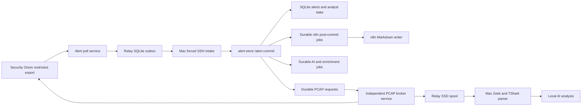

# Reliability And SLO Runbook

This is the current operational reference for the production reliability
controls introduced on 2026-07-13. Older planning documents are historical
context when they disagree with this file.

## Reliability Boundaries



The alert poller and PCAP broker are separate systemd jobs. A slow capture,
large rsync, or parser backlog cannot stop alert polling or five-minute
heartbeats. Public enrichment is asynchronous: `/alert` commits the alert and
a durable enrichment job before returning, while provider calls run after the
ingest transaction closes.

## Relay Services

| Unit | Schedule | Responsibility |
| --- | --- | --- |
| `so-alert-poll.service` | `so-alert-poll.timer`, every 5 minutes | Restricted export, durable outbox delivery, heartbeat. |
| `so-pcap-broker.service` | `so-pcap-broker.timer`, every minute | Sample `/nsm` telemetry, claim one request, stream bounded chunks to SSD, checksum, Mac transfer, completion. |
| `so-storage-health.service` | `so-storage-health.timer`, hourly | External-mount identity, capacity, temperature, and read-only SMART health. |

The legacy combined `so-alert-relay.timer` is disabled by the current installer
and retained only for controlled rollback compatibility.

The broker outer watchdog is 3,900 seconds and the systemd start limit is 70
minutes. This deliberately exceeds two independently bounded 30-minute rsync
legs plus export/checksum overhead. Interrupted transfers retain `.part` files
and resume with `--append-verify`.

```bash
systemctl list-timers --all so-alert-poll.timer so-pcap-broker.timer so-storage-health.timer --no-pager
systemctl status so-alert-poll.service so-pcap-broker.service so-storage-health.service --no-pager
journalctl -u so-alert-poll.service -u so-pcap-broker.service -u so-storage-health.service -n 100 --no-pager
```

The runtime-only relay outbox records an alert before delivery, leases it while
a worker owns it, and marks it delivered only after a successful per-item Mac
acknowledgement. Interrupted deliveries return to pending. `alert_id` is the
idempotency key, so replay cannot create a second outbox item. A bounded SSH
batch uses a dedicated forced-command key and pinned host key; permanent
message rejection is dead-lettered without blocking healthy rows.

Security Onion export uses timestamp plus `_id` ordering and Elasticsearch
`search_after` pagination. The page size is 500, normal ceiling is 5,000, and
hard cap is 20,000. Treat `query.saturated=true` as a backlog alarm rather than
a complete successful poll.

## Durable Mac Jobs

`alert-store` owns a reusable SQLite job queue. AI analysis, public enrichment,
and n8n post-commit reports use unique `(job_type, dedupe_key)` jobs with
priorities, attempts, leases, exponential retry, and terminal states. Restarts
requeue expired leases.

```bash
curl -fsS http://127.0.0.1:8787/jobs/stats
curl -fsS http://127.0.0.1:8787/jobs/status
curl -fsS http://127.0.0.1:8787/metrics
```

The preferred alert path does not place n8n before persistence. The forced SSH
wrapper submits each item to alert-store loopback; alert-store atomically stores
the alert and queues enrichment, AI, PCAP, notification, and report intent.
After commit, the `n8n_post_commit` worker calls the committed-alert webhook.
The workflow validates the shared token and committed payload before atomically
writing one deterministic Markdown report. An n8n outage can delay reports but
cannot lose or roll back alerts.

PCAP requests retain broker state and separate parser state:

```text
pending -> claimed -> fulfilled
analysis_status: pending -> processing -> completed | failed
```

Automatic requests coalesce on stable alert-group identity. A pending request
may be reused, but a leased request is never mutated. The parser reports to
`/pcap/analysis-status` and deletes raw broker-managed artifacts only after
validated Zeek and TShark evidence is durable.

The broker queue is intentionally serial at the relay and severity ordered at
alert-store: critical, high, medium, low, then informational. Within one
severity, the request closest to the configured Security Onion capture-retention
deadline runs first; creation time breaks any remaining tie newest-first. This
keeps urgent work ahead of routine captures while reducing avoidable expiry.

## Alert Identity

Durable work uses a v2 SHA-256 identity built from rule identity, dataset,
source, destination, destination port, and transport. Severity, routing,
suppression, triage, and analyst state are excluded because they can change
without changing the detection.

The dashboard uses legacy group IDs during the compatibility period.
`alert_group_alias` maps each legacy group to stable v2 identity. The mapping
is refreshed with every single-group summary update and backfilled at startup.

## AI Context And Model Authority

`$HOME/n8n-local/config/ai_model_settings.json` is the model-routing source of
truth; the LaunchAgent does not hardcode a model. Prompt packages include group
timeline, public enrichment, parsed PCAP evidence, analyst state, suppression or
acknowledgement reason, and bounded prior local analyses. AI workers report
`processing`, `completed`, and `failed` durable job transitions.

Local inference has a ten-minute request budget and a 4,096-token output cap.
Ollama JSON mode constrains response syntax, and the runner accepts the first
complete JSON object when a model appends harmless trailing text. Truly
malformed output still fails the durable job and remains visible in the LLM
analysis log rather than being guessed or silently discarded.

## Container Reproducibility

Compose pins n8n and PostgreSQL by immutable image digest and enables
`no-new-privileges`. The alert-store proxy is read-only except for bounded
`tmpfs`. To update: pull and inspect the intended version, record its digest,
recreate the stack, validate workflow activation and synthetic intake, and roll
back to the previous digest if any gate fails. Never use a floating `latest`
tag in production Compose.

## SLOs And Alerts

The AI worker reconciles durable `ai_analysis` queue intent against current AI,
prompt, and parsed-PCAP artifact timestamps before selecting more work. This
prevents an already-satisfied group from remaining pending indefinitely after
a duplicate alert or recovery replay re-enqueues its stable group ID.
Durable jobs preserve `last_completed_at` across later re-enqueues so health
monitoring can prove forward progress without confusing current pending state
with the absence of a prior successful run.

The scheduler carries `stable_group_id` from selection through every durable
job callback. During a rolling upgrade, alert-store also resolves a legacy
dashboard group ID through `alert_group_alias` before changing job state. This
compatibility belongs at the serialized SQLite write boundary; it prevents a
successful analysis from leaving its stable V2 queue row pending merely because
an older worker completed with the former group identifier.

PCAP requests persist `transfer_duration_seconds` from relay claim through the
terminal broker update. This includes Security Onion export, both resumable
transfer hops, checksum verification, and Mac ingest. The System Health PCAP
workflow log displays the elapsed time; legacy rows are backfilled from
`claimed_at` and `completed_at` when both timestamps are available.

| Signal | Target | Warning / action |
| --- | --- | --- |
| Relay heartbeat | Successful every 5 minutes | Critical when older than 20 minutes. |
| Alert ingest | Normal error rate 0; p95 below 500 ms | Investigate sustained errors or p95 above 1 second. |
| Enrichment jobs | Oldest pending below 15 minutes | Inspect provider latency, keys, cache, worker retries. |
| AI jobs | Active processing advances within 15 minutes; an idle worker with pending work completes within 30 minutes | Inspect PCAP evidence arrival, Ollama, LaunchAgent, leases, and failed jobs. The 30-minute idle threshold permits two bounded inference/scheduler retry windows, while an actively claimed job retains the tighter progress deadline. |
| PCAP broker | No request older than 20 minutes without fresh transfer progress | Fresh 30-second transfer heartbeats receive a bounded, size-aware queue grace; stale heartbeats revert immediately to the 20-minute warning. |
| Zeek capture loss during PCAP export | Latest worker maximum at or below 0.1 percent; Zeek/Suricata local packet loss at or below 0.1 percent | Relay defers before claim and between chunks when telemetry is missing, stale, or above threshold. Security Onion reads and relay-to-Mac rsync are both capped at 4 MiB/s by default. Keep the timer paused if a controlled export breaches the target. |
| Relay SSD | Below 75 percent used with at least 200 GiB free | Stop new streams before spool exhaustion. |
| Relay root SD card | Below 75 percent used with at least 2 GiB free | Stop new writes, prune seven-day relay-owned evidence, and alert before the 80 percent hard ceiling. |
| Mac Studio data volume | Below 75 percent used with at least 50 GiB free after projected work | Reject new alert/enrichment writes, PCAP intake/extraction, AI work, and backups before the 80 percent hard ceiling. Heartbeats and drain/cleanup state remain available. |
| Security Onion `/nsm` | Managed by Security Onion | Report utilization as telemetry only. Onion Sentinel stages zero bytes, runs no retention writer, never deletes native captures, and does not refuse read-only PCAP exports based on disk use. |
| Relay SSD SMART | Healthy, zero media/critical errors, stable unsafe-shutdown baseline, below 70 C | Telegram failure after the configured consecutive-failure threshold; inspect disk, bridge, power, and previous-boot journal. |
| SQLite | `PRAGMA quick_check` returns `ok` | Stop writers, back up, follow DB recovery runbook. |
| SO export | `query.saturated=false` | Increase poll frequency or diagnose backlog before raising caps. |

Run `operations/verify-stack.zsh` with `PCAP_TIMER_EXPECTED_STATE=safety-hold`
when controlled transfer qualification has breached the capture-loss target and
the relay PCAP timer is intentionally disabled. The default remains `active` so
an unexplained stopped timer still fails normal deployment verification.

The stream manifest uses Security Onion-local signed chunk capabilities. A
normal capture rotation cannot invalidate an in-flight manifest merely because
the directory listing changed; the wrapper validates the exact authorized
source identity and rejects substitutions. A healthy run must leave
zero Onion Sentinel packet artifacts or work directories under `/nsm`.

Security Onion applies no total wall-clock limit to a healthy read. The relay
observes the growing partial file and terminates a stream only when no bytes
arrive for the configured idle interval. This permits large, slow captures to
finish without allowing an indefinitely stalled SSH process.

`/metrics` reports aggregate ingest counters and latency, durable job depth and
age, PCAP state and age, Telegram outbox state, SQLite size, and a bounded
`pipeline` snapshot. Pending PCAP age is measured from the latest request
refresh because repeated detections can update an existing group request
without creating another row. It contains no secrets or raw alert payloads.

The pipeline snapshot covers alert ingest, public enrichment, PCAP transfer,
PCAP analysis, and AI analysis. Each stage reports queued and active counts,
oldest-item age, known and unknown byte backlog, 15-minute/1-hour/24-hour input
and completion rates, pressure ratio, and count- and byte-based drain ETAs.
`eta_seconds=0` means no backlog. A null ETA with queued work means no recent
completion rate exists and must be treated as stalled or not yet measurable,
not as healthy. Unknown-size items remain explicit rather than being guessed.

Disk samples are captured at most every five minutes. After sufficient history,
the snapshot reports net byte growth and a projected time to the 75-percent
start limit. It also projects utilization after the known byte backlog lands;
the SLO evaluator fails before that projection reaches 75 percent. The event
and disk-sample rows contain only stage transitions, identifiers, byte counts,
and timestamps and are pruned after seven days by default. They are operational
telemetry, not the source of truth for alert, analyst, or queue state.

The Mac Studio LaunchAgent runs `evaluate-operational-slos.py` through the
existing stateful stack monitor every five minutes. It fails the monitor when
the heartbeat is older than 20 minutes, enrichment is older than 15 minutes,
an active AI claim has made no state progress for 15 minutes, an idle AI worker
with pending work has made no completion for 30 minutes, a PCAP request is older
than 20 minutes without a fresh large-transfer heartbeat, recent PCAP workflow
warnings exist, ingest errors increase, runtime disk use reaches 75 percent,
or a verified backup becomes stale. The monitor sends one Telegram transition
message and one recovery message rather than repeating the same alarm every
cycle. Its runtime-only snapshot is
`$HOME/n8n-local/logs/operational-slo-snapshot.json`. A bounded 14-day history
is retained in `operational-slo-history.jsonl`; its `soak.healthy_since` clock
resets on any failed evaluation and `soak.qualified_48h` becomes true only
after 48 uninterrupted hours.

## Verified Recovery Bundles

Hourly alert-store maintenance continues to make online SQLite backups and run
`PRAGMA quick_check`. It uses a bounded busy timeout and retry window so an
ordinary alert-store write transaction cannot create a false backup outage.
Temporary backup targets from interrupted runs are removed only after they are
30 minutes old, while completed backups are promoted atomically after their own
independent `quick_check` succeeds.
A separate daily LaunchAgent creates an atomic recovery
bundle under `$HOME/n8n-local/recovery_backups` containing:

- an independently verified SQLite backup;
- an n8n PostgreSQL custom-format dump validated with `pg_restore --list`;
- the local `.env`, n8n encryption configuration, model/prompt configuration,
  and agent memories needed to decrypt and restore the operational runtime;
- a manifest with byte counts, SHA-256 hashes, and the alert-row count.

Recovery bundles are mode `0700` with files mode `0600`, retained for seven
days, and never copied into Git. They contain secrets and operational data, so
replicate them only to an operator-controlled encrypted backup target. A copy
on the same Mac protects against application corruption, not host or disk loss.

```bash
# Create and verify a bundle immediately.
python3 "$HOME/n8n-local/bin/backup-onion-sentinel-runtime.py"

# Inspect metadata without exposing secret-bearing archive contents.
python3 -m json.tool "$HOME/n8n-local/recovery_backups/$(ls -1 "$HOME/n8n-local/recovery_backups" | tail -1)/manifest.json"
```

The SQLite SLO is healthy when the newest hourly backup is at most two hours
old. The PostgreSQL/runtime SLO is healthy when the newest daily bundle is at
most 26 hours old.

## Production Soak

After a reliability deployment, preserve 48 continuous hours of SLO snapshots
before declaring the milestone qualified. The soak passes only when heartbeat
age remains below 20 minutes, ingest errors do not increase, durable AI and
enrichment work continues to drain, no PCAP request remains stale, both backup
SLOs remain healthy, SQLite maintenance stays green, and relay storage health
does not transition to failed. A reboot or service interruption resets the
continuous-soak clock; an expected empty PCAP or expired historical request
does not.

Generate the current acceptance report without changing production state:

```bash
python3 "$HOME/n8n-local/bin/report-production-soak.py"
```

The report requires at least 48 continuous healthy hours, no failed samples,
at least 90 percent of the expected five-minute samples, and no gap between
samples longer than 12 minutes. Before 48 hours it reports `in_progress`, not a
false pass. Runtime-only JSON and Markdown reports are written under
`$HOME/n8n-local/logs/soak-reports` and contain operational metrics rather than
alert payloads.

## Isolated Restore Drill

Run a complete restore drill against the newest recovery bundle without
stopping or writing to production:

```bash
python3 "$HOME/n8n-local/bin/run-recovery-restore-drill.py"
```

The drill verifies every manifest hash, copies and opens SQLite read-only,
runs `PRAGMA quick_check`, compares the restored alert-row count with the
manifest, and inspects the secret archive for required n8n encryption material
without extracting it. It then restores the PostgreSQL custom-format dump into
a disposable container using the exact pinned production image. The container
has `--network none`, a temporary data filesystem, no production credentials,
and is forcibly removed on success or failure. The drill passes only when the
n8n schema and workflow table are present. Its runtime-only result is stored
under `$HOME/n8n-local/logs/restore-drills`.

## Verification Baseline

The isolated 2026-07-13 ingest test used a temporary database and port, 1,000
synthetic alerts, and 50 concurrent clients. All requests returned HTTP 200 at
532.5 requests per second. Median latency was 91.7 ms, p95 was 108.5 ms,
maximum latency was 109.2 ms, and SQLite integrity returned `ok`.

An online SQLite backup was restored to a separate temporary database and
returned `quick_check=ok` with all 7,243 alert rows present at the time of the
drill. The temporary load and restore databases were removed afterward.

Repeat stress tests only against an isolated temporary database. Never insert
synthetic rows into the live alert store.

The 2026-07-14 staged-artifact qualification is retained as historical evidence,
but that data plane is retired. On 2026-07-15, failed 34 GiB exports demonstrated
that a tar plus matching work directory could consume roughly twice the request
size and pressure `/nsm`. Those artifacts were removed and the architecture was
changed to stateless per-rotation streaming. A new qualification must show zero
Onion Sentinel packet artifacts and no Onion Sentinel work directory under
`/nsm` throughout the request.

## Recovery Checks

```bash
# Mac Studio
curl -fsS http://127.0.0.1:8787/health
curl -fsS http://127.0.0.1:8787/metrics
cd "$HOME/n8n-local" && /usr/local/bin/docker compose ps
sqlite3 "$HOME/n8n-local/alert_store_data/alerts.sqlite3" 'PRAGMA quick_check;'

# Relay
systemctl is-active so-alert-poll.timer so-pcap-broker.timer so-storage-health.timer
journalctl -u so-alert-poll.service -u so-pcap-broker.service -u so-storage-health.service -n 80 --no-pager
```

Before committing, run the secret scan, alert-data checks, unit tests, and
`git diff --check`. Runtime databases, outbox files, packet artifacts, generated
reports, provider responses, and live configuration remain outside Git.

## PCAP Spool Capacity

The production relay spool is a 1 TB ext4 SSD mounted by UUID at
`/mnt/onion-sentinel-pcap-spool` with `noatime,nosuid,nodev,noexec`. The `pcap`
directory is owned by `soalert`; the filesystem root is not generally writable.
Current relay limits are 128 GiB per artifact, a 200 GiB free-space reserve, and
a 75 percent high-water mark. The Security Onion wrapper considers at most 12
time-overlapping source rotations, bounds each source to 1.1 GiB, and permits
one low-priority stream at a time. It scans each source once with a combined
tagged/untagged BPF and caps source reads at 4 MiB/s. `/nsm` utilization is
telemetry only because Onion Sentinel writes no packet artifacts on Security
Onion. Fresh Zeek capture-loss telemetry is a workload-protection gate: PCAP
work is deferred before claim or between chunks when the latest worker maximum
exceeds 1 percent. The broker timer uses a five-minute post-completion cooldown
and processes one request per invocation.
Successful checksum-verified relay artifacts are deleted only after the durable
alert-store completion acknowledgement. Retryable failures retain the relay SSD
copy, preserve transfer stage and byte progress, and use bounded exponential
backoff. The 24-hour abandoned-artifact retention remains a safety net for lost
broker state rather than the normal cleanup path.

The relay-to-Mac key is restricted by source address and a forced-command
intake wrapper. The wrapper permits only per-request directory preparation or
cleanup, inbound rsync server mode, and size/SHA-256 verification under
`$HOME/n8n-local/pcap-evidence/artifacts`. It cannot obtain a shell, select an
arbitrary destination, send files from the Mac, or enable rsync deletion.
If verification rejects a stale or corrupt destination, the relay removes only
that request directory, forces rsync checksum comparison, and retries once from
its already verified SSD copy. A second rejection remains a hard failure.

Mac archive extraction rejects traversal, links, device/FIFO entries, more
than 2,048 archive members, more than 40 GiB expanded data, or more than 256
PCAP files by default. Configure these through the placeholder-safe
`PCAP_MAX_ARCHIVE_MEMBERS`, `PCAP_MAX_EXTRACTED_BYTES`, and `PCAP_MAX_FILES`
environment variables.

Security Onion runs no Onion Sentinel retention writer. The production path is
read-only, creates no Security Onion artifact, and leaves native capture
retention to Security Onion.

## Deployment Qualification History

During the 2026-07-13 controlled reboot validation, the Raspberry Pi did not
return to ICMP or SSH and required a hard power cycle. After recovery, the OS
reached multi-user in about 9 seconds and the Sabrent USB SSD enumerated and
mounted about 29 seconds after kernel start. No undervoltage, USB reset, UAS,
I/O, or ext4 errors were present in the recovered boot. Alert polling, PCAP
processing, NTP, and the n8n heartbeat then passed.

The failed boot could not be diagnosed because the Pi had volatile journal
storage. The relay installer now retains a size-capped 14 days of journal data,
and only the PCAP worker uses `RequiresMountsFor` on the external spool. A
missing SSD cannot block alert polling. Treat unattended soft reboot as an open
deployment qualification item until at least three consecutive reboot drills
pass and `journalctl -b -1` remains available after each boot.

The relay reboot gate passed on 2026-07-14. Three consecutive unattended soft
reboots returned unique boot IDs, mounted the ext4 SSD at
`/mnt/onion-sentinel-pcap-spool`, restored the enabled `so-alert-poll.timer` and
`so-pcap-broker.timer`, and returned SMART `PASSED`. After the final boot the
first alert poll exported and durably delivered a nonzero batch with an empty
outbox, and produced a fresh successful Mac Studio health event. Keep
the legacy combined `so-alert-relay.timer` disabled; the split poll and PCAP
timers are the production units.

## Portal Event Stream Concurrency

The SOC alert event stream uses a short-lived, single-flight snapshot cache and
a five-second poll interval. Concurrent dashboard tabs therefore share one
SQLite/report snapshot instead of independently scanning the same runtime
state. Keep this cache bounded and invalidate the underlying API response
caches after analyst mutations.

After portal changes, hold at least four event streams open and issue repeated
`/healthz` requests. Health must remain responsive while the streams are
connected. This check protects against a regression where long-lived browser
tabs consume all portal request capacity.

The desktop and mobile API-rendered alert tables preserve an explicitly open
detail only across an in-page data refresh. Expansion state is never written
to browser storage, so a fresh navigation or reload starts collapsed and
cannot resurrect stale analyst context. Responsive acceptance covers 320,
390, 768, 1024, and 1440 pixel widths with no document-level horizontal
overflow; the mobile suppression textarea remains 16 px to prevent iOS zoom.
