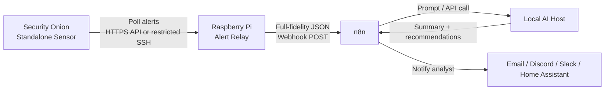

# Security Onion AI Alert Relay Plan

## Goal

- [ ] Confirm the goal and target architecture.

Build a Community Edition friendly alert-analysis pipeline where Security Onion is polled by a Raspberry Pi relay, and the relay forwards full-fidelity alert data to n8n or a local AI service.

The design keeps Security Onion and the AI hosts isolated from each other:

```text
Security Onion standalone
  -> Raspberry Pi polling relay
  -> n8n webhook or local AI intake API
  -> isolated AI analysis host
```

## Design Principles

- [ ] Review and accept the design principles.

- Keep Security Onion read-only from the relay's perspective.
- Do not allow the AI host to connect directly to Security Onion.
- Do not expose Elasticsearch directly to the Raspberry Pi if avoidable.
- Forward only normalized, minimized alert data.
- Deduplicate alerts before forwarding.
- Mark alerts as forwarded only after the downstream webhook succeeds.
- Start with advisory analysis only, not automated remediation.

## High-Level Architecture

- [ ] Review the high-level architecture.



## Recommended Network Layout

- [ ] Assign IPs/VLANs and confirm firewall direction.

Example addresses:

```text
Security VLAN:
  Security Onion: 192.168.1.7

Relay VLAN:
  VLAN: SOC_RELAY / VLAN 888
  Subnet: 10.88.8.0/24
  Gateway: 10.88.8.1
  Raspberry Pi: 10.88.8.8

AI VLAN:
  VLAN: VLAN_777 / AI Lab
  n8n Mac Studio: 10.77.7.225
  Local AI host: TBD
```

Recommended firewall rules:

```text
Pi -> Security Onion: allow TCP 22 for restricted SSH polling
Security Onion -> Pi: deny unless established replies
Pi -> n8n: allow TCP 5678 to 10.77.7.225
Pi -> AI host: optional, preferably only through n8n
AI host -> Security Onion: deny
n8n -> Security Onion: deny initially
Internet -> Pi: deny
Internet -> AI host: deny unless tightly controlled
```

Current pfSense VLAN 888 audit:

```text
Working:
- Pi can reach Security Onion SSH at 192.168.1.7:22.
- Pi can reach Mac Studio n8n at 10.77.7.225:5678.
- n8n health endpoint returns {"status":"ok"}.
- Pi is blocked from pfSense GUI at 10.100.4.1:10443.
- Pi is blocked from pfSense GUI at 192.168.1.1:10443.
- VLAN 888 gateway 10.88.8.1 is reachable from the admin Mac.

Remaining cleanup:
- Disabled Allow ALL rule should be deleted after validation confidence is high.
- SSH and n8n allow rules should be TCP only, not TCP/UDP.
- The n8n rule description should say n8n/webhook, not Security Onion SSH.
```

Recommended final VLAN 888 rules, top to bottom:

```text
Block IPv6 any -> any
Allow admin network or admin Mac -> 10.88.8.8 TCP/22 for Pi administration
Allow 10.88.8.8 -> 192.168.1.7 TCP/22
Allow 10.88.8.8 -> 10.77.7.225 TCP/5678
Allow 10.88.8.8 -> DNS server or This Firewall TCP/UDP 53
Allow 10.88.8.8 -> NTP server or This Firewall UDP/123
Allow 10.88.8.8 -> api.telegram.org or Internet TCP/443 for Telegram failure/recovery notices
Disabled except update windows: allow 10.88.8.8 -> Internet TCP/80,443 for OS package updates
Block/log VLAN 888 net -> any
```

Do not keep an `Allow ALL` rule on VLAN 888 after validation.

2026-07-01 reboot validation note:

```text
Pre-reboot state:
- so-alert-relay.timer enabled and active.
- Last pre-reboot relay run completed successfully.
- Last pre-reboot relay run posted 3 new alerts to n8n.

After issuing sudo reboot:
- 10.88.8.1 remained reachable.
- 10.88.8.8 did not respond to ping, SSH, ARP, or nmap host discovery.
- nmap -sn 10.88.8.0/24 found only 10.88.8.1.

Local console finding:
- Pi dropped into recovery/emergency shell.
- Root filesystem check was run with e2fsck -f -y /dev/mmcblk0p7.
- Pi booted normally after sync and reboot.

Validated after repair:
- SSH to 10.88.8.8 returned.
- so-alert-relay.timer is enabled and active after reboot.
- First post-boot scheduled relay run posted 14 new alerts to Mac Studio n8n.
- Follow-up relay run posted 2 new alerts and health_state.json reported status ok.
- n8n alert-store review showed 49 alerts in the last hour.
- New post-reboot alerts were not high/critical, so no new Telegram alert was expected.

Follow-up:
- Treat the SD card as suspect. If the Pi drops to recovery again, replace or reimage the card before trusting it as a production relay.
```

## Polling Options

- [x] Choose the polling method.

### Option A: Security Onion SOC/API Polling

- [x] Evaluate SOC/API polling on the installed Security Onion version.

Preferred if the installed Security Onion version exposes a stable API endpoint for the alert data you need.

Flow:

```text
Pi service
  -> authenticate to Security Onion API
  -> query recent alerts
  -> normalize and dedupe
  -> POST to n8n
```

Typical query logic:

```text
@timestamp >= now - lookback_window
AND alert-like event category/dataset
ORDER BY @timestamp ASC
LIMIT max_alerts_per_poll
```

Use a dedicated Security Onion user with the lowest available read-only privileges.

Status for this deployment: official SOC/API polling appears to require Security Onion API licensing, so this path is not being used for the Community Edition standalone deployment.

### Option B: Restricted SSH Wrapper

- [x] Evaluate restricted SSH wrapper polling.

Recommended fallback for a homelab Community Edition setup.

Flow:

```text
Pi service
  -> SSH to Security Onion with restricted key
  -> forced command runs a fixed query
  -> return JSON
  -> normalize and dedupe
  -> POST to n8n
```

The SSH key should be restricted with a forced command:

```text
command="/usr/local/sbin/export-recent-alerts",no-agent-forwarding,no-X11-forwarding,no-port-forwarding ssh-ed25519 AAAA...
```

The wrapper script should accept no arbitrary user input.

Current setup status:

- [x] Created dedicated `so-ai-relay` user on Security Onion.
- [x] Installed root-owned wrapper at `/usr/local/sbin/export-recent-alerts`.
- [x] Added sudoers rule at `/etc/sudoers.d/90-so-ai-relay-export`.
- [x] Installed forced-command SSH key in `/home/so-ai-relay/.ssh/authorized_keys`.
- [x] Tested that arbitrary SSH commands are ignored and alert JSON is returned.
- [ ] Restrict the SSH key with `from="PI_IP"` after the Raspberry Pi static IP is finalized.

Example wrapper concept:

```bash
#!/bin/bash
set -euo pipefail

sudo so-elasticsearch-query '*/_search' -d '{
  "size": 100,
  "sort": [{"@timestamp": {"order": "asc"}}],
  "query": {
    "bool": {
      "filter": [
        {"range": {"@timestamp": {"gte": "now-5m"}}},
        {"query_string": {"query": "event.dataset:alert OR event.kind:alert"}}
      ]
    }
  }
}'
```

Tune the query after inspecting which fields your Security Onion Alerts view uses.

## Alert Payload Schema

- [ ] Approve the normalized alert payload schema.

Forward a compact, normalized payload instead of the entire raw document.

Example:

```json
{
  "source": "security-onion",
  "sensor": "onion",
  "alert_id": "elastic_doc_id_here",
  "timestamp": "2026-06-30  12:34:56Z",
  "rule_name": "ET MALWARE Example",
  "rule_id": "2030000",
  "severity": "high",
  "category": "trojan-activity",
  "event_dataset": "suricata.alert",
  "src_ip": "192.168.1.50",
  "src_port": 51544,
  "dst_ip": "8.8.8.8",
  "dst_port": 443,
  "proto": "tcp",
  "host": "workstation-1",
  "message": "short alert message",
  "raw_truncated": {}
}
```

AI response schema:

```json
{
  "ai_summary": "Short explanation of what likely happened.",
  "severity_reasoning": "Why this is low/medium/high.",
  "recommended_actions": [
    "Pivot on source IP in Security Onion.",
    "Check host EDR or system logs.",
    "Look for repeated connections to the destination."
  ],
  "false_positive_hints": [
    "Known update service?",
    "Expected scanner?",
    "Internal lab traffic?"
  ],
  "confidence": "medium",
  "needs_human_review": true
}
```

## Raspberry Pi Deployment

- [ ] Deploy and harden the Raspberry Pi relay.

### 1. Install Base Packages

- [ ] Install Raspberry Pi base packages.

Use Raspberry Pi OS Lite 64-bit or Debian.

```bash
sudo apt update
sudo apt full-upgrade -y
sudo apt install -y python3 python3-venv python3-pip sqlite3 jq curl git ufw
```

### 2. Harden the Pi

- [ ] Apply Pi firewall and baseline hardening.

```bash
sudo timedatectl set-timezone America/Denver

sudo ufw default deny incoming
sudo ufw default deny outgoing

# DNS and NTP
sudo ufw allow out 53
sudo ufw allow out 123/udp

# Security Onion restricted SSH polling
sudo ufw allow out to 192.168.1.7 port 22 proto tcp

# n8n webhook
sudo ufw allow out to 10.77.7.225 port 5678 proto tcp

sudo ufw enable
```

### 3. Create Relay User

- [ ] Create the dedicated relay service user.

```bash
sudo useradd --system --home /opt/so-alert-relay --create-home --shell /usr/sbin/nologin soalert
sudo mkdir -p /opt/so-alert-relay/{app,state,logs}
sudo chown -R soalert:soalert /opt/so-alert-relay
```

### 4. Python App Layout

- [ ] Create the relay app directory layout.

```text
/opt/so-alert-relay/app/
  relay.py
  config.yaml
  requirements.txt

/opt/so-alert-relay/state/
  seen.sqlite3

/opt/so-alert-relay/logs/
  relay.log
```

`requirements.txt`:

```text
requests
PyYAML
python-dateutil
```

Create a virtual environment:

```bash
sudo -u soalert python3 -m venv /opt/so-alert-relay/app/.venv
sudo -u soalert /opt/so-alert-relay/app/.venv/bin/pip install -r /opt/so-alert-relay/app/requirements.txt
```

### 5. Relay Configuration

- [ ] Create the relay configuration file.

Example `config.yaml`:

```yaml
poller: ssh_wrapper

security_onion:
  host: 192.168.1.7
  ssh_user: so-ai-relay
  ssh_command: /usr/local/sbin/export-recent-alerts
  api_base_url: https://192.168.1.7
  verify_tls: false

n8n:
  webhook_url: http://10.77.7.225:5678/webhook/security-onion-alert
  token_env: N8N_RELAY_TOKEN

relay:
  poll_interval_seconds: 30
  lookback_minutes: 5
  max_alerts_per_poll: 100
  post_timeout_seconds: 10
  retry_attempts: 3
  dedupe_retention_days: 30
  max_raw_field_bytes: 4000
```

### 6. SQLite Dedupe Table

- [ ] Create the SQLite dedupe database.

```sql
CREATE TABLE IF NOT EXISTS seen_alerts (
  alert_id TEXT PRIMARY KEY,
  first_seen TEXT NOT NULL,
  forwarded_at TEXT NOT NULL
);
```

Relay behavior:

```text
load config
poll Security Onion
parse JSON hits
for each alert:
  compute stable alert_id
  skip if already seen
  normalize fields
  retain full-fidelity fields locally; restrict access to storage and reports
  POST to n8n
  if POST succeeds:
    mark alert_id as seen
sleep poll_interval_seconds
```

## n8n Workflow

- [ ] Build the n8n intake workflow.

Create an n8n workflow:

```text
Webhook Trigger
  -> Validate required fields
  -> Optional enrichment
  -> Call local AI model
  -> Store result
  -> Notify analyst
```

Use a shared secret header from the relay:

```http
X-Relay-Token: long-random-token
```

Suggested n8n validation:

```text
Required:
  alert_id
  timestamp
  rule_name or message
  source

Reject:
  missing token
  body larger than expected
  unknown source
```

## Local AI Prompt

- [x] Configure the local AI analysis prompt.

Implemented runtime prompt path:

```text
$HOME/n8n-local/config/soc_analyst_system_prompt.md
```

The SOC Alerts Settings page lets an authenticated LAN Portal admin edit and
save this `SOC Analyst` system prompt:

```text
http://10.77.7.225:8765/view/b68c5a48b9778061/settings.html
```

Use a bounded prompt:

```text
You are analyzing a Security Onion alert.
Use only the provided alert fields.
Do not invent packet contents, files, users, hostnames, or command lines.
Return JSON with:
  summary
  severity_reasoning
  recommended_actions
  false_positive_hints
  confidence
  needs_human_review
```

Keep the first version advisory only.

## Sanitization Rules

- [ ] Implement sanitization rules before forwarding.

Before forwarding to n8n or AI:

- Truncate long fields.
- Retain packet payloads in full-fidelity mode for local evidence review.
- Drop credentials, cookies, auth headers, API keys, and tokens.
- Consider hashing internal hostnames if needed.
- Preserve the original alert ID for manual pivoting in Security Onion.
- Avoid sending full raw event documents unless explicitly required.

## systemd Service

- [ ] Install and enable the relay systemd service.

Create `/etc/systemd/system/so-alert-relay.service`:

```ini
[Unit]
Description=Security Onion Alert Relay
After=network-online.target
Wants=network-online.target

[Service]
User=soalert
Group=soalert
WorkingDirectory=/opt/so-alert-relay/app
ExecStart=/opt/so-alert-relay/app/.venv/bin/python /opt/so-alert-relay/app/relay.py
Restart=always
RestartSec=10
Environment=PYTHONUNBUFFERED=1
Environment=N8N_RELAY_TOKEN=replace-with-long-random-token

[Install]
WantedBy=multi-user.target
```

Enable and monitor:

```bash
sudo systemctl daemon-reload
sudo systemctl enable --now so-alert-relay
sudo journalctl -u so-alert-relay -f
```

## Security Onion Side

- [ ] Configure Security Onion read-only access for the relay.

Create a dedicated read-only account, for example:

```text
so-ai-relay
```

If using API polling:

- Give this account the lowest role that can read alerts.
- Store credentials on the Pi in a root-owned or `soalert`-owned config file with `0600` permissions.

If using SSH wrapper:

- Use a dedicated Linux account.
- Use a forced command in `authorized_keys`.
- Do not permit shell access.
- Permit only the export script.
- Keep the export script fixed and non-interactive.

## Reliability Defaults

- [ ] Configure relay reliability defaults.

Recommended starting values:

```yaml
poll_interval_seconds: 30
lookback_minutes: 5
max_alerts_per_poll: 100
post_timeout_seconds: 10
retry_attempts: 3
dedupe_retention_days: 30
max_raw_field_bytes: 4000
```

Important:

- Use overlapping polling windows.
- Deduplicate by Security Onion document ID when available.
- Otherwise deduplicate by a hash of timestamp, rule, source, destination, and event ID.
- Mark as seen only after successful downstream delivery.
- If n8n is down, retry and keep alerts unmarked.
- Log metadata, not full sensitive alert payloads.

## MVP Build Order

- [ ] Work through the MVP build order.

- [x] Defer Raspberry Pi setup and prototype from this Mac first.
- [x] Build local Mac relay prototype.
- [x] Pull alert JSON from Security Onion using the restricted SSH wrapper.
- [x] Add local SQLite dedupe.
- [x] Add local file-output mode for development.
- [x] Add webhook forwarding from the Mac and test with a local mock endpoint.
- [x] Add n8n webhook forwarding from the Mac.
- [x] Test end-to-end Security Onion -> Mac relay -> local n8n.
- [x] Choose Mac Studio as the n8n host: `10.77.7.225`.
- [x] Import and activate the Phase 1 workflow on Mac Studio n8n.
- [x] Test end-to-end Security Onion -> Mac relay -> Mac Studio n8n.
- [x] Add internal SQLite backend for Mac Studio n8n dedupe and storage.
- [x] Test end-to-end Security Onion -> Mac relay -> Mac Studio n8n -> SQLite.
- [x] Add deterministic n8n triage scoring.
- [x] Test end-to-end Security Onion -> Mac relay -> Mac Studio n8n -> SQLite triage.
- [x] Add Telegram notification routing for high/critical alerts.
- [x] Add Telegram bot token and confirm phone delivery.
- [x] Add alert review report CLI and first Obsidian Markdown report.
- [x] Move scoring/tuning rules into a JSON config file.
- [x] Add rescore action for applying tuning changes to existing alerts.
- [x] Complete first tuning pass for repeated internal scan/curl noise.
- [x] Run real nmap validation against `<example_ip>`; current tuning scores it as medium.
- [ ] Put the Pi on the relay VLAN.
- [ ] Apply outbound-only firewall rules.
- [x] Decide API polling vs restricted SSH wrapper.
- [ ] Build a relay that prints alerts to stdout.
- [ ] Add SQLite dedupe.
- [x] Add full-fidelity JSON normalization.
- [x] Add n8n webhook forwarding.
- [x] Add n8n token validation.
- [x] Add n8n-side SQLite dedupe and storage.
- [x] Add deterministic triage score, level, traffic direction, and routing.
- [x] Make deterministic triage configurable without editing workflow code.
- [x] Add Telegram notification routing.
- [x] Add Obsidian investigation-note export for high/critical alerts.
- [x] Schedule Mac-side relay polling and report export with launchd.
- [x] Add Mac Studio LaunchAgent to keep Docker n8n stack running after login/reboot.
- [x] Move relay polling from this Mac to Raspberry Pi at `10.88.8.8`.
- [x] Restrict Security Onion relay SSH key to `from="10.88.8.8"`.
- [x] Add Pi systemd timer for 5-minute relay polling.
- [x] Supersede relay-side noise drops by moving drop/suppression policy to Mac Studio alert-store.
- [x] Add Pi relay failure/recovery notification wrapper.
- [x] Add Mac Studio n8n/alert-store failure monitor LaunchAgent.
- [x] Allow Pi DNS and outbound TCP/443 for direct Telegram failure notifications.
- [x] Add daily SQLite-backed SOC rollups for local AI context.
- [ ] Add local AI summarization.
- [x] Add analyst notification.
- [x] Add monitoring for relay failures.
- [ ] Review forwarded payloads for sensitive fields.
- [ ] Consider controlled enrichment after the basic pipeline is stable.

## Things to Avoid

- [ ] Review anti-goals before enabling the pipeline.

- Do not expose Elasticsearch directly to the Pi.
- Do not let the AI host query Security Onion.
- Do not send full packet payloads to hosted LLMs by default; local dashboard/SQLite may retain them.
- Do not modify Security Onion managed Salt/ElastAlert internals unless you are ready to maintain those changes across updates.
- Do not start with automatic containment or remediation.

## Final Recommended Shape

- [ ] Confirm final deployment shape.

For a free Community Edition standalone Security Onion deployment:

```text
Security Onion
  -> restricted read-only polling
  -> Raspberry Pi relay
  -> n8n webhook
  -> local AI host
  -> analyst notification
```

This keeps the system maintainable, limits trust boundaries, and avoids depending on Pro-only notification features.

## Current Deployment Update

As of 2026-07-01, the Raspberry Pi relay is intentionally transport-focused:

```text
Security Onion -> Pi transport/dedupe -> n8n -> alert-store policy engine -> reports/Telegram/UI
```

The Pi should not own normal rule filtering. Its config should keep:

```json
"filters": {
  "drop_alerts": []
}
```

Mac Studio alert-store now owns:

- deterministic scoring
- hard `drop_rules`
- TTL-based `suppress_rules`
- escalation thresholds
- notification routing
- Markdown report decisions

For the LAN Portal, the current Markdown-generated UI is acceptable for modest
report counts. The recommended high-volume path is a SQLite-backed SOC Alerts
API with pagination/search/metrics, while Markdown remains the local AI
reference corpus.
