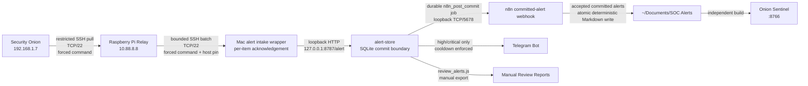
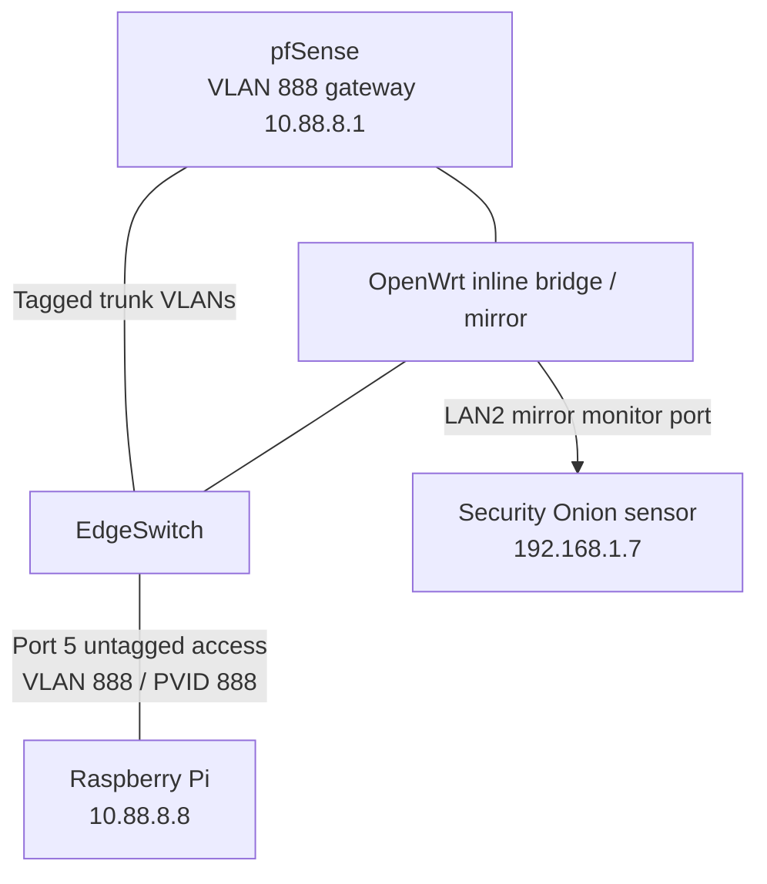
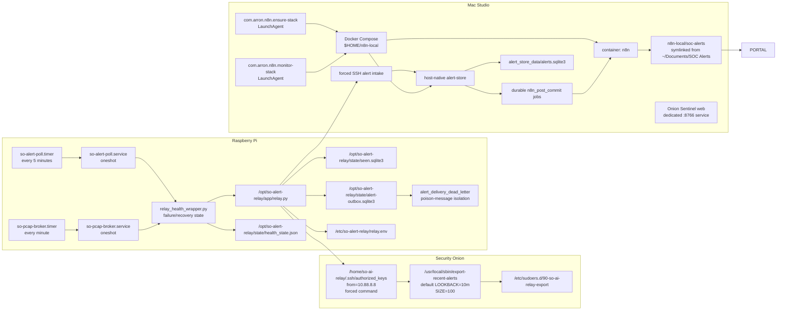
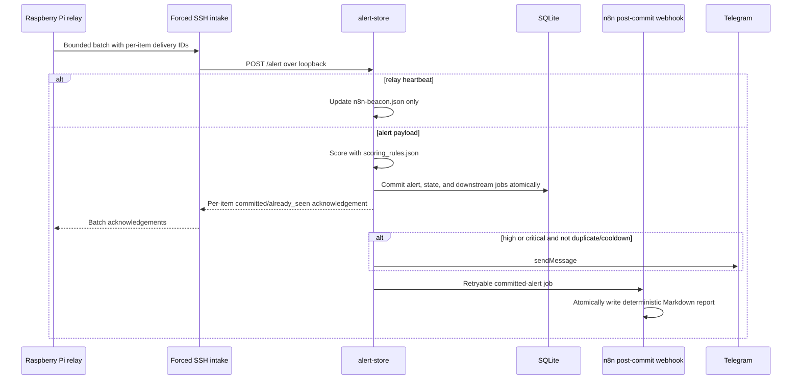

# Security Onion Alert Relay Architecture

## Current State

The live alert relay path has been moved off this Mac and onto the Raspberry Pi.

```text
Security Onion -> Raspberry Pi relay -> Mac Studio alert-store SQLite -> n8n post-commit reports / Telegram / portal
```

This Mac is no longer part of the live polling path. The old local relay LaunchAgent, local report LaunchAgent, and Obsidian/report sync helper have been removed.

Current design boundary:

```text
Pi relay: transport, exact alert-id retry dedupe, bounded SSH batches, local evidence files
Mac Studio alert-store: durable commit, scoring, policy, state, notifications, downstream jobs
Mac Studio n8n: post-commit Markdown report creation for accepted alerts
Onion Sentinel portal: SQLite-backed analyst API with Markdown/JSON evidence corpus
```

Reliability update (2026-07-13): alert polling and PCAP brokerage now run as
independent systemd timers; alert delivery uses a durable relay outbox and a
forced-command SSH commit boundary;
enrichment and AI use durable Mac Studio jobs; Security Onion alert export is
deterministically paginated. See `docs/reliability-and-slo-runbook.md` for the
authoritative service inventory and SLOs.

## Network Segments

| Segment | VLAN | Subnet | Purpose | Important Hosts |
| --- | ---: | --- | --- | --- |
| Security Onion / LAN | Native/LAN | `192.168.1.0/24` | Security Onion management and restricted alert export | `192.168.1.7` Security Onion |
| SOC Relay | `888` | `10.88.8.0/24` | Isolated Raspberry Pi relay network | `10.88.8.1` pfSense gateway, `10.88.8.8` Raspberry Pi |
| AI Lab | `777` | `10.77.7.0/24` | n8n and future AI workflow hosts | `10.77.7.225` Mac Studio |
| Network Management | `100` | `192.168.100.0/24` | Network/admin devices | Admin workstation/subnet, network gear |

## Host Inventory

| Host | IP | Role | Runs |
| --- | --- | --- | --- |
| Security Onion | `192.168.1.7` | Alert source | Restricted SSH wrapper `/usr/local/sbin/export-recent-alerts` |
| Raspberry Pi relay | `10.88.8.8` | Poller, forwarder, PCAP broker, and relay health monitor | `so-alert-poll.timer`, `so-pcap-broker.timer`, durable outbox, `relay_health_wrapper.py` |
| Mac Studio | `10.77.7.225` | Workflow engine, storage, and stack health monitor | Docker Desktop, n8n, alert-store, SQLite, Telegram notification logic, `com.arron.n8n.monitor-stack` |
| This Mac | varies | Admin/development workstation | Obsidian vault, project source copies, manual report generation only |
| pfSense | `10.88.8.1` on VLAN 888 | Router/firewall | VLAN 888 gateway and access rules |
| OpenWrt tap/mirror bridge | inline | Packet visibility path | VLAN trunk pass-through and LAN2 mirror output to Security Onion |
| EdgeSwitch | switch fabric | Access/trunk switching | Port 5 as VLAN 888 untagged access for Pi |

## End-To-End Data Flow



## Network Path



## Control Plane And Services



## Raspberry Pi Relay

| Item | Value |
| --- | --- |
| SSH | `<relay_user>@10.88.8.8` |
| Service user | `soalert` |
| App path | `/opt/so-alert-relay/app/relay.py` |
| Health wrapper | `/opt/so-alert-relay/app/relay_health_wrapper.py` |
| Config | `/opt/so-alert-relay/app/config.json` |
| Secret env | `/etc/so-alert-relay/relay.env` |
| SSH hardening | `/etc/ssh/sshd_config.d/99-key-only-admin.conf` |
| Security Onion key | `/opt/so-alert-relay/keys/so-ai-relay_ed25519` |
| Security Onion PCAP key | `/opt/so-alert-relay/keys/so-ai-relay-pcap_ed25519` |
| State DB | `/opt/so-alert-relay/state/seen.sqlite3` |
| Raw batches | `/opt/so-alert-relay/state/batches` |
| New alert files | `/opt/so-alert-relay/state/new-alerts` |
| Alert timer/service | `/etc/systemd/system/so-alert-poll.timer`, `so-alert-poll.service` |
| PCAP timer/service | `/etc/systemd/system/so-pcap-broker.timer`, `so-pcap-broker.service` |
| Durable delivery outbox | `/opt/so-alert-relay/state/alert-outbox.sqlite3` |
| Mac alert-intake key | `/opt/so-alert-relay/keys/macstudio-alert-ingest_ed25519` |
| Pinned Mac host keys | `/opt/so-alert-relay/keys/macstudio_known_hosts` |

The Pi pulls alert JSON from Security Onion, deduplicates alert IDs with local
SQLite for retry safety, writes local state, and delivers bounded batches to a
Mac Studio forced-command intake wrapper. Normal rule filtering is intentionally not done on the Pi. The live Pi
config keeps `filters.drop_alerts` empty so tuning can move with the Mac Studio
workflow if the forwarding method changes later.

Alert delivery uses a durable SQLite outbox, a dedicated least-privilege SSH
key, strict Mac host-key pinning, bounded batches, and per-item
acknowledgements. Transient failures stay queued; permanent malformed items are
dead-lettered independently. The Mac wrapper can only POST bounded JSON to the
loopback alert-store endpoint. Alert-store commits the alert and downstream
intent in one SQLite transaction before acknowledging the relay.

Markdown creation is post-commit. Alert-store queues a unique
`n8n_post_commit` job by alert ID and retries n8n independently. The n8n report
writer uses a stable filename and atomic rename, so a response-loss replay
overwrites the same report instead of creating another one. The former HTTP
webhook transport remains disabled as a rollback path.

PCAP fulfillment is brokered separately from alert polling. Alert-store owns the
request queue and exposes pending/claim/complete state. The relay should poll a
relay-safe n8n broker/proxy endpoint, claim pending requests, and use a separate
Security Onion forced-command key that can run only
`/usr/local/sbin/export-pcap-window`. The wrapper validates the request JSON,
uses bounded time windows, and emits one tuple-filtered Security Onion rotation
to SSH stdout at a time. The relay writes the stream directly to its external
SSD and checkpoints it before requesting the next chunk. Onion Sentinel stages
zero bytes on Security Onion.

The PCAP request should include `suricata.capture_file` whenever that field is
available in the raw Security Onion event. Alert-store and the dashboard resolve
group-based requests back to a concrete representative alert row before
queueing PCAP, so the request carries the exact tuple, timestamp, and capture
file instead of a multi-day grouped summary. On Security Onion, the wrapper
validates that the capture path stays under `/nsm/suripcap`, tries that file
first, and combines VLAN-aware and plain tuple filters into one BPF expression.
This covers tagged and untagged captures without scanning a rotation twice.

The current production PCAP data plane is:

```mermaid
flowchart LR
  Q["n8n metadata-only request"] --> R["Relay claims one request"]
  R --> M["Security Onion stream manifest"]
  M --> C["One bounded filtered rotation over SSH stdout"]
  C --> S["Relay 1 TB SSD checkpoint"]
  S -->|"repeat sequentially"| C
  S --> T["Relay builds tar locally"]
  T --> X["Resumable rsync to Mac Studio"]
  X --> P["Offline full-stream Zeek and TShark parser"]
  P --> E["Bounded summaries, coverage, and local query index"]
  E --> A["Local SOC Analyst"]
```



The Mac parser reads every capture artifact and every packet rather than a
prefix. Zeek produces bounded full-log aggregations; TShark produces exact
packet/byte/time coverage plus a deterministic representative field sample.
Parser processes have no role in the relay control plane and cannot delay alert
polling. They run unprivileged with a stripped environment, resource and output
ceilings, process-tree cleanup, and network denial on macOS when available.

The derived evidence artifact contains a private, bounded query index for one
optional local-model follow-up round. That interface exposes fixed read-only
operations only and cannot execute shell text, paths, regular expressions,
display filters, or parser options. Raw captures are not retained as model
tools, and packet samples or query results are removed from hosted-model
payloads.

Escalated Incident Response cases use a fixed baseline evidence path and an
optional, separately restricted live endpoint OSQuery follow-up:

```mermaid
flowchart LR
  IR["Incident Response durable job"] --> C["Mac incident evidence collector"]
  C -->|"dedicated forced SSH key"| RB["Relay incident evidence broker"]
  RB -->|"dedicated forced SSH key"| SO["Security Onion incident wrapper"]
  SO --> Q["Five Elastic packs + seven OSquery packs"]
  Q --> A["KQL + exact DSL + exact OSquery SQL + bounded results"]
  A --> R["Initial Incident Response analysis"]
  R -->|"optional bounded requests"| L["Live endpoint OSQuery forced-command path"]
  L -->|"bounded evidence + audit"| F["Final Incident Response report"]
```



The fixed Elastic packs are alert context, network flow, DNS activity, host
telemetry, and cross-sensor timeline. The fixed OSquery packs are Security
Onion system inventory, logged-in users, listening ports, processes, packages,
scheduled tasks, and startup items. Security Onion constructs every baseline
request locally.

The optional live path accepts only Incident Responder requests against exact
operator aliases. Three validators enforce SELECT-only SQL, a reviewed table
allowlist, at most 8 requests, 200 rows per query, a 4 MiB response, and bounded
runtime. The endpoint-to-Fleet-ID map and Kibana authorization remain root-only
on Security Onion; the Mac and relay never receive them. Both SSH hops disable
forwarding, PTY allocation, user rc files, and arbitrary original commands.
The exact packs and live-query contract are in
`docs/incident-response-query-and-model-routing.md`.

The former `/nsm/pcapout/onion-sentinel` tar-staging path does not exist in the
current codebase. Each PCAP broker cycle queries restricted storage and Zeek
capture-loss metadata before claiming work. Disk utilization is visibility only
and never blocks a read-only export. A missing, stale, or over-threshold Zeek
sample defers PCAP work without claiming it. Security Onion manages native
capture retention and disk capacity. Alert polling remains a separate timer and
is not blocked by PCAP state.

Security Onion source reads are capped at 4 MiB/s by default, run under idle I/O
priority and positive CPU niceness, and are limited to one active stream. The
relay processes at most one PCAP request per invocation. Its timer waits five
minutes after the prior oneshot exits before starting another cycle, preventing
long transfers from turning a nominal interval into continuous back-to-back
capture scans.

Stream lifetime is progress-aware rather than bounded by total runtime. The
Security Onion wrapper keeps reading while packet bytes are available; the
relay stops only a stream that has produced no additional bytes for its
configured idle interval.

The systemd service calls `relay_health_wrapper.py`. The wrapper runs alert
delivery and PCAP broker processing as independent sub-steps, records combined
health state, sends a Telegram notification on first failure, suppresses
repeated failure spam, and sends a recovery notification once both sub-steps
succeed again. If alert delivery fails, PCAP broker processing is still
attempted. If PCAP broker processing fails, alert delivery is still attempted.
The wrapper exits nonzero when either sub-step fails so degraded service remains
visible in systemd, journald, Telegram health state, and the dashboard health
history.

Current alert timer:

```text
OnBootSec=2min
OnActiveSec=5min
OnUnitActiveSec=5min
AccuracySec=30s
Persistent=true
```

Current reboot behavior: `so-alert-poll.timer` and `so-pcap-broker.timer` are
enabled and active, `NetworkManager-wait-online.service` is enabled, and both
services are `Type=oneshot` jobs that exit between runs.

The PCAP timer uses `OnUnitInactiveSec=1min`, not `OnUnitActiveSec`. The cooldown
therefore begins only after the broker service exits. PCAP work remains
single-flight and capture-loss gated, so reducing idle recovery time does not
allow concurrent Security Onion reads.

Reboot validation update on 2026-07-01:

```text
Pre-reboot:
- Pi reachable at 10.88.8.8 over SSH.
- `so-alert-poll.timer` and `so-pcap-broker.timer` enabled and active.
- Relay service last run completed successfully.

Initial post-reboot problem:
- VLAN 888 gateway 10.88.8.1 stayed reachable.
- Pi 10.88.8.8 did not answer ping, SSH, ARP, or nmap host discovery.
- nmap -sn 10.88.8.0/24 found only 10.88.8.1.

Console recovery:
- Pi was in recovery/emergency shell.
- Root filesystem check was run with e2fsck -f -y /dev/mmcblk0p7.
- Pi booted normally after sync and reboot.

Validated after repair:
- SSH to 10.88.8.8 returned.
- both split relay timers are enabled and active after reboot.
- Post-boot scheduled relay runs delivered new alerts to the Mac commit boundary.
- /opt/so-alert-relay/state/health_state.json reported status ok.
- alert-store review on Mac Studio confirmed that post-reboot ingestion resumed.

Risk note:
- The SD card should be treated as suspect. If recovery mode happens again, replace or reimage the card before relying on the Pi for production relay duty.
```

Operational commands:

```bash
ssh <relay_user>@10.88.8.8 'systemctl list-timers --all so-alert-poll.timer so-pcap-broker.timer --no-pager'
ssh <relay_user>@10.88.8.8 'sudo journalctl -u so-alert-poll.service -u so-pcap-broker.service -n 40 --no-pager'
ssh <relay_user>@10.88.8.8 'sudo systemctl start so-alert-poll.service'
ssh -o BatchMode=yes -o PasswordAuthentication=no -o KbdInteractiveAuthentication=no -o PreferredAuthentications=publickey <relay_user>@10.88.8.8 'echo key_auth_ok'
```

Pi health state:

```text
/opt/so-alert-relay/state/health_state.json
```

Pi administrative SSH was hardened on 2026-07-01:

```text
Port: 22
PubkeyAuthentication: yes
PasswordAuthentication: no
KbdInteractiveAuthentication: no
PermitRootLogin: no
Config drop-in: /etc/ssh/sshd_config.d/99-key-only-admin.conf
```

## Security Onion Export

| Item | Value |
| --- | --- |
| Host | `aj@192.168.1.7` |
| Relay SSH user | `so-ai-relay` |
| Export wrapper | `/usr/local/sbin/export-recent-alerts` |
| Default lookback | `10m` |
| Default size | `100` |
| Sort order | newest first |
| Allowed sudo command | `/usr/local/sbin/export-recent-alerts` |
| Source restriction | `from="10.88.8.8"` |

The forced key on Security Onion permits only the Pi to run the export wrapper:

```text
from="10.88.8.8",command="sudo -n /usr/local/sbin/export-recent-alerts",no-agent-forwarding,no-X11-forwarding,no-port-forwarding,no-pty,no-user-rc ...
```

This Mac was tested after the source restriction and is denied by Security Onion when trying to use the relay key directly.

## Mac Studio n8n Stack

| Item | Value |
| --- | --- |
| SSH | `<mac_user>@10.77.7.225` |
| Compose directory | `$HOME/n8n-local` |
| n8n URL | `http://10.77.7.225:5678` |
| n8n container | `n8n` |
| alert-store host service | `com.arron.soc.alert-store` |
| alert-store Docker proxy | `alert-store` |
| SQLite DB | `$HOME/n8n-local/alert_store_data/alerts.sqlite3` |
| SOC Markdown reports | `$HOME/Documents/SOC Alerts` |
| Docker-mounted report directory | `$HOME/n8n-local/soc-alerts` |
| Onion Sentinel dashboard | `http://10.77.7.225:8766/` |
| Scoring config | `$HOME/n8n-local/alert_store/config/scoring_rules.json` |
| Review CLI | `$HOME/n8n-local/alert_store/review_alerts.js` |
| Investigation CLI | `$HOME/n8n-local/alert_store/investigation_notes.js` |
| Docker restart policy | `unless-stopped` |
| Docker stack helper | `$HOME/n8n-local/bin/ensure-n8n-stack.zsh` |
| Stack monitor | `$HOME/n8n-local/bin/monitor-n8n-stack.zsh` |
| LaunchAgent | `$HOME/Library/LaunchAgents/com.arron.n8n.ensure-stack.plist` |
| Monitor LaunchAgent | `$HOME/Library/LaunchAgents/com.arron.n8n.monitor-stack.plist` |

The Mac Studio LaunchAgent runs at login and every 5 minutes. It waits for Docker Desktop and then runs:

```bash
cd $HOME/n8n-local
/usr/local/bin/docker compose up -d
```

The Mac Studio monitor LaunchAgent also runs at login and every 5 minutes. It checks Docker, the `n8n` container, the `alert-store` container, n8n `/healthz`, and alert-store `/health`. It sends Telegram on first failure and on recovery.

The alert-store SQLite maintenance LaunchAgent runs hourly:

```text
com.arron.soc.alert-store-maintenance
$HOME/n8n-local/bin/maintain-alert-store-sqlite.zsh
```

It runs `PRAGMA quick_check`, verifies that `alert_group_summary` matches the
raw `alerts` table, writes verified `.backup` copies under
`$HOME/n8n-local/alert_store_backups`, retains the newest 10 verified hourly
backups, and creates `.recover` candidates when corruption is detected. The
separate daily recovery bundles provide longer disaster-recovery coverage. If
grouped state is stale,
it calls the local alert-store `/refresh-groups` endpoint and rechecks the
summary. It sends Telegram on failure and recovery transitions when Telegram
credentials are present in the runtime `.env`. It does not automatically replace
the live DB unless `ALERT_STORE_AUTO_RECOVER=1` is deliberately set for that
maintenance run. Alert-store itself runs host-native on the Mac Studio and opens
SQLite with a 30 second busy timeout, `DELETE` journaling, and `FULL`
synchronous writes. The Docker Compose `alert-store` service is only a TCP proxy
for n8n's Docker-network DNS name. Do not run the SQLite-writing alert-store
inside Docker against the macOS bind-mounted DB; that path produced repeat
`SQLITE_IOERR` and index corruption during summary rebuilds. Dashboard builders
should open the DB read-only; portal writes use the same busy timeout and
journal settings.

The n8n workflow also writes one Obsidian-compatible Markdown file for every
newly accepted alert. Duplicate and suppressed alerts are still tracked by
alert-store but do not create repeated Markdown reports.

Production workflow:

```text
Security Onion Alert Intake - Configurable Scoring
Workflow ID: j237Tnda0cPniG1e
Repo export: n8n/workflows/security-onion-configurable-scoring.workflow.json
```

PCAP broker proxy workflow:

```text
Onion Sentinel PCAP Broker Proxy
Workflow ID: onionSentinelPcapBroker
Repo export: n8n/workflows/onion-sentinel-pcap-broker.workflow.json
Production webhook paths: /pcap-requests, /pcap-claim, /pcap/progress, /pcap-complete
```

The PCAP proxy uses a separate n8n variable, `PCAP_BROKER_TOKEN`, and the relay
`pcap_broker.token` field must match it. Keep this broker token distinct from
the post-commit report token. The relay calls n8n over TCP/5678; n8n then calls
alert-store over the Docker-internal `alert-store:8787` service name without
storing the live broker token in workflow JSON or workflow history.

The workflow has a preferred post-commit route and a rollback-compatible legacy
route. Only the committed route may write reports:

| Order | Node | Responsibility |
| --- | --- | --- |
| 1 | `Committed Alert Webhook` | Receive only alerts already committed by alert-store |
| 2 | `Validate Committed Alert` | Validate the post-commit token and immutable committed payload |
| 3 | `Write SOC Markdown Report` | Atomically write the deterministic accepted-alert report into `/soc-alerts` |
| 4 | `Security Onion Alert Webhook` | Emergency rollback input for the retired direct-to-n8n relay path |
| 5 | `Validate Relay Request` / `Enrich Alert` / `Store Score And Filter Alert` | Validate and commit a rollback-path alert through alert-store |
| 6 | `Route Report Decision` / `Acknowledge Durable Alert Commit` | Return the commit result without writing a report on the rollback route |

The enrichment node is visible in n8n, but alert-store owns the asynchronous
enrichment service. The `/alert` transaction stores the alert and durable job;
a background worker extracts public IPs, domains, redacted public URLs, hashes, and
CVEs; skips private IPs/internal hostnames; honors configured API keys; caches
responses in SQLite; and records skipped/rate-limited source notes in the alert
detail bundle.

The enrichment stage is best-effort by design. Provider failures are retried by
the durable worker and recorded without rolling back alert storage. The store
node uses a 30 second
alert-store timeout and does not let a failed enrichment retry trigger surprise
public API work inside the storage path. Alert-store also maintains an indexed
group-key expression for `alert_group_summary` refreshes so high-volume inserts
do not degrade into avoidable table scans as JSON evidence grows.

Report path:

```text
$HOME/Documents/SOC Alerts
```

Implementation detail:

```text
$HOME/Documents/SOC Alerts -> $HOME/n8n-local/soc-alerts
```

The symlink keeps the visible report location under Documents for Obsidian
while Docker mounts the less-protected
`$HOME/n8n-local/soc-alerts` directory into the n8n container as
`/soc-alerts`.

The Onion Sentinel-owned builder reads SQLite and the Markdown corpus, then
writes the independently served dashboard tree:

```text
Source: $HOME/Documents/SOC Alerts
Builder: $HOME/n8n-local/onion-sentinel-dashboard/scripts/build_soc_alerts_dashboard.py
Refresh: $HOME/n8n-local/bin/refresh-soc-dashboard.py
Dashboard: http://10.77.7.225:8766/
```

Scaling note: the current SOC Alerts UI is generated from Markdown and is good
for analyst browsing at modest report counts. For large volumes, the recommended
path is SQLite-backed API pagination and metrics, with Markdown retained as the
local AI/reference corpus. See `soc-alert-storage-ui-scaling-architecture.md`.

Dashboard implementation:

```text
Dashboard URL: http://10.77.7.225:8766/
Primary UI source: $HOME/n8n-local/alert_store_data/alerts.sqlite3
LLM/report corpus: $HOME/Documents/SOC Alerts
```

The dashboard should use SQLite for alert tables, metrics, filters, suppressed
records, dropped records, and pagination. Markdown generation should continue
for accepted alerts so the local LLM has durable investigation notes to read.

The SOC Alerts dashboard builder reads the
SQLite `alerts` table as its primary source for metrics and uses the Onion Sentinel
API for table rows. The page ships an empty table shell, then fetches grouped
SQLite alert rows from `/api/soc-alerts` in page-numbered slices. The default
page size is 25 grouped detections, and analysts can choose larger page sizes
from the rows-per-page selector. Markdown detail content remains the local
AI/reference corpus, and full rendered detail is fetched lazily so initial page
load stays small.

2026-07-03 update: lazy detail loading is deployed. The builder writes full
rendered detail fragments to `SOC Alerts Web/details/<group_id>.html`, the
dedicated web service serves them directly through
`GET /api/soc-alerts/<group_id>/detail`. The table loads lightweight rows first
and fetches full Markdown/AI/raw-JSON detail only when a row is expanded.

2026-07-03 update: live dashboard updates are deployed through
`GET /api/soc-alerts/events`. The endpoint is a Server-Sent Events stream that
pushes analyst status counts, AI queue/activity state, n8n beacon data, and
SQLite metrics to the browser. The SOC Alerts page uses that stream for quick
metric and table refreshes, while retaining slower polling as a fallback.

Dashboard duplicate grouping direction: visible alert rows should be grouped by
`suppression_key` when available, otherwise by triage level, rule, source,
destination, and filter status. The dashboard should include a duplicate/repeat
count column derived from SQLite counts so repeated alerts are not displayed as
unrelated unique rows. The visible table row uses the newest alert in the group
as the representative event, while `Count` sums the grouped observations.

Grouped rows with duplicates include a `Duplicate Alert Timeline` in the
Detailed Alert Report. The timeline plots repeated alert members by time, while
the table expands counted observations so its row count matches the grouped
alert `Count`. The observation table is paginated at 25 rows per page by
default and lists firing timestamp, source IP, destination IP, destination port,
and short alert ID so analysts can distinguish short bursts from persistent
repeated detections without loading an unwieldy detail view.

Source port should not be part of this grouping key because it is usually an
ephemeral client port. Keep source port in alert details/raw JSON, but group the
dashboard table without it. Destination port can remain visible and may be used
in grouping if it is available in SQLite or extracted from `alert_json`.

SOC Alerts Flow page: the dedicated Onion Sentinel service includes a
`flow.html` page generated by `build_soc_alerts_dashboard.py`. It uses locally
bundled brand assets for Security Onion, Raspberry Pi, n8n, Apple, Ollama,
SQLite, Telegram, and the generated Onion Sentinel logo. It also renders an enrichment lane with local
provider logo/favicons for AbuseIPDB, GreyNoise, Shodan InternetDB, OTX,
URLhaus, VirusTotal, urlscan.io, Google Safe Browsing, PhishTank,
MalwareBazaar, ThreatFox, Shodan, CISA KEV, EPSS, and NVD; Censys uses a local
fallback badge if the official asset cannot be fetched. The layout uses
responsive lanes rather than absolute connector geometry so labels, arrows, and
service tiles stay readable on phone, tablet, laptop, desktop, and wide desktop
displays. An upper-right eye privacy button masks node IP addresses by default
and reveals them only when clicked. It shows this operational flow:

```text
Durable alert data plane
  Security Onion read-only alert export
    -> restricted SSH poll
  Raspberry Pi alert poller + SQLite outbox on VLAN 888
    -> retryable webhook + heartbeat
  Docker-hosted n8n alert workflow on Mac Studio
    -> validate and normalize; internal POST /alert
  alert-store + SQLite atomic commit
    -> score, group, dedupe, analyst state, and durable jobs

Independent public-enrichment worker
  alert-store durable job
    -> privacy and API-key gates, cache, retries, rate limits
    -> configured or keyless public providers
    -> normalized enrichment_json in SQLite

Independent PCAP evidence data plane
  n8n carries request metadata only
  Security Onion native capture rotations
    -> one bounded read-only SSH stream at a time
  Raspberry Pi PCAP broker + external SSD checkpoints
    -> relay-built artifact, checksum, resumable rsync
  Restricted Mac Studio artifact intake
    -> verify and claim
  Zeek + TShark parser
    -> bounded structured evidence; delete raw PCAP after durable success

SOC Analyst AI and outputs
  grouped alerts + enrichment + parsed PCAP + prior analyses + agent memory
    -> Ollama with the current configured local model
    -> AI findings, Markdown/JSON reports, and reusable memory lessons
  SQLite + reports
    -> Onion Sentinel API/dashboard
  notification outbox
    -> Telegram high/critical and health/recovery signals
```

Validation command after redeploy:

```bash
python3 $HOME/n8n-local/bin/refresh-soc-dashboard.py
```

Then confirm the served HTML contains `data-view="overview"`,
`flow-lane-ingress`, `flow-lane-pcap`, and `flow-enrichment-band`. The SOC Alerts nav item should switch to the grouped
SQLite table and retain the `Count` column. On static pages, the left
navigation badge for `SOC Alerts` renders the grouped SQLite alert count and is
kept current by the shared `soc-alerts-status.json` poller. On the SOC Alerts
table page, the same badge is owned by the table filter loop so it matches the
number of currently visible grouped alert rows after search,
acknowledged/suppressed visibility, severity, and last-seen window filters.

Grouped analyst state: as of 2026-07-03, acknowledge/suppress/expose state is
stored in SQLite table `analyst_alert_group_state`, keyed by the stable grouped
detection digest instead of by a raw Security Onion alert id. The Onion Sentinel API
supports server-side grouped alert queries with `analyst_status=open`,
`analyst_status=acknowledged`, or `analyst_status=suppressed`, plus cursor
pagination. This is now the production path for high-volume and multi-analyst
use: the SOC Alerts page ships an empty table shell and asks the backend for the
requested state slice instead of loading every row and filtering locally. The
default page size is 25 grouped detections, with a rows-per-page dropdown for
larger analyst views. Search, severity, last-seen window, acknowledged, and
suppressed filters all re-query SQLite server-side. The UI posts only the
changed grouped detection state and polls shared state every 5 seconds so
multiple analyst browsers converge.

Column sorting is also server-side. Each sortable table header sends an
allowlisted `sort` key and `direction` to `/api/soc-alerts`, then reloads page 1
from SQLite so sorting applies to the full matching alert set instead of only
the browser's current page. Count, severity, last seen, alert title, source IP,
destination IP, destination port, log source, and risk are database-backed today.
Representative alert size is calculated from alert JSON length. AI status is
present in the UI pattern, but should be backed by a future
`alert_group_summary.ai_status` column for fully semantic sorting.

Grouped read performance: `alert-store` now maintains SQLite table
`alert_group_summary` whenever alerts are inserted, rescored, or manually
rebuilt. It stores one row per grouped detection with newest representative
alert, first/last seen, raw row count, total observed count, log source,
severity, route, filter state, and common endpoint fields. The Onion Sentinel API
uses this table for alert pagination and metrics, then falls back to runtime
grouping if the table is missing or empty after a restore.

Local AI analysis now has a deployed runner:

```text
$HOME/n8n-local/bin/run-local-ai-analysis.py
```

It reads curated prompt packages from `soc-alerts/ai-prompts`, calls local
Ollama by default, validates the response schema, and writes Markdown plus JSON
notes to:

```text
$HOME/n8n-local/soc-alerts/ai-analysis
```

The AI system prompt is an editable runtime setting:

```text
SOC Analyst prompt:  $HOME/n8n-local/config/soc_analyst_system_prompt.md
Incident Responder:  $HOME/n8n-local/config/incident_responder_system_prompt.md
SIEM Engineer prompt: $HOME/n8n-local/config/siem_engineer_system_prompt.md
Cyber Threat Intel: $HOME/n8n-local/config/cyber_threat_intel_system_prompt.md
Threat Hunter prompt: $HOME/n8n-local/config/threat_hunter_system_prompt.md
Model routing: $HOME/n8n-local/config/ai_model_settings.json
Settings UI:  http://10.77.7.225:8766/settings.html
Analyst Prompt API: /api/soc-settings/analyst-prompt
Incident Response:  /api/soc-settings/incident-responder-prompt
Engineer Prompt API: /api/soc-settings/siem-engineer-prompt
Cyber Threat Intel API: /api/soc-settings/cyber-threat-intel-prompt
Threat Hunter API: /api/soc-settings/threat-hunter-prompt
Model API:    /api/soc-settings/ai-model
Ollama list:  /api/soc-settings/ollama-models
```

The portal API saves prompt and model-routing settings atomically after Onion
Sentinel Administration authentication. The Settings page keeps the `AI
Analysis Model Selection` panel and the full `SOC Analyst System Prompt`,
`Incident Responder`, `SIEM Engineer System Prompt`, `Cyber Threat Intel
Analyst`, and `Threat Hunter System Prompt` sections collapsed by default.
Inside model selection, Ollama and GPT CLI are separate collapsed provider
sections with independent enable controls. The Ollama roster is sourced from
`ollama ls` through `/api/soc-settings/ollama-models`, refreshes every 60
seconds, and supports manual refresh. Each agent has an exact primary route
plus an optional, different second-opinion route. The active SOC Analyst does
not silently fail over providers: its reviewer runs only for an explicit
request, low confidence, or an inconclusive result, and reviewer failure never
invalidates the completed primary analysis.
The local AI runner reads the model-routing and prompt files before each analysis, so prompt tuning and
model selection take effect on the next alert analysis without restarting the
Docker stack or launchd scheduler.
The SIEM Engineer prompt is for periodic 6 hour SIEM engineering review after
the alert analysis backlog is clear; it recommends current-rule tuning and new
detection creation separately.

The Incident Responder prompt is for senior incident response planning and
future external host artifact collection guidance. Direct execution against a
dedicated incident response host remains a TODO until that host integration is
configured, authenticated, logged, and approved.

The Cyber Threat Intel Analyst prompt is for intelligence briefs, indicator
review, enrichment pivot recommendations, confidence scoring, and watchlist
ideas from supplied Onion Sentinel evidence and agent context.

Cyber Security Agent Markdown memory files live under the local SOC corpus and
are shown in the collapsed Settings rows:

```text
$HOME/n8n-local/soc-alerts/agent-memory/soc-analyst-memory.md
$HOME/n8n-local/soc-alerts/agent-memory/incident-responder-memory.md
$HOME/n8n-local/soc-alerts/agent-memory/siem-engineer-memory.md
$HOME/n8n-local/soc-alerts/agent-memory/cyber-threat-intel-memory.md
$HOME/n8n-local/soc-alerts/agent-memory/threat-hunter-memory.md
$HOME/n8n-local/soc-alerts/agent-memory/shared-agent-memory.md
```

They are seeded by the Mac Studio installer only if missing. The SOC Analyst
AI prompt package retrieves relevant role and shared records as bounded model
context. Successful analyses may propose reusable memory candidates, but a
deterministic local writer enforces confidence, evidence, size, secret-rejection,
deduplication, expiry, and file-locking policy before changing Markdown. Full
investigation history remains in SQLite and the report corpus.

The Incident Responder, SIEM Engineer, Cyber Threat Intel, and Threat Hunter
prompts use the same memory candidate contract. Their current workflows remain
manual/planned; `manage-agent-memory.py` is the shared query/writeback adapter
that future n8n or custom-harness executions must call.

Scheduled analysis is handled by a launchd wrapper:

```text
Script:      $HOME/n8n-local/bin/auto-run-ai-analysis.py
LaunchAgent: $HOME/Library/LaunchAgents/com.arron.soc.ai-analysis.plist
Interval:    300 seconds
Primary:     devstral-small-2:24b-instruct-2512-q4_K_M via local Ollama
Reviewer:    gemma4:31b via local Ollama when conditional review is triggered
```

The wrapper is deliberately conservative. Each launchd invocation:

1. Opens `$HOME/n8n-local/run/ai-analysis.lock`.
2. Exits cleanly if another model job is already active.
3. Reads `$HOME/n8n-local/alert_store_data/alerts.sqlite3`.
4. Selects the highest priority unanalyzed grouped detections across
   `critical`, `high`, `medium`, `low`, and `informational` levels using a long
   87600-hour lookback. Priority is a strict severity drain: all Critical
   groups newest-first, then all High groups newest-first, then all Medium
   groups newest-first, then all Low groups newest-first, then all
   Informational groups newest-first. The queue time uses `last_seen`, then
   `timestamp`, then `first_seen` as fallbacks.
5. Treats blank `filter_status` as `accepted` for trigger eligibility and also
   includes real `suppressed` detections for AI review.
6. Skips test/validation alert IDs and skips an entire duplicate group once any member
   alert has a matching analysis JSON artifact.
7. Builds or reuses a prompt package.
8. Starts the local Ollama analysis runner.
9. Rebuilds and syncs the SOC dashboard while the runner is active so the SOC
   Alerts metrics show the animated `Analyzing` indicator.
10. Rebuilds and syncs the SOC dashboard again after the runner completes so the
   alert table and detail page show the final AI state.

The LaunchAgent passes `--max-per-run 0`, which means continuous queue drain.
After one model job completes, the wrapper immediately selects the next queued
unique group and starts the next analysis without waiting for the next
5-minute launchd interval. The interval remains a safety wakeup for new alerts
and missed runs, while the lock file still prevents overlapping Ollama jobs.
The local AI runner also records repaired schema drift in the JSON artifact, so
missing non-critical fields such as `tuning_reason` do not block later alerts.

The AI trigger wakes the Onion Sentinel-owned dashboard refresh worker. It
rebuilds `$HOME/SOC Alerts Web` for the dedicated service without invoking or
writing any Hermes-owned path.

This keeps the Raspberry Pi as a simple transport layer. AI scheduling, prompt
construction, model execution, artifact storage, and UI refresh all live on the
Mac Studio.

## Alert Filtering And Suppression

Rule filtering now belongs to Mac Studio alert-store. The Pi can retain an
emergency local hard-drop list, but the normal deployment leaves it empty.

Detailed tuning runbook:

```text
security-onion-alert-filtering-guide.md
```

Policy file:

```text
$HOME/n8n-local/alert_store/config/scoring_rules.json
```

Policy sections:

| Section | Purpose |
| --- | --- |
| `drop_rules` | Hard-drop explicit known-noise events before storage/reporting |
| `suppress_rules` | Store repeated patterns but suppress repeated reports/Telegram for a TTL |
| `rule_adjustments` | Score changes for matching rule text |
| `pair_adjustments` | Score changes for matching source/destination/rule pairs |

Suppression behavior:

```text
First event in window: accepted
Repeated event inside TTL: stored as suppressed
Escalation threshold: accepted again despite suppression
Window expiry: next event starts a new accepted window
```

Current initial suppression examples:

```text
<example_ip> <example ssh scan rule>: 30 minute TTL, escalate every 20
<example_ip> <example curl rule>: 30 minute TTL, escalate every 20
<example_ip> <example scan rule>: 15 minute TTL, escalate every 25
```

Operational commands:

```bash
ssh <mac_user>@10.77.7.225 'cd $HOME/n8n-local && /usr/local/bin/docker compose ps'
ssh <mac_user>@10.77.7.225 '/usr/local/bin/docker inspect -f "{{.Name}} restart={{.HostConfig.RestartPolicy.Name}} status={{.State.Status}}" n8n alert-store'
curl http://10.77.7.225:5678/healthz
ssh <mac_user>@10.77.7.225 'find -L "$HOME/Documents/SOC Alerts" -maxdepth 1 -type f -name "*.md" | tail'
ssh <mac_user>@10.77.7.225 'launchctl print gui/502/com.arron.n8n.monitor-stack | grep -E "runs =|last exit code|run interval"'
```

## Failure Notifications

Failure notifications are split by responsibility.

| Component | Detects | Notification path | Status |
| --- | --- | --- | --- |
| Raspberry Pi `relay_health_wrapper.py` | Security Onion SSH failures, Mac forced-intake failures, heartbeat/rollback webhook failures, relay runtime exceptions | Direct Telegram from Pi | Installed and tested |
| Mac Studio `monitor-n8n-stack.zsh` | Docker unavailable, n8n down, alert-store down, local health check failure | Direct Telegram from Mac Studio | Installed and tested with HTTP `200` |
| alert-store | High/critical Security Onion alerts | Telegram from Mac Studio | Installed and tested |

Pi notification behavior:

```text
First failure: send [FAILURE]
Repeated failures: update local state, no repeat Telegram spam
First successful run after failure: send [RECOVERY]
Normal success: no Telegram
```

Pi notification state:

```text
/opt/so-alert-relay/state/health_state.json
```

Current Pi direct Telegram status:

```text
Installed: yes
Token present in /etc/so-alert-relay/relay.env: yes
Failure/recovery state logic: tested
Direct Telegram delivery from Pi: tested
Explicit notification test: HTTP 200
Simulated failure notification: HTTP 200
Simulated recovery notification: HTTP 200
```

Required VLAN 888 rules for Pi direct failure notifications:

```text
10.88.8.8 -> DNS server TCP/UDP 53
10.88.8.8 -> Internet or api.telegram.org TCP/443
```

Mac Studio monitor validation:

```text
monitor-n8n-stack.zsh health_status=ok
LaunchAgent com.arron.n8n.monitor-stack last exit code=0
Telegram test notification returned HTTP 200
```

## Alert-store And n8n Flow



## Relay Filtering

The Pi does not own semantic filtering. Keep `filters.drop_alerts` empty. It
performs exact alert-ID retry deduplication and durable transport only; scoring,
suppression, filtering, grouping, notification policy, and analyst state belong
to Mac Studio alert-store.

## Firewall Policy

VLAN 888 should stay narrow. The disabled `Allow ALL` rule should remain disabled and should be deleted after validation confidence is high.

Recommended live rules:

| Action | Source | Destination | Port | Purpose |
| --- | --- | --- | --- | --- |
| Block | any IPv6 | any | any | No IPv6 on relay VLAN |
| Pass | admin Mac or admin network | `10.88.8.8` | TCP/22 | Pi SSH administration |
| Pass | `10.88.8.8` | `192.168.1.7` | TCP/22 | Restricted SSH alert polling |
| Pass | `10.88.8.8` | `10.77.7.225` | TCP/22 | Forced-command durable alert intake and PCAP artifact transport |
| Pass | `10.88.8.8` | `10.77.7.225` | TCP/5678 | n8n heartbeat, PCAP control metadata, and rollback alert webhook |
| Pass | `10.88.8.8` | DNS server / firewall | TCP/UDP 53 | DNS |
| Pass | `10.88.8.8` | NTP server / firewall | UDP/123 | Time sync |
| Temporary pass | `10.88.8.8` | Internet NTP | UDP/123 | Time sync until VLAN-local NTP is ready |
| Pass, required for Pi direct failure alerts | `10.88.8.8` | `api.telegram.org` or Internet | TCP/443 | Telegram failure/recovery notifications |
| Disabled except patch windows | `10.88.8.8` | Internet | TCP/80,443 | OS updates |
| Block/log | VLAN 888 net | any | any | Default deny |

Relay time sync should prefer the VLAN-local firewall/NTP service instead of
broad Internet NTP. A sanitized `systemd-timesyncd` drop-in template is stored
at `relay/systemd/onion-sentinel-relay-vlan-timesyncd.conf.example`; render it
to `/etc/systemd/timesyncd.conf.d/onion-sentinel-relay-vlan.conf` with the live
NTP server address.

If the local firewall/NTP service is not ready, use
`relay/systemd/onion-sentinel-relay-internet-timesyncd.conf.example` as a
temporary drop-in and allow only the relay host (`10.88.8.8`) to reach Internet
NTP on UDP/123. Remove that broader NTP rule once VLAN-local NTP is working.

Validate NTP from the relay:

```bash
sudo systemctl restart systemd-timesyncd
timedatectl status
timedatectl timesync-status
```

Healthy output must show `System clock synchronized: yes` and a `Packet count`
greater than `0`. A UDP port probe alone is not enough because it does not
prove the relay received a valid NTP response.

Verified blocked:

```text
10.88.8.8 -> 10.100.4.1:10443 blocked
10.88.8.8 -> 192.168.1.1:10443 blocked
```

Verified allowed on 2026-07-01:

```text
admin Mac -> 10.88.8.8:22 succeeded
10.88.8.8 -> 192.168.1.7:22 succeeded
10.88.8.8 -> 10.77.7.225:5678 succeeded
10.88.8.8 -> DNS for api.telegram.org succeeded
10.88.8.8 -> api.telegram.org:443 succeeded
10.77.7.225:5678 /healthz returned {"status":"ok"}
```

## Pi Update Procedure

Use an explicit update window instead of leaving broad Internet access open.

1. Enable a temporary pfSense rule on VLAN 888:

```text
Pass 10.88.8.8 -> Internet TCP/80,443
```

This lets the Pi reach Debian/Raspberry Pi package mirrors during maintenance. Keep the rule above the default block rule and disable it again after updates finish.

2. Confirm the Pi can resolve DNS and reach HTTPS:

```bash
ssh <relay_user>@10.88.8.8 'getent hosts deb.debian.org; nc -vz deb.debian.org 443'
```

`getent hosts` confirms DNS works from the Pi. `nc` confirms outbound HTTPS is allowed for package downloads.

3. Run package updates:

```bash
ssh <relay_user>@10.88.8.8 'sudo apt update && sudo apt full-upgrade'
```

`apt update` refreshes package metadata. `apt full-upgrade` applies available updates and allows dependency changes when needed.

4. Reboot after kernel, firmware, systemd, OpenSSH, or Python updates:

```bash
ssh <relay_user>@10.88.8.8 'sudo reboot'
```

5. Verify the Pi returns and the relay timer resumes:

```bash
ssh <relay_user>@10.88.8.8 'systemctl is-enabled so-alert-poll.timer so-pcap-broker.timer; systemctl is-active so-alert-poll.timer so-pcap-broker.timer; systemctl list-timers --all so-alert-poll.timer so-pcap-broker.timer --no-pager'
ssh <relay_user>@10.88.8.8 'sudo journalctl -u so-alert-poll.service -u so-pcap-broker.service -n 30 --no-pager'
```

The timer should be enabled and active. The service should show a successful run within a few minutes after boot.

6. Disable the temporary package-update Internet rule.

After the rule is disabled, keep only the narrow production egress rules plus admin SSH inbound to the Pi.

## Reporting And Obsidian

The live relay no longer depends on this Mac. Obsidian reporting is documentation/analysis, not part of alert delivery.

Current report file:

```text
<obsidian_vault>/Security Onion/reports/security-onion-alert-review-2026-07-01.md
```

Generate a current report manually:

```bash
ssh <mac_user>@10.77.7.225 \
  '/usr/local/bin/docker exec alert-store node /app/review_alerts.js --hours 24 --limit 20' \
  > "<obsidian_vault>/Security Onion/reports/security-onion-alert-review-$(date -u +%Y-%m-%d).md"
```

Generate high/critical investigation notes manually:

```bash
python3 work/alert-store/export_investigation_notes.py \
  --hours 24 \
  --levels critical,high \
  --limit 10
```

The old Obsidian/report sync helper on this Mac has been removed because scheduled live polling now runs on the Pi, and reports can be generated directly when needed.

## What Is Not Running Anymore

| Old item | Previous purpose | Current status |
| --- | --- | --- |
| `com.arron.securityonion.relay.plist` on this Mac | Mac-side relay polling | Removed |
| `com.arron.securityonion.reports.plist` on this Mac | Mac-side report export | Removed |
| `~/Library/Application Support/SecurityOnionRelay` on this Mac | Local relay runtime copy | Removed |
| `sync_automated_exports_to_obsidian.zsh` | Copy scheduled exports into Obsidian | Removed |

## Operational Checks

Pi relay:

```bash
ssh <relay_user>@10.88.8.8 'systemctl list-timers --all so-alert-poll.timer so-pcap-broker.timer --no-pager'
ssh <relay_user>@10.88.8.8 'sudo journalctl -u so-alert-poll.service -u so-pcap-broker.service -n 40 --no-pager'
```

Mac Studio stack:

```bash
ssh <mac_user>@10.77.7.225 'cd $HOME/n8n-local && /usr/local/bin/docker compose ps'
curl http://10.77.7.225:5678/healthz
```

Security Onion wrapper:

```bash
ssh aj@192.168.1.7 'sudo grep -n "LOOKBACK\\|from=\\\"10.88.8.8\\\"" /usr/local/sbin/export-recent-alerts /home/so-ai-relay/.ssh/authorized_keys'
```

Alert review:

```bash
ssh <mac_user>@10.77.7.225 \
  '/usr/local/bin/docker exec alert-store node /app/review_alerts.js --hours 1 --limit 15'
```

## Current Trust Boundary

The Pi is intentionally a narrow bridge:

```text
Allowed:
- Pi -> Security Onion TCP/22
- Pi -> Mac Studio TCP/22 for alert intake and artifact transport
- Pi -> Mac Studio TCP/5678 for heartbeat and PCAP control metadata
- Pi -> DNS/NTP

Denied:
- Pi -> pfSense UI
- Pi -> arbitrary internal networks
- Pi -> management VLAN except explicit admin flows
- non-Pi hosts -> Security Onion relay key
```

The AI/n8n environment does not query Security Onion directly. It receives
full-fidelity alert data from the relay path.

## PCAP Evidence Request Broker

Alert-store queues bounded PCAP evidence requests in SQLite, while
packet-capture fulfillment remains intentionally separate from AI analysis and
alert ingestion.

Design contract:

```text
SOC Analyst / analyst UI
  -> alert-store POST /pcap/request
  -> dashboard portal POST /api/soc-alerts/<group_id>/pcap when manually requested
  -> SQLite pcap_requests table
  -> Raspberry Pi relay polls pending requests
  -> Security Onion dedicated forced-command wrapper exports bounded PCAP
  -> relay pulls artifact chunks onto SSD spool
  -> relay rsyncs artifact to Mac Studio pcap-evidence/artifacts
  -> relay verifies Mac artifact hash/size and completes request through n8n
  -> Mac Studio Zeek/TShark worker writes bounded packet summaries
  -> dashboard/local AI use parsed summaries, not raw PCAP bytes
```

The SOC Analyst may recommend or queue a PCAP request when packet evidence
would materially reduce uncertainty, but it must not receive direct shell,
SSH, sudo, or Security Onion API access. Requests must include a short reason
and either an existing `alert_id`/`group_id` or the exact flow tuple and
timestamps needed to reconstruct the smallest useful capture window.

The dashboard request button is intentionally only a queueing surface. It
normalizes the selected grouped alert, clamps the window, records a deterministic
request id, and marks failed requests pending again when an analyst retries. It
does not SSH to Security Onion, touch capture files, or block the normal alert
relay path.

Alert-store request broker:

```text
POST /pcap/request
GET /pcap/requests?status=pending&limit=25
POST /pcap/claim
POST /pcap/progress
POST /pcap/complete
```

Safety controls:

- Alert-store only validates and queues requests; it never exports PCAP.
- Request windows are clamped by `PCAP_REQUEST_MAX_WINDOW_SECONDS`.
- Alert-store no longer accepts PCAP artifact bytes over HTTP. Artifacts move
  through the relay SSD spool and restricted rsync, then alert-store records
  fulfillment metadata only.
- Requests store tuple fields, timestamps, optional `network.community_id`,
  requester, reason, and audit timestamps. `created_at`, `claimed_at`,
  `completed_at`, and `updated_at` are the canonical request lifecycle fields.
- Fulfillment must use a separate Security Onion forced-command SSH key or a
  carefully extended forced-command wrapper. Do not reuse an unrestricted shell.
- Security Onion-side fulfillment must enforce time-window, tuple,
  file-size, output-path, and cleanup limits before any PCAP is returned.
- Group-based dashboard requests must resolve to a concrete alert row before
  queueing PCAP. Do not build packet requests from aggregate group timestamps
  alone; broad group windows can mix a representative tuple with unrelated
  first/last seen boundaries.
- When the raw event contains `suricata.capture_file`, include it in the
  request JSON. The Security Onion wrapper validates the path under
  `/nsm/suripcap`, treats it as a preferred hint, then selects capture files by
  the Security Onion capture epoch nearest the alert window. It combines the
  VLAN-aware and plain tuple expressions into one filter because full packet
  capture commonly runs on tagged interfaces. This is intentionally event-time based: a
  historical backfill must never fall through to the newest captures simply
  because those files have the newest modification times.
- Mac Studio does not need a direct path to Security Onion. The relay remains
  the only bridge between the isolated relay VLAN and the Mac Studio runtime.
- The required data plane is `streamed_chunks`: the Security Onion PCAP command
  key returns a manifest and emits one filtered rotation to SSH stdout at a
  time. The relay checkpoints each stream on
  `/mnt/onion-sentinel-pcap-spool/pcap`, builds the tar locally, verifies
  size/SHA256, and rsyncs it to
  `$HOME/n8n-local/pcap-evidence/artifacts/<request_id>/`, verifies the Mac
  copy, and only then reports fulfillment through the n8n control plane.
- The relay SSD spool is intentionally outside the Pi SD card and should be
  mounted with `noatime,nosuid,nodev,noexec`. The production 1 TB ext4 SSD uses
  a 128 GiB per-artifact ceiling, 200 GiB free-space reserve, and 75 percent
  high-water cutoff. Continue monitoring average and maximum artifact size.
- Security Onion stages zero bytes. It considers at most 12 time-overlapping
  rotations, bounds each to 1.1 GiB, combines tagged and untagged tuple filters
  into one source scan, caps source reads at 4 MiB/s, and permits one
  low-priority stream at a time. Disk utilization is reported as telemetry but
  never refuses a read. Security Onion retains ownership of native capture
  lifecycle and capacity.
- The wrapper reports the latest Zeek capture-loss worker interval. The relay
  requires a fresh sample and defers before claim when maximum worker loss is
  above 1.0 percent. It also defers when fresh Zeek or Suricata local packet loss
  exceeds 0.1 percent. It checks again between stream chunks so packet capture
  has priority over investigation evidence. Deferral is a healthy protected
  state, not a stack failure.
- Relay-to-Mac rsync is capped at 4 MiB/s by default and may not be configured
  above the code-enforced 8 MiB/s ceiling. This is a separate guard from the
  4 MiB/s Security Onion source-read cap: the relay may already have a large
  cached artifact, and its inter-VLAN SSH upload is itself visible on the
  monitored network. Timeout sizing uses the configured ceiling so a healthy
  throttled multi-gigabyte transfer is not declared stalled.
- Manifest chunks are HMAC-authorized by a root-only Security Onion key. A
  chunk request binds the source device/inode, initial size, request window,
  flow tuple, and BPF variant. Chunk validation does not re-enumerate the live
  rotation directory, eliminating the manifest-change race while preventing
  the relay from substituting another capture source.
- n8n inline artifact upload and Security Onion tar staging are intentionally
  removed. If export, SSH, rsync, timeout, or checksum verification fails, the
  relay returns sanitized retry metadata instead of falling back to an encoded
  payload. Alert-store preserves transfer stage and bytes, schedules bounded
  exponential backoff, and marks the request terminal only after its configured
  attempt budget is exhausted.
- A relay-side lock file prevents overlapping timer runs from exporting or
  uploading the same request concurrently.
- Alert-store requeues stale `claimed` PCAP requests after
  `PCAP_CLAIM_LEASE_SECONDS` so interrupted transfers do not strand work.
  Active relay transfers renew that lease through `/pcap/progress`; only a
  fresh heartbeat receives size-aware health grace, and the grace is bounded.
- Relay fulfillment treats Security Onion export and artifact upload as
  separate stages. If export succeeds but artifact upload fails, the relay logs
  `pcap_artifact_upload_failed`, schedules `/pcap-retry`, preserves the SSD copy,
  and continues processing later requests. It must not report a request as
  fulfilled unless the Mac Studio artifact ingest path accepted the PCAP bytes.
- The relay retries a transient completion callback three times by default with
  a short bounded delay. A failed callback never stops the alert relay or later
  PCAP work; the claim lease remains the final recovery path if every retry
  fails.
- Critical and high PCAP work remains preemptive. Medium, low, and
  informational requests older than `PCAP_PRIORITY_MAX_WAIT_SECONDS` are
  selected oldest-first; fresh requests retain severity and capture-retention
  ordering. This bounded aging prevents starvation without allowing a
  historical backfill to delay newly detected critical or high alerts. The
  internal `/pcap/requeue` recovery route accepts an explicit
  reviewed list of failed request IDs after a broker or selector repair; it is
  not an automatic retry of every `No Packets` result.
- Set `PCAP_CAPTURE_RETENTION_SECONDS` to Security Onion's verified rolling
  capture horizon. Alert-store rejects new and pending requests older than this
  boundary, preserving the reason instead of spending relay capacity on a
  capture that Security Onion has already rotated away. The portable template
  uses 96 hours; confirm the live retention range before changing it.
- After the Mac Studio accepts the artifact and alert-store acknowledges the
  fulfilled completion callback, the relay removes its local tar and stream
  sidecar. No Security Onion cleanup callback is required because no source-side
  artifact exists. Interrupted work resumes from relay checkpoints.

- On the Mac Studio, `process-pcap-evidence.py` treats raw broker artifacts as
  temporary transport data. It runs Zeek and TShark, atomically publishes
  bounded derived evidence, reopens the outputs for validation, and then
  removes exactly that request's raw artifact directory. Both parser command
  sets must succeed. Failed or partial analysis preserves the raw capture for
  retry, and direct operator-supplied PCAP paths are never deleted. A daily
  analyzed-only cleanup provides crash recovery without applying age-based
  deletion to unparsed data. The same maintenance pass removes exact legacy
  request directories for terminal `no_packets_available`, `expired`, and
  `oversize` outcomes; those artifacts cannot produce a successful parse.
- Valid negative fulfillment is surfaced distinctly. A failed request whose
  broker error indicates no matching packets is displayed as `No Packets` in
  the dashboard so analysts can distinguish capture absence from transport or
  parser failures. The restricted wrapper returns bounded diagnostics with the
  candidate count, candidate basenames, search window, and BPF variants; the
  relay persists them with the request completion. Packet contents, raw packet
  fields, and absolute artifact paths are never returned in diagnostics.
- System Health exposes the PCAP workflow separately from n8n beacons. It
  reports request counts, latest request state, parser output count, runtime
  artifact size, and warnings for stale pending/claimed requests older than 20
  minutes or failed requests that are not normal no-packet outcomes.
- Mac Studio cleanup is handled by
  `$HOME/n8n-local/bin/maintain-pcap-evidence.py`. The daily LaunchAgent uses
  `--analyzed-only --apply` every five minutes, which requires durable successful Zeek and TShark
  evidence. Age-based cleanup remains an explicit operator action, and all
  modes refuse paths outside `$HOME/n8n-local`.
- Onion Sentinel does not run a retention timer on Security Onion. A healthy
  read-only production transfer creates no Onion Sentinel path under `/nsm` and
  leaves native capture retention entirely to Security Onion.
- The legacy `so-ai-relay-pcap-rsync` account, authorized key, SSH match block,
  and relay private key remain disabled in production. The installer enforces
  this state during DR rebuilds.
- PCAP artifacts are runtime-only evidence. Never commit `.pcap`, `.pcapng`,
  packet payloads, generated packet artifacts, or `soc-alerts/pcap-analysis`
  output to Git.
- The relay-to-Mac transfer key uses the forced-command intake wrapper and is
  source-restricted to the relay with agent, X11, port forwarding, and pty
  allocation disabled. Its cleanup command is confined to one validated request
  directory. The relay uses it only after Mac size/SHA-256 rejection, then
  retries once from the checksum-verified SSD artifact.
- Zeek/zeek-cut and TShark live on the Mac Studio with Ollama. Zeek is the
  primary parser for structured connection, DNS, TLS, HTTP, notice, and weird
  logs; TShark provides protocol hierarchy, conversation, and bounded packet
  field corroboration for the local model.
- Parsed PCAP evidence updates are allowed to arrive after the original local
  AI report. The dashboard appends current parsed PCAP evidence during lazy
  detail loading, and the AI scheduler treats newer group-level PCAP evidence
  as stale-making so the next SOC Analyst run rebuilds the prompt with packet
  context.

## Alert Detail Enrichment

As of 2026-07-02, the Security Onion export wrapper enriches each alert before
the Pi receives it. The Pi remains a transport layer and forwards the enriched
JSON without trying to interpret it.

Enrichment source:

```text
/usr/local/sbin/export-recent-alerts
```

The wrapper now returns full-fidelity alert documents:

| Category | Examples |
| --- | --- |
| Normalized alert fields | `alert_id`, `timestamp`, `rule_name`, `source.ip`, `destination.ip`, `network.community_id` |
| Event/rule metadata | `event.*`, `rule.*`, `tags`, `labels`, `threat.*`, `related.*` |
| Protocol context | `dns.*`, `http.*`, `url.*`, `tls.*` |
| Endpoint context | `host.*`, `observer.*`, `agent.*`, `log.*`, `process.*`, `file.*`, `user.*` |
| Full Security Onion raw event | `security_onion.raw_event` |
| Suricata context | `suricata.eve.*` fields including alert, flow, DNS, HTTP, TLS, packet, payload, and capture metadata when present |

Full-fidelity mode:

```text
_source: true
No exporter-side field exclusions.
Packet, payload, payload_printable, PCAP, and HTTP body fields are retained when Security Onion provides them.
```

The Security Onion `message` field can contain the original Suricata JSON,
including packet data. In full-fidelity mode, that raw `message` remains in
`security_onion.raw_event`. The top-level normalized `message` still tries to
extract a concise alert signature for table readability.

Mac Studio persistence:

```text
$HOME/n8n-local/alert_store_data/alerts.sqlite3
alerts.alert_json
alerts.enrichment_json
alerts.raw_event_json
alerts.source_port / alerts.destination_port
alerts.network_protocol / alerts.transport_protocol
```

SQLite persistence rules:

| Column | Purpose |
| --- | --- |
| `alert_json` | Complete scored alert object received from the relay plus alert-store triage |
| `enrichment_json` | Focused enrichment bundle for dashboard/local-AI tooling: message, tags, ECS, DNS, HTTP, URL, TLS, related, threat, Suricata, and Security Onion fields |
| `raw_event_json` | Full original Security Onion event from `security_onion.raw_event`, including packet/payload/body fields when present |
| `source_port`, `destination_port` | Typed endpoint port columns derived from alert JSON for fast filtering, timelines, and future service-aware grouping |
| `network_protocol`, `transport_protocol` | Typed protocol columns derived from ECS fields for fast filtering and dashboard/API use |

The `/rescore` endpoint also backfills these derived columns from existing
`alert_json`. On 2026-07-02, it processed 1,549 rows and populated 1,137
source/destination port pairs plus 1,534 transport protocol values.

The Onion Sentinel builder reads SQLite and adds `Enriched Alert Details` plus
`Complete Alert JSON` to each Detailed Alert Report. It also reads
`$HOME/n8n-local/soc-alerts/ai-analysis/*-local-ai-analysis.json`
and adds `AI Model Used` plus `AI Analysis Output` sections. The model section
records which local model evaluated the alert, and the output section renders
the structured AI response plus the complete AI response JSON. Existing
Markdown reports remain the local AI corpus, while SQLite remains the fast
source for tables, grouping, counts, and machine-readable detail.

Grouped rows with duplicates also render a `Duplicate Alert Timeline` section
inside the Detailed Alert Report. It plots repeated members by time, and
includes a compact member table with each alert firing timestamp, seen count,
source IP, destination IP, destination port, and short alert ID in
chronological order.

The dashboard keeps large evidence blocks out of the default reading path:
`Complete Alert JSON` and `Raw Alert` are always re-added at the bottom of each
Detailed Alert Report as collapsed `<details>` sections. Analysts can expand
them when they need packet, payload, PCAP, HTTP body, or raw event evidence.

The SOC Alerts table has an `AI` status column. It reports `Analyzing` when a
local AI runner process is active for that alert prompt, `Analyzed` when a
matching AI analysis artifact exists, `Queued` when no analysis artifact exists yet
(either prompt-staged or scheduler backlog), and `Not queued` only for fallback/error states.

The legacy-labeled `Last n8n beacon` metric is intentionally separate from full
dashboard generation. Mac Studio alert-store writes an atomic JSON beacon on
every `/alert` request, regardless of whether it arrived through preferred SSH
intake or emergency n8n rollback. Normal alerts update it after storage; relay
heartbeats update it without writing an alert row. It therefore proves the Pi
relay and Mac alert-store commit path during quiet periods. n8n health is
validated separately through `/healthz` and the Mac stack monitor.

```text
Container path: /data/n8n-beacon.json
Served path:    $HOME/SOC Alerts Web/n8n-beacon.json
URL:            http://10.77.7.225:8766/n8n-beacon.json
```

The alert-store also keeps a rolling beacon history beside each configured
beacon path:

```text
Container path: /data/n8n-beacon-history.json
Served path:    $HOME/SOC Alerts Web/n8n-beacon-history.json
API:            /api/system-health/beacons?hours=24
Page:           /system-health.html
```

The System Health page highlights unsuccessful recovery-marked events and any
gap longer than 10 minutes between successful beacons. Alert payloads and
quiet-cycle heartbeats use per-item acknowledgements from the forced SSH intake
and do not depend on n8n availability. PCAP control metadata still uses n8n;
HTTP failures include the returned status code when one exists, while timeouts
record bounded transport text because no status code is available.

The legacy alert webhook remains disabled but recoverable. If rollback mode is
explicitly enabled, the relay must validate n8n's JSON body in addition to HTTP
status and the n8n validation node must read `$vars.RELAY_WEBHOOK_TOKEN`. Never
put that token in workflow JSON, Git, process arguments, or execution logs.

The dashboard polls this file every 3 seconds and updates the metric card with
the latest webhook time, status, rule, and source/destination summary. This
keeps the metric live even when the full dashboard table has not rebuilt yet.
During a dashboard rebuild, the generator seeds `n8n-beacon.json` from the
latest alert if no live alert-store beacon exists.

The portal now generates one static HTML file per left-navigation item.
`index.html` is the default SOC Alerts table page, `home.html` is the executive
KPI/chart overview, `flow.html` is the dedicated data-flow route with a simple
ocean-wave line icon, `siem-engineering.html` is the SIEM Engineer workspace
for tuning and new detection recommendations, including a compact top ROI
tuning candidate ranked from model-backed tuning output, repeated observations,
and severity. `cyber-threat-intel.html` is the Cyber Threat Intel workspace
placeholder. `siem-tuning.html` is kept as a backward-compatible alias, and
`soc-alerts.html` is kept as a direct SOC Alerts bookmark. Other left-nav
routes currently render their own placeholder pages until their data-backed
widgets are implemented.

Data sensitivity warning:

```text
Full-fidelity mode may store sensitive packet payloads, HTTP bodies, credentials,
tokens, internal URLs, hostnames, and file/process artifacts in SQLite, Markdown,
and rendered dashboard HTML. Keep access to the Mac Studio, SQLite database,
SOC Alerts directory, and Onion Sentinel service restricted.

Future supported Security Onion API access and OSQuery investigation work must
follow `docs/security-onion-api-and-osquery-roadmap.md`. These are adapter and
policy-broker additions; they do not grant the SOC Analyst arbitrary shell or
query execution, and they do not replace restricted SSH until the documented
security and rollback gates pass.
```

Backfill status from 2026-07-02:

```text
alert-store /rescore backfilled enrichment_json/raw_event_json from existing alert_json.
Full-fidelity exporter deployed and live Pi pull posted new full-fidelity rows.
Rows with packet/payload/PCAP strings in SQLite after validation: <count>
```

Only rows collected after Security Onion exporter enrichment have
`raw_event_json`; older rows still retain all details that were available at the
time in `alert_json` and `enrichment_json`.

## Relay Failure/Recovery Noise

On 2026-07-02, the Pi sent several failure/recovery Telegram messages for two
different reasons:

| Failure type | Root cause | Current status |
| --- | --- | --- |
| Webhook HTTP `500` | n8n internal runtime SQLite at `$HOME/n8n-local/n8n_data/database.sqlite` reported `SQLITE_NOTADB` / `SQLITE_CORRUPT` | alert-store SQLite is healthy; n8n DB still needs a maintenance repair window |
| SSH pull timeout | The Pi SSH command to `so-ai-relay@192.168.1.7` timed out after 30 seconds on intermittent runs | Security Onion export normally completes quickly; Pi timeout increased and notifications are thresholded |

The Pi config now uses:

```json
"ssh_timeout_seconds": 45
```

The Pi health wrapper now uses:

```text
RELAY_FAILURE_NOTIFY_THRESHOLD=3
```

Behavior:

```text
1 failed poll: log as transient_failed, no Telegram
2 failed polls: log as transient_failed, no Telegram
3 failed polls: send one [FAILURE] Telegram
continued failures: log still_failed, no repeat Telegram
first success after a notified failure: send one [RECOVERY] Telegram
first success after an unnotified transient failure: no recovery Telegram
```
