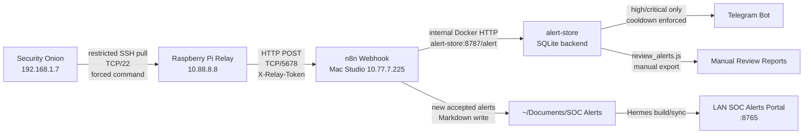
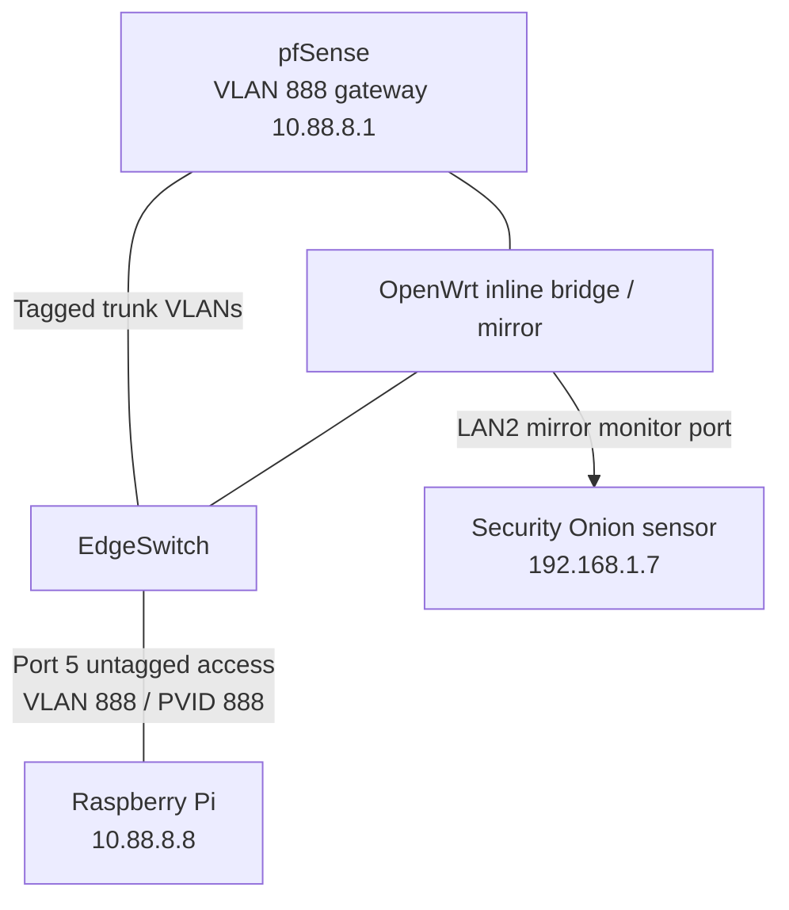
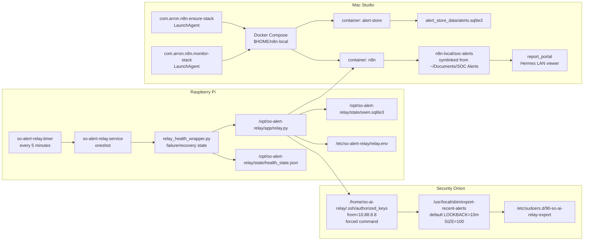
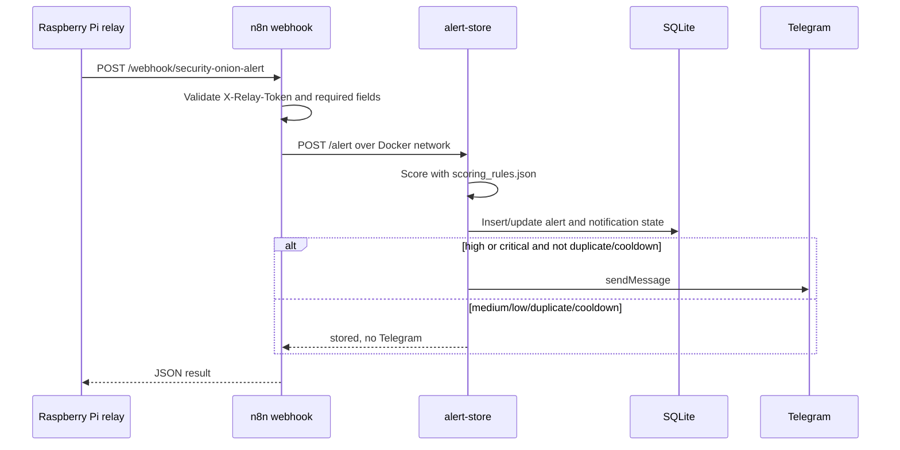

# Security Onion Alert Relay Architecture

## Current State

The live alert relay path has been moved off this Mac and onto the Raspberry Pi.

```text
Security Onion -> Raspberry Pi relay -> Mac Studio n8n -> alert-store SQLite -> Telegram / Markdown reports / Hermes portal
```

This Mac is no longer part of the live polling path. The old local relay LaunchAgent, local report LaunchAgent, and Obsidian/report sync helper have been removed.

Current design boundary:

```text
Pi relay: transport, exact alert-id retry dedupe, local evidence files
Mac Studio alert-store: scoring, drop policy, suppression windows, routing, notifications
Mac Studio n8n: webhook intake and Markdown report creation for accepted alerts
Hermes LAN Portal: analyst UI over Markdown today; should move to SQLite-backed API for scale
```

## Network Segments

| Segment | VLAN | Subnet | Purpose | Important Hosts |
| --- | ---: | --- | --- | --- |
| Security Onion / LAN | Native/LAN | `192.168.1.0/24` | Security Onion management and restricted alert export | `192.168.1.7` Security Onion |
| SOC Relay | `888` | `10.88.8.0/24` | Isolated Raspberry Pi relay network | `10.88.8.1` pfSense gateway, `10.88.8.8` Raspberry Pi |
| AI Lab | `777` | `10.77.7.0/24` | n8n and future AI workflow hosts | `10.77.7.225` Mac Studio |
| Network Management | `100` | `192.168.100.0/24` | Network/admin devices | Admin workstation/subnet, network gear |

## Host Inventory

| Host | IP | Role | Runs |
| --- | --- | --- | --- |
| Security Onion | `192.168.1.7` | Alert source | Restricted SSH wrapper `/usr/local/sbin/export-recent-alerts` |
| Raspberry Pi relay | `10.88.8.8` | Poller, forwarder, and relay health monitor | `so-alert-relay.service`, `so-alert-relay.timer`, `relay_health_wrapper.py`, Python relay |
| Mac Studio | `10.77.7.225` | Workflow engine, storage, and stack health monitor | Docker Desktop, n8n, alert-store, SQLite, Telegram notification logic, `com.arron.n8n.monitor-stack` |
| This Mac | varies | Admin/development workstation | Obsidian vault, project source copies, manual report generation only |
| pfSense | `10.88.8.1` on VLAN 888 | Router/firewall | VLAN 888 gateway and access rules |
| OpenWrt tap/mirror bridge | inline | Packet visibility path | VLAN trunk pass-through and LAN2 mirror output to Security Onion |
| EdgeSwitch | switch fabric | Access/trunk switching | Port 5 as VLAN 888 untagged access for Pi |

## End-To-End Data Flow



## Network Path



## Control Plane And Services



## Raspberry Pi Relay

| Item | Value |
| --- | --- |
| SSH | `<relay_user>@10.88.8.8` |
| Service user | `soalert` |
| App path | `/opt/so-alert-relay/app/relay.py` |
| Health wrapper | `/opt/so-alert-relay/app/relay_health_wrapper.py` |
| Config | `/opt/so-alert-relay/app/config.json` |
| Secret env | `/etc/so-alert-relay/relay.env` |
| SSH hardening | `/etc/ssh/sshd_config.d/99-key-only-admin.conf` |
| Security Onion key | `/opt/so-alert-relay/keys/so-ai-relay_ed25519` |
| State DB | `/opt/so-alert-relay/state/seen.sqlite3` |
| Raw batches | `/opt/so-alert-relay/state/batches` |
| New alert files | `/opt/so-alert-relay/state/new-alerts` |
| Timer | `/etc/systemd/system/so-alert-relay.timer` |
| Service | `/etc/systemd/system/so-alert-relay.service` |

The Pi pulls alert JSON from Security Onion, deduplicates alert IDs with local
SQLite for retry safety, writes local state, and posts new alerts to Mac Studio
n8n. Normal rule filtering is intentionally not done on the Pi. The live Pi
config keeps `filters.drop_alerts` empty so tuning can move with the Mac Studio
workflow if the forwarding method changes later.

The systemd service calls `relay_health_wrapper.py`. The wrapper runs the relay, records health state, sends a Telegram notification on first failure, suppresses repeated failure spam, and sends a recovery notification once the relay succeeds again.

Current timer:

```text
OnBootSec=2min
OnActiveSec=5min
OnUnitActiveSec=5min
AccuracySec=30s
Persistent=true
```

Reboot behavior verified on 2026-07-01: `so-alert-relay.timer` is enabled and active, `NetworkManager-wait-online.service` is enabled, and `so-alert-relay.service` is a `Type=oneshot` job that exits cleanly between timer runs. After Pi updates and reboot, the timer should start at boot, wait roughly two minutes, then run every five minutes.

Reboot validation update on 2026-07-01:

```text
Pre-reboot:
- Pi reachable at 10.88.8.8 over SSH.
- so-alert-relay.timer enabled and active.
- Relay service last run completed successfully.

Initial post-reboot problem:
- VLAN 888 gateway 10.88.8.1 stayed reachable.
- Pi 10.88.8.8 did not answer ping, SSH, ARP, or nmap host discovery.
- nmap -sn 10.88.8.0/24 found only 10.88.8.1.

Console recovery:
- Pi was in recovery/emergency shell.
- Root filesystem check was run with e2fsck -f -y /dev/mmcblk0p7.
- Pi booted normally after sync and reboot.

Validated after repair:
- SSH to 10.88.8.8 returned.
- so-alert-relay.timer is enabled and active after reboot.
- First post-boot scheduled relay run posted 14 new alerts to Mac Studio n8n.
- Follow-up relay run posted 2 new alerts.
- /opt/so-alert-relay/state/health_state.json reported status ok.
- alert-store review on Mac Studio showed 49 alerts in the last hour.
- New post-reboot alerts were not high/critical, so no new Telegram alert was expected.

Risk note:
- The SD card should be treated as suspect. If recovery mode happens again, replace or reimage the card before relying on the Pi for production relay duty.
```

Operational commands:

```bash
ssh <relay_user>@10.88.8.8 'systemctl list-timers --all so-alert-relay.timer --no-pager'
ssh <relay_user>@10.88.8.8 'sudo journalctl -u so-alert-relay.service -n 40 --no-pager'
ssh <relay_user>@10.88.8.8 'sudo systemctl start so-alert-relay.service'
ssh -o BatchMode=yes -o PasswordAuthentication=no -o KbdInteractiveAuthentication=no -o PreferredAuthentications=publickey <relay_user>@10.88.8.8 'echo key_auth_ok'
```

Pi health state:

```text
/opt/so-alert-relay/state/health_state.json
```

Pi administrative SSH was hardened on 2026-07-01:

```text
Port: 22
PubkeyAuthentication: yes
PasswordAuthentication: no
KbdInteractiveAuthentication: no
PermitRootLogin: no
Config drop-in: /etc/ssh/sshd_config.d/99-key-only-admin.conf
```

## Security Onion Export

| Item | Value |
| --- | --- |
| Host | `aj@192.168.1.7` |
| Relay SSH user | `so-ai-relay` |
| Export wrapper | `/usr/local/sbin/export-recent-alerts` |
| Default lookback | `10m` |
| Default size | `100` |
| Sort order | newest first |
| Allowed sudo command | `/usr/local/sbin/export-recent-alerts` |
| Source restriction | `from="10.88.8.8"` |

The forced key on Security Onion permits only the Pi to run the export wrapper:

```text
from="10.88.8.8",command="sudo -n /usr/local/sbin/export-recent-alerts",no-agent-forwarding,no-X11-forwarding,no-port-forwarding,no-pty,no-user-rc ...
```

This Mac was tested after the source restriction and is denied by Security Onion when trying to use the relay key directly.

## Mac Studio n8n Stack

| Item | Value |
| --- | --- |
| SSH | `<mac_user>@10.77.7.225` |
| Compose directory | `$HOME/n8n-local` |
| n8n URL | `http://10.77.7.225:5678` |
| n8n container | `n8n` |
| alert-store container | `alert-store` |
| SQLite DB | `$HOME/n8n-local/alert_store_data/alerts.sqlite3` |
| SOC Markdown reports | `$HOME/Documents/SOC Alerts` |
| Docker-mounted report directory | `$HOME/n8n-local/soc-alerts` |
| SOC alert portal | `http://10.77.7.225:8765/view/b68c5a48b9778061/` |
| Scoring config | `$HOME/n8n-local/alert_store/config/scoring_rules.json` |
| Review CLI | `$HOME/n8n-local/alert_store/review_alerts.js` |
| Investigation CLI | `$HOME/n8n-local/alert_store/investigation_notes.js` |
| Docker restart policy | `unless-stopped` |
| Docker stack helper | `$HOME/n8n-local/bin/ensure-n8n-stack.zsh` |
| Stack monitor | `$HOME/n8n-local/bin/monitor-n8n-stack.zsh` |
| LaunchAgent | `$HOME/Library/LaunchAgents/com.arron.n8n.ensure-stack.plist` |
| Monitor LaunchAgent | `$HOME/Library/LaunchAgents/com.arron.n8n.monitor-stack.plist` |

The Mac Studio LaunchAgent runs at login and every 5 minutes. It waits for Docker Desktop and then runs:

```bash
cd $HOME/n8n-local
/usr/local/bin/docker compose up -d
```

The Mac Studio monitor LaunchAgent also runs at login and every 5 minutes. It checks Docker, the `n8n` container, the `alert-store` container, n8n `/healthz`, and alert-store `/health`. It sends Telegram on first failure and on recovery.

The n8n workflow also writes one Obsidian-compatible Markdown file for every
newly accepted alert. Duplicate and suppressed alerts are still tracked by
alert-store but do not create repeated Markdown reports.

Production workflow:

```text
Security Onion Alert Intake - Configurable Scoring
Workflow ID: j237Tnda0cPniG1e
Repo export: n8n/workflows/security-onion-configurable-scoring.workflow.json
```

The workflow is split into separate operational nodes so filtering behavior is
easy to inspect and tune:

| Order | Node | Responsibility |
| --- | --- | --- |
| 1 | `Security Onion Alert Webhook` | Receive relay POSTs |
| 2 | `Validate Relay Request` | Validate token and alert payload shape |
| 3 | `Store Score And Filter Alert` | Call alert-store for scoring, drop, suppression, dedupe, and Telegram decisions |
| 4 | `Route Report Decision` | Decide whether a Markdown report should be written |
| 5 | `Write SOC Markdown Report` | Write accepted-alert Markdown into `/soc-alerts` |

Report path:

```text
$HOME/Documents/SOC Alerts
```

Implementation detail:

```text
$HOME/Documents/SOC Alerts -> $HOME/n8n-local/soc-alerts
```

The symlink keeps the visible report location under Documents for Hermes and
Obsidian while Docker mounts the less-protected
`$HOME/n8n-local/soc-alerts` directory into the n8n container as
`/soc-alerts`.

The Hermes portal builder reads the Markdown folder and publishes the LAN view:

```text
Source: $HOME/Documents/SOC Alerts
Builder: $HOME/.hermes/scripts/build_soc_alerts_dashboard.py
Sync: $HOME/.hermes/scripts/sync_report_portal.py
Portal: http://10.77.7.225:8765/view/b68c5a48b9778061/
```

Scaling note: the current SOC Alerts UI is generated from Markdown and is good
for analyst browsing at modest report counts. For large volumes, the recommended
path is SQLite-backed API pagination and metrics, with Markdown retained as the
local AI/reference corpus. See `soc-alert-storage-ui-scaling-architecture.md`.

Implementation direction for Hermes:

```text
Dashboard URL: http://10.77.7.225:8765/view/b68c5a48b9778061/
Primary UI source: $HOME/n8n-local/alert_store_data/alerts.sqlite3
LLM/report corpus: $HOME/Documents/SOC Alerts
```

The dashboard should use SQLite for alert tables, metrics, filters, suppressed
records, dropped records, and pagination. Markdown generation should continue
for accepted alerts so the local LLM has durable investigation notes to read.

2026-07-03 status: the Hermes SOC Alerts dashboard builder now reads the
SQLite `alerts` table as its primary source for metrics and uses the LAN Portal
API for table rows. The page ships an empty table shell, then fetches grouped
SQLite alert rows from `/api/soc-alerts` in page-numbered slices. The default
page size is 25 grouped detections, and analysts can choose larger page sizes
from the rows-per-page selector. Markdown detail content remains the local
AI/reference corpus, and full rendered detail is fetched lazily so initial page
load stays small.

2026-07-03 update: lazy detail loading is deployed. The builder writes full
rendered detail fragments to `SOC Alerts Web/details/<group_id>.html`, the
portal sync mirrors them into
`$HOME/report_portal/library/Cybersecurity/SOC Alerts/details/`,
and the LAN Portal serves them through
`GET /api/soc-alerts/<group_id>/detail`. The table loads lightweight rows first
and fetches full Markdown/AI/raw-JSON detail only when a row is expanded.

2026-07-03 update: live dashboard updates are deployed through
`GET /api/soc-alerts/events`. The endpoint is a Server-Sent Events stream that
pushes analyst status counts, AI queue/activity state, n8n beacon data, and
SQLite metrics to the browser. The SOC Alerts page uses that stream for quick
metric and table refreshes, while retaining slower polling as a fallback.

Dashboard duplicate grouping direction: visible alert rows should be grouped by
`suppression_key` when available, otherwise by triage level, rule, source,
destination, and filter status. The dashboard should include a duplicate/repeat
count column derived from SQLite counts so repeated alerts are not displayed as
unrelated unique rows. The visible table row uses the newest alert in the group
as the representative event, while `Count` sums the grouped observations.

Grouped rows with duplicates include a `Duplicate Alert Timeline` in the
Detailed Alert Report. The timeline plots repeated alert members by time and
the table lists every member row chronologically by alert firing timestamp,
seen count, source IP, destination IP, destination port, and short alert ID so
analysts can distinguish short bursts from persistent repeated detections.

Source port should not be part of this grouping key because it is usually an
ephemeral client port. Keep source port in alert details/raw JSON, but group the
dashboard table without it. Destination port can remain visible and may be used
in grouping if it is available in SQLite or extracted from `alert_json`.

SOC Alerts Flow page: as of 2026-07-03, the portal includes a dedicated
`flow.html` page generated by `build_soc_alerts_dashboard.py`. It uses locally
bundled brand SVG assets for Security Onion, Raspberry Pi, Docker, n8n, Apple,
Ollama, SQLite, and Telegram plus the generated Onion Sentinel PNG logo, with
faster animated packet markers on every connector segment. The hero summary uses
a thin pulsing cyan divider instead of summary chips, matching the connector
line color without adding another arrow. Connector label chips have extra
padding and opaque backing so text does not obscure the arrows or packet motion. SQLite, Telegram, and Onion Sentinel are first-class nodes in the
diagram, not just text-only outputs. SQLite now displays compact metric pills
for grouped detections and total observations. Telegram uses matching metric
pills for actual Critical and High notifications sent, sourced from
`notification_log.sent_count` where `channel = 'telegram'`. The Onion Sentinel
dashboard node uses a larger logo and compact metrics so grouped detections,
total observations, AI coverage, and critical/high groups are visible in the
flow itself. An upper-right eye privacy button masks node IP addresses by
default and reveals them only when clicked. It shows this operational flow:

```text
Security Onion 192.168.1.7
  -> restricted SSH polling
Raspberry Pi relay 10.88.8.8 on VLAN 888
  -> webhook POST
Docker on Mac Studio 10.77.7.225
  -> container network
n8n workflow :5678 webhook
  -> scoring/routing
Mac Studio AI Lab 10.77.7.225
  -> prompt package and evidence bundle
Ollama local LLM
  -> devstral:latest
  -> AI findings
  -> AI Reports node
  -> Markdown and JSON artifact counts with same-size Obsidian and {JSON} badges
Mac Studio AI Lab 10.77.7.225
  -> SQLite node for grouped detection storage, grouped detections, and
     total observation metrics
AI Reports node + SQLite node
  -> Onion Sentinel dashboard node for analyst triage
  -> compact dashboard metrics for grouped detections, total observations,
     AI coverage, and critical/high groups
n8n workflow :5678 webhook
  -> Telegram node for high/critical mobile notification
  -> Critical and High notification totals from notification_log
```

Validation command after redeploy:

```bash
python3 $HOME/.hermes/scripts/build_soc_alerts_dashboard.py
python3 $HOME/.hermes/scripts/sync_report_portal.py
```

Then confirm the served HTML contains `data-view="overview"` and the
`network-diagram` section. The SOC Alerts nav item should switch to the grouped
SQLite table and retain the `Count` column. On static pages, the left
navigation badge for `SOC Alerts` renders the grouped SQLite alert count and is
kept current by the shared `soc-alerts-status.json` poller. On the SOC Alerts
table page, the same badge is owned by the table filter loop so it matches the
number of currently visible grouped alert rows after search,
acknowledged/suppressed visibility, severity, and last-seen window filters.

Grouped analyst state: as of 2026-07-03, acknowledge/suppress/expose state is
stored in SQLite table `analyst_alert_group_state`, keyed by the stable grouped
detection digest instead of by a raw Security Onion alert id. The LAN Portal API
supports server-side grouped alert queries with `analyst_status=open`,
`analyst_status=acknowledged`, or `analyst_status=suppressed`, plus cursor
pagination. This is now the production path for high-volume and multi-analyst
use: the SOC Alerts page ships an empty table shell and asks the backend for the
requested state slice instead of loading every row and filtering locally. The
default page size is 25 grouped detections, with a rows-per-page dropdown for
larger analyst views. Search, severity, last-seen window, acknowledged, and
suppressed filters all re-query SQLite server-side. The UI posts only the
changed grouped detection state and polls shared state every 5 seconds so
multiple analyst browsers converge.

Column sorting is also server-side. Each sortable table header sends an
allowlisted `sort` key and `direction` to `/api/soc-alerts`, then reloads page 1
from SQLite so sorting applies to the full matching alert set instead of only
the browser's current page. Count, severity, last seen, alert title, source IP,
destination IP, destination port, log source, and risk are database-backed today.
Representative alert size is calculated from alert JSON length. AI status is
present in the UI pattern, but should be backed by a future
`alert_group_summary.ai_status` column for fully semantic sorting.

Grouped read performance: `alert-store` now maintains SQLite table
`alert_group_summary` whenever alerts are inserted, rescored, or manually
rebuilt. It stores one row per grouped detection with newest representative
alert, first/last seen, raw row count, total observed count, log source,
severity, route, filter state, and common endpoint fields. The LAN Portal API
uses this table for alert pagination and metrics, then falls back to runtime
grouping if the table is missing or empty after a restore.

Local AI analysis now has a deployed runner:

```text
$HOME/n8n-local/bin/run-local-ai-analysis.py
```

It reads curated prompt packages from `soc-alerts/ai-prompts`, calls local
Ollama by default, validates the response schema, and writes Markdown plus JSON
notes to:

```text
$HOME/n8n-local/soc-alerts/ai-analysis
```

The AI system prompt is an editable runtime setting:

```text
Prompt file: $HOME/n8n-local/config/soc_analyst_system_prompt.md
Model routing: $HOME/n8n-local/config/ai_model_settings.json
Settings UI:  http://10.77.7.225:8765/view/b68c5a48b9778061/settings.html
Save API:     /api/soc-settings/analyst-prompt
Model API:    /api/soc-settings/ai-model
Ollama list:  /api/soc-settings/ollama-models
```

The portal API saves the prompt and model-routing settings atomically after LAN
Portal Administration authentication. The Settings page keeps both the `AI Analysis Model Selection` model-routing panel
and the full `SOC Analyst System Prompt` section collapsed by default. The model-routing form is ordered as a focused numbered 1-2-3 workflow:
Analysis Mode, Ollama Settings, then Cloud Provider Settings. The Ollama model field is a
dropdown sourced from `ollama ls` through `/api/soc-settings/ollama-models` and refreshes every 60 seconds while the Settings page is open.
The local AI runner reads both files before each analysis, so prompt tuning and
model selection take effect on the next alert analysis without restarting the
Docker stack or launchd scheduler.

Scheduled analysis is handled by a launchd wrapper:

```text
Script:      $HOME/n8n-local/bin/auto-run-ai-analysis.py
LaunchAgent: $HOME/Library/LaunchAgents/com.arron.soc.ai-analysis.plist
Interval:    300 seconds
Model:       Settings-driven; defaults to devstral:latest via local Ollama
```

The wrapper is deliberately conservative. Each launchd invocation:

1. Opens `$HOME/n8n-local/run/ai-analysis.lock`.
2. Exits cleanly if another model job is already active.
3. Reads `$HOME/n8n-local/alert_store_data/alerts.sqlite3`.
4. Selects the highest priority unanalyzed grouped detections across
   `critical`, `high`, `medium`, `low`, and `informational` levels using a long
   87600-hour lookback. Priority is a strict severity drain: all Critical
   groups newest-first, then all High groups newest-first, then all Medium
   groups newest-first, then all Low groups newest-first, then all
   Informational groups newest-first. The queue time uses `last_seen`, then
   `timestamp`, then `first_seen` as fallbacks.
5. Treats blank `filter_status` as `accepted` for trigger eligibility and also
   includes real `suppressed` detections for AI review.
6. Skips test/validation alert IDs and skips an entire duplicate group once any member
   alert has a matching analysis JSON artifact.
7. Builds or reuses a prompt package.
8. Starts the local Ollama analysis runner.
9. Rebuilds and syncs the SOC dashboard while the runner is active so the SOC
   Alerts metrics show the animated `Analyzing` indicator.
10. Rebuilds and syncs the SOC dashboard again after the runner completes so the
   alert table and detail page show the final AI state.

The LaunchAgent passes `--max-per-run 0`, which means continuous queue drain.
After one model job completes, the wrapper immediately selects the next queued
unique group and starts the next analysis without waiting for the next
5-minute launchd interval. The interval remains a safety wakeup for new alerts
and missed runs, while the lock file still prevents overlapping Ollama jobs.
The local AI runner also records repaired schema drift in the JSON artifact, so
missing non-critical fields such as `tuning_reason` do not block later alerts.

If the general Hermes portal sync fails because an unrelated dashboard builder
cannot access its source directory, the AI trigger falls back to copying only
`$HOME/SOC Alerts Web` into
`$HOME/report_portal/library/Cybersecurity/SOC Alerts`.

This keeps the Raspberry Pi as a simple transport layer. AI scheduling, prompt
construction, model execution, artifact storage, and UI refresh all live on the
Mac Studio.

## Alert Filtering And Suppression

Rule filtering now belongs to Mac Studio alert-store. The Pi can retain an
emergency local hard-drop list, but the normal deployment leaves it empty.

Detailed tuning runbook:

```text
security-onion-alert-filtering-guide.md
```

Policy file:

```text
$HOME/n8n-local/alert_store/config/scoring_rules.json
```

Policy sections:

| Section | Purpose |
| --- | --- |
| `drop_rules` | Hard-drop explicit known-noise events before storage/reporting |
| `suppress_rules` | Store repeated patterns but suppress repeated reports/Telegram for a TTL |
| `rule_adjustments` | Score changes for matching rule text |
| `pair_adjustments` | Score changes for matching source/destination/rule pairs |

Suppression behavior:

```text
First event in window: accepted
Repeated event inside TTL: stored as suppressed
Escalation threshold: accepted again despite suppression
Window expiry: next event starts a new accepted window
```

Current initial suppression examples:

```text
<example_ip> <example ssh scan rule>: 30 minute TTL, escalate every 20
<example_ip> <example curl rule>: 30 minute TTL, escalate every 20
<example_ip> <example scan rule>: 15 minute TTL, escalate every 25
```

Operational commands:

```bash
ssh <mac_user>@10.77.7.225 'cd $HOME/n8n-local && /usr/local/bin/docker compose ps'
ssh <mac_user>@10.77.7.225 '/usr/local/bin/docker inspect -f "{{.Name}} restart={{.HostConfig.RestartPolicy.Name}} status={{.State.Status}}" n8n alert-store'
curl http://10.77.7.225:5678/healthz
ssh <mac_user>@10.77.7.225 'find -L "$HOME/Documents/SOC Alerts" -maxdepth 1 -type f -name "*.md" | tail'
ssh <mac_user>@10.77.7.225 'launchctl print gui/502/com.arron.n8n.monitor-stack | grep -E "runs =|last exit code|run interval"'
```

## Failure Notifications

Failure notifications are split by responsibility.

| Component | Detects | Notification path | Status |
| --- | --- | --- | --- |
| Raspberry Pi `relay_health_wrapper.py` | Security Onion SSH failures, n8n webhook post failures, relay runtime exceptions | Direct Telegram from Pi | Installed and tested with HTTP `200` |
| Mac Studio `monitor-n8n-stack.zsh` | Docker unavailable, n8n down, alert-store down, local health check failure | Direct Telegram from Mac Studio | Installed and tested with HTTP `200` |
| alert-store | High/critical Security Onion alerts | Telegram from Mac Studio | Installed and tested |

Pi notification behavior:

```text
First failure: send [FAILURE]
Repeated failures: update local state, no repeat Telegram spam
First successful run after failure: send [RECOVERY]
Normal success: no Telegram
```

Pi notification state:

```text
/opt/so-alert-relay/state/health_state.json
```

Current Pi direct Telegram status:

```text
Installed: yes
Token present in /etc/so-alert-relay/relay.env: yes
Failure/recovery state logic: tested
Direct Telegram delivery from Pi: tested
Explicit notification test: HTTP 200
Simulated failure notification: HTTP 200
Simulated recovery notification: HTTP 200
```

Required VLAN 888 rules for Pi direct failure notifications:

```text
10.88.8.8 -> DNS server TCP/UDP 53
10.88.8.8 -> Internet or api.telegram.org TCP/443
```

Mac Studio monitor validation:

```text
monitor-n8n-stack.zsh health_status=ok
LaunchAgent com.arron.n8n.monitor-stack last exit code=0
Telegram test notification returned HTTP 200
```

## n8n And alert-store Flow



## Relay Filtering

The Pi relay has local drop filters to keep known low-value noise from entering n8n.

| Filter | Purpose |
| --- | --- |
| `rule_contains: GPL ICMP PING` | Drops high-volume ICMP ping noise |
| `source_ip: 10.88.8.8`, `destination_ip: 192.168.1.7`, `rule_contains: <example ssh scan rule>` | Drops relay-to-Security Onion SSH self-noise |

Last validation:

```text
Manual Pi service run after filters: dropped 100, posted 0
Scheduled Pi timer run after filters: dropped 100, posted 0
Mac Studio urgent count: 0
Telegram notifications from cutover: 0
```

## Firewall Policy

VLAN 888 should stay narrow. The disabled `Allow ALL` rule should remain disabled and should be deleted after validation confidence is high.

Recommended live rules:

| Action | Source | Destination | Port | Purpose |
| --- | --- | --- | --- | --- |
| Block | any IPv6 | any | any | No IPv6 on relay VLAN |
| Pass | admin Mac or admin network | `10.88.8.8` | TCP/22 | Pi SSH administration |
| Pass | `10.88.8.8` | `192.168.1.7` | TCP/22 | Restricted SSH alert polling |
| Pass | `10.88.8.8` | `10.77.7.225` | TCP/5678 | n8n webhook |
| Pass | `10.88.8.8` | DNS server / firewall | TCP/UDP 53 | DNS |
| Pass | `10.88.8.8` | NTP server / firewall | UDP/123 | Time sync |
| Pass, required for Pi direct failure alerts | `10.88.8.8` | `api.telegram.org` or Internet | TCP/443 | Telegram failure/recovery notifications |
| Disabled except patch windows | `10.88.8.8` | Internet | TCP/80,443 | OS updates |
| Block/log | VLAN 888 net | any | any | Default deny |

Verified blocked:

```text
10.88.8.8 -> 10.100.4.1:10443 blocked
10.88.8.8 -> 192.168.1.1:10443 blocked
```

Verified allowed on 2026-07-01:

```text
admin Mac -> 10.88.8.8:22 succeeded
10.88.8.8 -> 192.168.1.7:22 succeeded
10.88.8.8 -> 10.77.7.225:5678 succeeded
10.88.8.8 -> DNS for api.telegram.org succeeded
10.88.8.8 -> api.telegram.org:443 succeeded
10.77.7.225:5678 /healthz returned {"status":"ok"}
```

## Pi Update Procedure

Use an explicit update window instead of leaving broad Internet access open.

1. Enable a temporary pfSense rule on VLAN 888:

```text
Pass 10.88.8.8 -> Internet TCP/80,443
```

This lets the Pi reach Debian/Raspberry Pi package mirrors during maintenance. Keep the rule above the default block rule and disable it again after updates finish.

2. Confirm the Pi can resolve DNS and reach HTTPS:

```bash
ssh <relay_user>@10.88.8.8 'getent hosts deb.debian.org; nc -vz deb.debian.org 443'
```

`getent hosts` confirms DNS works from the Pi. `nc` confirms outbound HTTPS is allowed for package downloads.

3. Run package updates:

```bash
ssh <relay_user>@10.88.8.8 'sudo apt update && sudo apt full-upgrade'
```

`apt update` refreshes package metadata. `apt full-upgrade` applies available updates and allows dependency changes when needed.

4. Reboot after kernel, firmware, systemd, OpenSSH, or Python updates:

```bash
ssh <relay_user>@10.88.8.8 'sudo reboot'
```

5. Verify the Pi returns and the relay timer resumes:

```bash
ssh <relay_user>@10.88.8.8 'systemctl is-enabled so-alert-relay.timer; systemctl is-active so-alert-relay.timer; systemctl list-timers --all so-alert-relay.timer --no-pager'
ssh <relay_user>@10.88.8.8 'sudo journalctl -u so-alert-relay.service -n 30 --no-pager'
```

The timer should be enabled and active. The service should show a successful run within a few minutes after boot.

6. Disable the temporary package-update Internet rule.

After the rule is disabled, keep only the narrow production egress rules plus admin SSH inbound to the Pi.

## Reporting And Obsidian

The live relay no longer depends on this Mac. Obsidian reporting is documentation/analysis, not part of alert delivery.

Current report file:

```text
<obsidian_vault>/Security Onion/reports/security-onion-alert-review-2026-07-01.md
```

Generate a current report manually:

```bash
ssh <mac_user>@10.77.7.225 \
  '/usr/local/bin/docker exec alert-store node /app/review_alerts.js --hours 24 --limit 20' \
  > "<obsidian_vault>/Security Onion/reports/security-onion-alert-review-$(date -u +%Y-%m-%d).md"
```

Generate high/critical investigation notes manually:

```bash
python3 work/alert-store/export_investigation_notes.py \
  --hours 24 \
  --levels critical,high \
  --limit 10
```

The old Obsidian/report sync helper on this Mac has been removed because scheduled live polling now runs on the Pi, and reports can be generated directly when needed.

## What Is Not Running Anymore

| Old item | Previous purpose | Current status |
| --- | --- | --- |
| `com.arron.securityonion.relay.plist` on this Mac | Mac-side relay polling | Removed |
| `com.arron.securityonion.reports.plist` on this Mac | Mac-side report export | Removed |
| `~/Library/Application Support/SecurityOnionRelay` on this Mac | Local relay runtime copy | Removed |
| `sync_automated_exports_to_obsidian.zsh` | Copy scheduled exports into Obsidian | Removed |

## Operational Checks

Pi relay:

```bash
ssh <relay_user>@10.88.8.8 'systemctl list-timers --all so-alert-relay.timer --no-pager'
ssh <relay_user>@10.88.8.8 'sudo journalctl -u so-alert-relay.service -n 40 --no-pager'
```

Mac Studio stack:

```bash
ssh <mac_user>@10.77.7.225 'cd $HOME/n8n-local && /usr/local/bin/docker compose ps'
curl http://10.77.7.225:5678/healthz
```

Security Onion wrapper:

```bash
ssh aj@192.168.1.7 'sudo grep -n "LOOKBACK\\|from=\\\"10.88.8.8\\\"" /usr/local/sbin/export-recent-alerts /home/so-ai-relay/.ssh/authorized_keys'
```

Alert review:

```bash
ssh <mac_user>@10.77.7.225 \
  '/usr/local/bin/docker exec alert-store node /app/review_alerts.js --hours 1 --limit 15'
```

## Current Trust Boundary

The Pi is intentionally a narrow bridge:

```text
Allowed:
- Pi -> Security Onion TCP/22
- Pi -> Mac Studio TCP/5678
- Pi -> DNS/NTP

Denied:
- Pi -> pfSense UI
- Pi -> arbitrary internal networks
- Pi -> management VLAN except explicit admin flows
- non-Pi hosts -> Security Onion relay key
```

The AI/n8n environment does not query Security Onion directly. It receives
full-fidelity alert data from the relay path.

## Alert Detail Enrichment

As of 2026-07-02, the Security Onion export wrapper enriches each alert before
the Pi receives it. The Pi remains a transport layer and forwards the enriched
JSON without trying to interpret it.

Enrichment source:

```text
/usr/local/sbin/export-recent-alerts
```

The wrapper now returns full-fidelity alert documents:

| Category | Examples |
| --- | --- |
| Normalized alert fields | `alert_id`, `timestamp`, `rule_name`, `source.ip`, `destination.ip`, `network.community_id` |
| Event/rule metadata | `event.*`, `rule.*`, `tags`, `labels`, `threat.*`, `related.*` |
| Protocol context | `dns.*`, `http.*`, `url.*`, `tls.*` |
| Endpoint context | `host.*`, `observer.*`, `agent.*`, `log.*`, `process.*`, `file.*`, `user.*` |
| Full Security Onion raw event | `security_onion.raw_event` |
| Suricata context | `suricata.eve.*` fields including alert, flow, DNS, HTTP, TLS, packet, payload, and capture metadata when present |

Full-fidelity mode:

```text
_source: true
No exporter-side field exclusions.
Packet, payload, payload_printable, PCAP, and HTTP body fields are retained when Security Onion provides them.
```

The Security Onion `message` field can contain the original Suricata JSON,
including packet data. In full-fidelity mode, that raw `message` remains in
`security_onion.raw_event`. The top-level normalized `message` still tries to
extract a concise alert signature for table readability.

Mac Studio persistence:

```text
$HOME/n8n-local/alert_store_data/alerts.sqlite3
alerts.alert_json
alerts.enrichment_json
alerts.raw_event_json
alerts.source_port / alerts.destination_port
alerts.network_protocol / alerts.transport_protocol
```

SQLite persistence rules:

| Column | Purpose |
| --- | --- |
| `alert_json` | Complete scored alert object received from the relay plus alert-store triage |
| `enrichment_json` | Focused enrichment bundle for dashboard/local-AI tooling: message, tags, ECS, DNS, HTTP, URL, TLS, related, threat, Suricata, and Security Onion fields |
| `raw_event_json` | Full original Security Onion event from `security_onion.raw_event`, including packet/payload/body fields when present |
| `source_port`, `destination_port` | Typed endpoint port columns derived from alert JSON for fast filtering, timelines, and future service-aware grouping |
| `network_protocol`, `transport_protocol` | Typed protocol columns derived from ECS fields for fast filtering and dashboard/API use |

The `/rescore` endpoint also backfills these derived columns from existing
`alert_json`. On 2026-07-02, it processed 1,549 rows and populated 1,137
source/destination port pairs plus 1,534 transport protocol values.

The LAN Portal builder reads SQLite and adds `Enriched Alert Details` plus
`Complete Alert JSON` to each Detailed Alert Report. It also reads
`$HOME/n8n-local/soc-alerts/ai-analysis/*-local-ai-analysis.json`
and adds `AI Model Used` plus `AI Analysis Output` sections. The model section
records which local model evaluated the alert, and the output section renders
the structured AI response plus the complete AI response JSON. Existing
Markdown reports remain the local AI corpus, while SQLite remains the fast
source for tables, grouping, counts, and machine-readable detail.

Grouped rows with duplicates also render a `Duplicate Alert Timeline` section
inside the Detailed Alert Report. It plots repeated members by time, and
includes a compact member table with each alert firing timestamp, seen count,
source IP, destination IP, destination port, and short alert ID in
chronological order.

The dashboard keeps large evidence blocks out of the default reading path:
`Complete Alert JSON` and `Raw Alert` are always re-added at the bottom of each
Detailed Alert Report as collapsed `<details>` sections. Analysts can expand
them when they need packet, payload, PCAP, HTTP body, or raw event evidence.

The SOC Alerts table has an `AI` status column. It reports `Analyzing` when a
local AI runner process is active for that alert prompt, `Analyzed` when a
matching AI analysis artifact exists, `Queued` when no analysis artifact exists yet
(either prompt-staged or scheduler backlog), and `Not queued` only for fallback/error states.

The `Last n8n beacon` metric is intentionally separate from full dashboard
generation. The Mac Studio alert-store writes an atomic JSON beacon on every
n8n `/alert` webhook request:

```text
Container path: /data/n8n-beacon.json
Served path:    $HOME/report_portal/library/Cybersecurity/SOC Alerts/n8n-beacon.json
URL:            /view/b68c5a48b9778061/n8n-beacon.json
```

The dashboard polls this file every 3 seconds and updates the metric card with
the latest webhook time, status, rule, and source/destination summary. This
keeps the metric live even when the full dashboard table has not rebuilt yet.
During a dashboard rebuild, the generator seeds `n8n-beacon.json` from the
latest alert if no live alert-store beacon exists.

The portal now generates one static HTML file per left-navigation item.
`index.html` is the default SOC Alerts table page, `home.html` is the executive
KPI/chart overview, `flow.html` is the dedicated data-flow route with a simple
ocean-wave line icon, and `soc-alerts.html` is kept as a direct SOC Alerts
bookmark. Other left-nav routes currently render their own placeholder pages
until their data-backed widgets are implemented.

Data sensitivity warning:

```text
Full-fidelity mode may store sensitive packet payloads, HTTP bodies, credentials,
tokens, internal URLs, hostnames, and file/process artifacts in SQLite, Markdown,
and rendered dashboard HTML. Keep access to the Mac Studio, SQLite database,
SOC Alerts directory, and LAN Portal restricted.
```

Backfill status from 2026-07-02:

```text
alert-store /rescore backfilled enrichment_json/raw_event_json from existing alert_json.
Full-fidelity exporter deployed and live Pi pull posted new full-fidelity rows.
Rows with packet/payload/PCAP strings in SQLite after validation: <count>
```

Only rows collected after Security Onion exporter enrichment have
`raw_event_json`; older rows still retain all details that were available at the
time in `alert_json` and `enrichment_json`.

## Relay Failure/Recovery Noise

On 2026-07-02, the Pi sent several failure/recovery Telegram messages for two
different reasons:

| Failure type | Root cause | Current status |
| --- | --- | --- |
| Webhook HTTP `500` | n8n internal runtime SQLite at `$HOME/n8n-local/n8n_data/database.sqlite` reported `SQLITE_NOTADB` / `SQLITE_CORRUPT` | alert-store SQLite is healthy; n8n DB still needs a maintenance repair window |
| SSH pull timeout | The Pi SSH command to `so-ai-relay@192.168.1.7` timed out after 30 seconds on intermittent runs | Security Onion export normally completes quickly; Pi timeout increased and notifications are thresholded |

The Pi config now uses:

```json
"ssh_timeout_seconds": 45
```

The Pi health wrapper now uses:

```text
RELAY_FAILURE_NOTIFY_THRESHOLD=3
```

Behavior:

```text
1 failed poll: log as transient_failed, no Telegram
2 failed polls: log as transient_failed, no Telegram
3 failed polls: send one [FAILURE] Telegram
continued failures: log still_failed, no repeat Telegram
first success after a notified failure: send one [RECOVERY] Telegram
first success after an unnotified transient failure: no recovery Telegram
```
